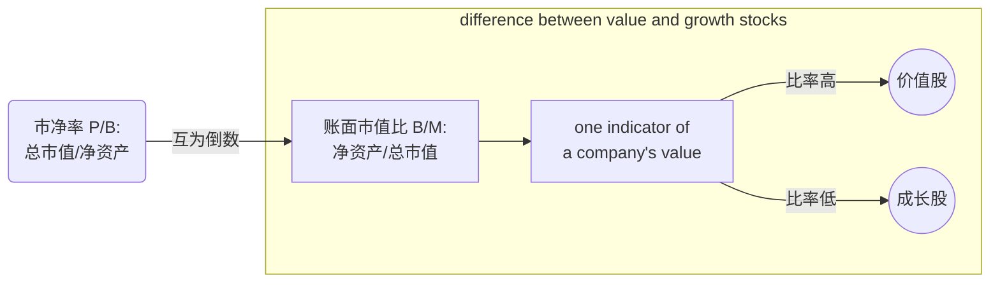

# 资产定价基础知识

### Fama-French 三因子模型

$$
\bar{R}_{i,t}-r_f=\alpha_i+\beta_i(\bar{R}_{M,t}-r_f)+s_i R_t^{SMB}+h_i R_t^{HML}+e_{i,t}
$$


### Fama-French 五因子模型

$$
\bar{R}_{i,t}-r_f=\alpha_i+\beta_i(\bar{R}_{M,t}-r_f)+s_i R_t^{SMB}+h_i R_t^{HML} + r_i R_t^{RMW}+c_i R_t^{CMA} +e_{i,t}
$$

<table border="0" cellpadding="0" cellspacing="0" width="303" style="border-collapse:
 collapse;table-layout:fixed;width:700pt">
  <colgroup>
    <col width="167" style="mso-width-source:userset;mso-width-alt:5700;width:190pt">
    <col width="68" style="width:350pt">
  </colgroup>
  <tbody><caption>因子介绍</caption>
  <tr height="19" style="height:39pt">
    <td class="xl65" align="left" style="border-top:.5pt solid windowtext;
    border-right:none;border-bottom:#f3f3ef solid 1px;border-left:none;background:#F3F3EF;
    mso-pattern:black none">$SMB$: 市值因子</td>
    <td class="xl65" align="left" style="border-top:.5pt solid windowtext;
    border-right:none;border-bottom:#f3f3ef solid 1px;border-left:none;background:#F3F3EF;
    mso-pattern:black none">买多小股票、卖空大股票的零成本资产组合</td>
  </tr>
  <tr height="19" style="height:39pt">
    <td class="xl65" align="left" style="border-top:.5pt solid windowtext;
    border-right:none;border-bottom:#f3f3ef solid 1px;border-left:none;background:#F3F3EF;
    mso-pattern:black none">$HML$: 账面市值比因子</td>
    <td class="xl65" align="left" style="border-top:.5pt solid windowtext;
    border-right:none;border-bottom:#f3f3ef solid 1px;border-left:none;background:#F3F3EF;
    mso-pattern:black none">买多高BM ratio的股票，卖空低BM ratio的股票的零成本资产组合</td>
  </tr>
  <tr height="19" style="height:39pt">
    <td class="xl65" align="left" style="border-top:.5pt solid windowtext;
    border-right:none;border-bottom:#f3f3ef solid 1px;border-left:none;background:#F3F3EF;
    mso-pattern:black none">$RMW$: 利润因子</td>
    <td class="xl65" align="left" style="border-top:.5pt solid windowtext;
    border-right:none;border-bottom:#f3f3ef solid 1px;border-left:none;background:#F3F3EF;
    mso-pattern:black none">买多高利润公司股票、卖空低利润公司股票的零成本资产组合</td>
  </tr>
  <tr height="19" style="height:39pt">
    <td align="left" style="border-top:none;border-right:none;border-bottom:.5pt solid windowtext;border-left:none;background:#F3F3EF;mso-pattern:black none">$CMA$: 投资因子</td>
    <td align="left" style="border-top:none;border-right:none;border-bottom:.5pt solid windowtext;border-left:none;background:#F3F3EF;mso-pattern:black none">买多低资产增长率公司股票、卖空高资产增长率公司股票的零成本资产组合</td>
  </tr>
  <!--[if supportMisalignedColumns]-->
  <tr height="0" style="display:none">
    <td width="167" style="width:125pt"></td>
    <td width="68" style="width:51pt"></td>
    <td width="68" style="width:51pt"></td>
  </tr>
 <!--[endif]-->
</tbody></table>

<div align ='center'>


</div>

> $CMA_t$ is the difference between the returns on diversified portfolios of the stocks of low and high investment firms, which we call conservative and aggressive.

Factor timing（因子择时）是指根据市场中不同因子的表现，调整投资组合中各因子的权重或配置，以利用因子的相对强弱来获取额外的收益。
在投资中，因子是指能够解释资产收益率变化的共同特征或风险因素，例如市场风险、规模、价值、动量等。因子择时的目标是根据对不同因子表现的预测或评估，调整因子在投资组合中的权重，以寻求超额收益或降低风险。
例如，如果投资者预计市场将进入一个较为稳定的阶段，他们可能会增加规模因子的权重，因为较小的公司在稳定市场环境下表现较好。相反，如果预计市场将面临较大的不确定性和波动性，他们可能会增加市场风险因子的权重，以抵御可能的市场风险。
因子择时的关键在于对市场和因子的预测和评估。投资者可以使用各种技术和基本分析工具来分析因子的表现，并基于这些分析结果做出相应的调整。然而，需要注意的是，因子择时需要有可靠的数据和有效的模型来支持决策，并且在实践中并不总是能够产生一致的正收益。
因此，因子择时需要谨慎，并且需要基于充分的研究和测试。投资者应当充分了解因子的特性、市场环境和自身投资目标，以做出明智的因子配置和择时决策。

```mindmap
graph LR
  A[主题] --> B[子主题1: $x^2 + y^2 = z^2$]
  A --> C[子主题2]
  B --> D[子主题1.1]
  B --> E[子主题1.2: $\sum_{n=1}^{\infty} \frac{1}{n^2} = \frac{\pi^2}{6}$]
  C --> F[子主题2.1]
```

# Plain text

```mindmap
root
  topic1
    subtopic
  topic2
    subtopic
```

```mindmap
some
  example
    content
  for
  you
    to
    see
      the
    file
      structure
```