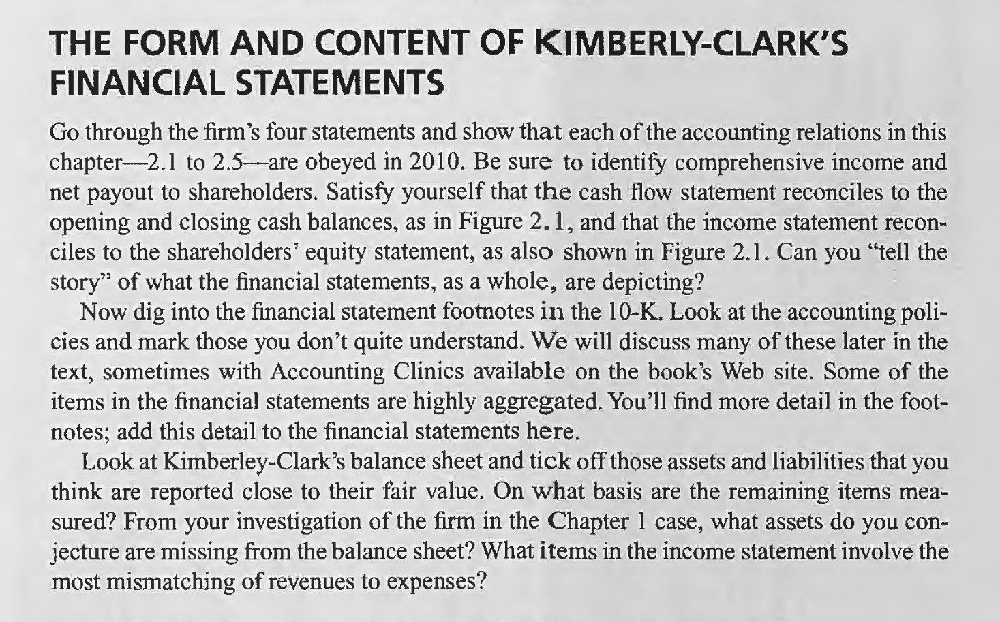
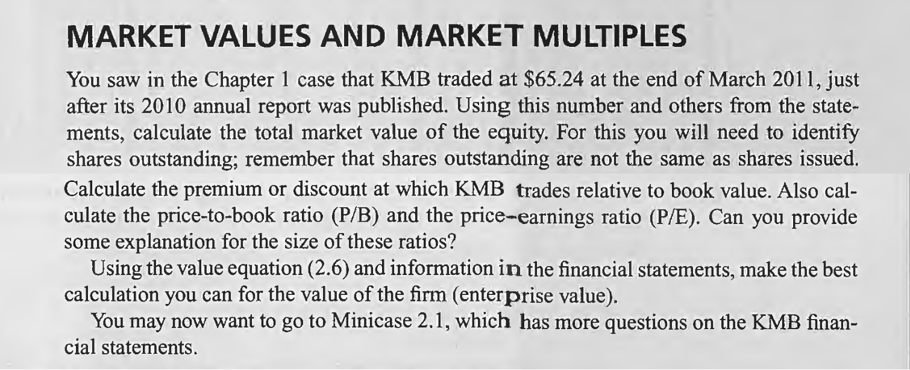

# Chapter 2

## Part 1

#### Go through the firm's four statements and show that each of the accounting relations in this chapter-2.1 to 2.5-are obeyed in 2010.

1. **The Balance Sheet equation**

<table><tr><td bgcolor='#e8e7e7'>

$
\begin{array}{ll}
 \text{Shareholders’ equity} & \qquad \qquad = \quad Assets - Liabilities \\
 \text{\$6,202} &  \qquad \qquad = \quad \$19,864 - \$13,662
\end{array}
$
</td></tr></table>

$\qquad$ In the equation above, liabilities have two parts: current liabilities and long-term liabilities.
$\qquad$ The equity calculated above is equal to that in the balance sheet.

1. **The Income statement equation**

$$\begin{array}{rll}
\text{Net revenue - Cost of goods sold} & = & \text{Gross margin} \\
&&\\
\text{Gross margin - Operating expenses} & = & \text{Operating income} \\
&&\\
\text{Operating income - Interest expense + Interest income} & = & \text{Income before taxes} \\
&&\\
\text{Income before taxes - Income taxes} & = & \text{Income after taxes (and before extraordinary items)} \\
&&\\
\text{Income before extraordinary items + Extraordinary items} & = & \text{Net income} \\
&&\\
\text{Net income - Preferred dividends} & = & \text{Net income available to common}
\end{array}
$$

&nbsp;

                            Revenue		                                  19,746
                            Cost of sales					  13,196  
                            Gross margin		                           6,550
                            Share of income in equity companies                  181
                            Other income (expense)			            (104)
                                                                               6,627
                            Operating expenses				   3,673			    
                            Ebit						   2,954
                            Net interest expense				     223	
                            Income before taxes				   2,731
                            Tax expense					     788
                            Income before extraordinary items		   1,943
                            Income from discontinued operations		       -
                            Income before noncontrolling interest              1,943
                            Noncontrolling interest			             100 
                            Net income					   1,843	

$\qquad$ The Net income calculated above is equal to that in the Consolidated Income Statement.

1. **The Cash Flow Statement equation**

Cash from operations + Cash from investment
+ Cash from financing = Change in cash

&nbsp;

                            Cash from operations				   2,744
                            Cash investment			                    (781)    
                            Cash used for financing			          (1,859)  
                            Change in cash before exchange rate effects          104

4. **The Statement of Shareholders' Equity**

Ending equity = Beginning equity + Comprehensive income
- Net payout to shareholders

&nbsp;

                            Beginning equity                = $5,406
                            Comprehensive income            = $2,210 (comprehensive income statement)
                            Net payout                      = dividends + stock repurchases – share issues
                                                            = 1,085 + 809 – 195
                                                            = $1,699

                            Ending equity                   = 5,406 + 2,210 – 1,699
                                                            = $5,917

1. **The Comprehensive income equation**

Comprehensive income = Net income+ Other comprehensive income

&nbsp;

<table><tr><td bgcolor=lightgrey>

$
\begin{array}{lr}
 \text{Foreign currency translation gain} & \qquad \qquad 326\\
 \text{Employee postretirement benefits} & 57\\
 \text{Other} & (16) \\
 \text{Other comprehensive income} & \$367
\end{array}
$
</td></tr></table>
&nbsp;

<table><tr><td bgcolor=lightgrey>

$$
\begin{array}{ll}
 \text{Comprehensive income to common} &  \qquad  \qquad= \$1,843 + 367 \\
 & \qquad  \qquad= 2,210
\end{array}
$$
</td></tr></table>

#### Can you "tell the story" of what the financial statements, as a whole, ate depicting?

* In 2009, KMB had \$5,406 million equity in the form of  common shareholders, and \$284 million equity in subsidiaries;
* In 2010, KMB earned \$2,210 million in comprehensive income for common shareholders, it pay dividends for shareholders or repurchase stocks in amount of \$1,699 million. At the end of 2010, KMB had \$5,917 million equity in the form of  common shareholders, and \$285 million equity in subsidiaries;
* In 2010, KMB earned \$2,744 million from operating, with \$781 million invested and \$1,859 million paid to shareholders and debtholders. So the cash earned in 2010 was \$104 million (2744 - 781 - 1859).

#### Look at Kimberley-Clark's balance sheet and tick off those assets and liabilities that you think are reported close to their fair value.

* Cash and cash equivalents
* Accounts receivable
* Notes receivable
* Most current liabilities
* Long-term income taxes payable

#### On what basis are the remaining items measured? From your investigation of the firm in the Chapter 1 case, what assets do you conjecture are missing from the balance sheet?

I think KMB's brand asset is missing here, because it has many famous brands, which could bring brand value.

#### What items in the income statement involve the most mismatching of revenues to expenses?

Advertising: The spending on advertising happens today, but it could lead to an increase in sales in the next period. Under GAAP accounting rules, which match advertising and sales revenue, it reduces current revenue;
Research and development: research and development also increases future sales, but when matched with sales revenue today, it decreases current sales.

&nbsp;
## Part 2

#### Calculate the total market value of the equity

                Total market value of common equity         = Price per share × Shares outstanding
                                                            = $65.24 × 406.9 million
                                                            = $26,546 million

#### Calculate the premium or discount at which KMB trades relative to book value.

                Premium over book value                     = $26,546 - $5,917
                                                            = $20,629 million

#### Also calculate the price-to-book ratio (P/B) and the price-earnings ratio (P/E). Can you provide some explanation for the size of these ratios?

                book value per share                        = $5,917/406.9
                                                            = $14.54
                P/B ratio                                   = $65.24/$14.54 
                                                            = 4.49

                earnings per share                          = $4.47
                P/E ratio                                   = $65.24/$4.47
                                                            = 14.6
P/B ratio is 4.49, which means there much value not reflected on the balance sheet;
P/E ratio is 14.6, which means investors think the EPS they get from KMB will grow steadily in the future.

#### Using the value equation (2.6) and information in the financial statements, make the best calculation you can for the value of the firm (enterprise value).

$$\text{Value of equity = Value of the firm - Value of debt} \qquad \quad (2.6)  $$

&nbsp;
There is a minority noncontrolling interest in the enterprise, so the market value of the firm is: 
**Value of the equity + Value of debt + Value of the Minority Interest**

We have calculated the market value of common equity above, $26,546 million;
Now we need to calculate the net debt:

                        Debt payable within one year                 344
                        Preferred securities of sub                  506
                        Long-term debt	        	       5,120
                        Preferred stock	                         541
                                                                6,511
                        Cash equivalents	         	    850
                        Short-term note receivable              218
                        Long-term note receivable               393  
                                                                   1,461
                        Net debt		                      $5,050

    Value of the firm (market)      = Value of the equity + Value of debt + Value of the Minority Interest
                                    = $26,546 + $5,050 + $1,280
                                    = $33,876
