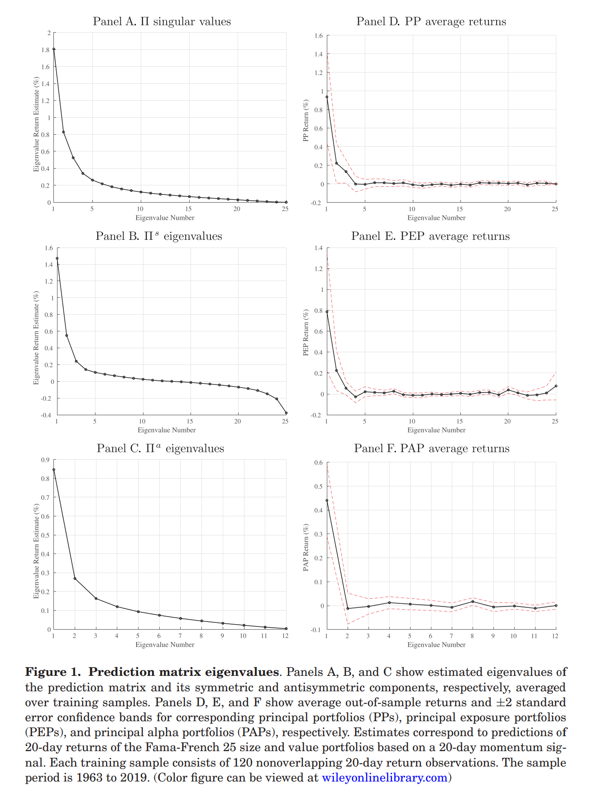

# Principal Portfolios

 **Journal:**

Journal of Finance

 **Authors:**

* Bryan Kelly:
  
  AQR Capital Management, Yale School of Management, and NBER
* Semyon Malamud:
  
  Swiss Finance Institute, EPFL, and CEPR, and is a consultant to AQR
* Lasse Heje Pedersen:
  
  AQR Capital Management, Copenhagen Business School, and CEPR

## Abstract

We propose a new asset pricing framework in which all securities’ signals predict each individual return. While the literature focuses on securities’ own-signal predictability, assuming equal strength across securities, our framework includes crosspredictability—leading to three main results. First, we derive the optimal strategy in closed form. It consists of eigenvectors of a “prediction matrix,” which we call “principal portfolios.” Second, we decompose the problem into alpha and beta, yielding optimal strategies with, respectively, zero and positive factor exposure. Third, we provide a new test of asset pricing models. Empirically, principal portfolios deliver significant out-of-sample alphas to standard factors in several data sets.

## Introducion

> 
&nbsp;&nbsp; 📘: The starting point for much of asset pricing is a signal, $S_{i,t}$ , that proxies for the conditional expected return for a security i at time t.  In the context of an equilibrium asset pricing model, $S_{i,t}$ may represent the conditional beta with respect to the market (or the pricing kernel). Alternatively, $S_{i,t}$ may be a predictor that is agnostic of equilibrium considerations, such as each asset’s valuation ratio or its recent price momentum. Standard analyses—for example, evaluating characteristic-sorted portfolios or asset pricing tests in the spirit of Gibbons, Ross, and Shanken (1989)—focus on own-asset predictive signals; that is, the association between $S_{i,t}$ and the return only on asset i, $R_{i,t+1}$.

本文提出了一种新的方法，通过 **“预测矩阵”** 来分析资产价格，这个模型的贡献：

* 在考虑横截面预测性的情况下，如何最优投资，即最大化收益率
* 怎样获取最优 $\alpha$ 和 $\beta$
* 关于资产定价模型的新的检验方法

$$
\Pi=E(R_{t+1}S_t')\in\mathbb{R}^{N\times N}
$$

$R_{t+1}=(R_{i,t+1})\in\mathbb{R}^N \qquad i=1,\dotsb,N$：收益率向量

$S_t=(S_{i,t})\in\mathbb{R}^N \qquad i=1,\dotsb,N$：信号向量

预测矩阵 $\Pi$ 的对角线部分跟踪自身信号的预测效果，这是标准资产定价的重点

$\Pi_{i,i} = E(R_{i,t+1}S_{i,t})$：资产 i 基于自身信号的预期利润

而预测矩阵还可以做到横截面预测：矩阵的非对角线元素

$\Pi_{i,j} = E(R_{i,t+1}S_{j,t})$：资产 j 的信号对资产 i 的收益的预测作用

> 
&nbsp;&nbsp; 📘: Knowledge of the entire prediction matrix, as opposed to the typical focus on diagonal elements alone, is critical to devising optimal portfolios and understanding their risk-return trade-off.

> 
&nbsp;&nbsp; 📘: Our main contribution is to develop an extensive theoretical understanding of the prediction matrix and the asset pricing information it carries.

定义 $\Pi$ 的奇异向量为：“principal portfolios” (PPs)

这篇文章的另一个创新点是将 $\Pi$ 分解为对称的和反对称的两个部分：

$$
\Pi=\underbrace{\dfrac{1}{2}(\Pi+\Pi')}_{\Pi^s}+\underbrace{\dfrac{1}{2}(\Pi-\Pi')}_{\Pi^a}
$$

we show that eigenvectors of the symmetric matrix $\Pi^s$ are effective ways to achieve exposure (beta) to the factor based on the signal S

strategies arising from eigenvectors of the symmetric component as “principal exposure portfolios” (PEPs)

---

while eigenvectors of the antisymmetric matrix $\Pi^a$ are powerful factor-neutralized (alpha) strategies with respect to this factor

strategies arising from the antisymmetric part as "principal alpha portfolios." (PAPs)

作者表明，PEPS 和 PAPs 的 **unconditional average returns** 和他们各自的特征值是成比例的

## I. Principal Portfolio Analysis (PPA)

变量设定：

* 市场上有 N 个证券，这些证券的交易时间是离散的

* $R_{i,t}$：证券 i 在时刻 t 的超额收益率，
  * 所有 $R_{i,t}$ 组成一个收益率向量：
  $$R_t = (R_{i,t})_{i=1}^N$$
  * 所有 $R_{i,t}$ 的条件协方差矩阵(conditional variancecovariance matrix)：
  $$\Sigma_{R,t}=\operatorname{var}_t(R_{t+1})$$

* $S_{i,t}$：证券 i 在时刻 t 的“信号”或“特征”
  * 所有 $S_{i,t}$ 组成一个收益率向量：
  $$S_t = (S_{i,t})_{i=1}^N$$

> 
&nbsp;&nbsp; 📘: We can think of these predictive characteristics as market betas, valuation ratios, momentum scores, or other observable signals that proxy for conditional expected returns.

### A. Linear Trading Strategies

$L\in\mathbb{R}^{N\times N}$：position matrix

一个线性策略的权重有如下形式：$w_t' = S_t'L$

$$
\begin{aligned}
R_{t+1}^{w_t}&=w_t'R_{t+1}\\
\\
&=\sum_j\underbrace{(S_t'L_j)}_{\text{position in j}}\quad \underbrace{R_{j,t+1}}_{\text{return of j}}\\
\\
&=S_t'LR_{t+1}
\end{aligned} \tag{2}
$$

$$
\begin{aligned}
R_{t+1}^{w_t}&=\begin{bmatrix}
  {S_{1,t}}&{S_{2,t}}&{\cdots}&{S_{N,t}}  
  \end{bmatrix}
  \begin{bmatrix}
    {L_{1,1}}&{L_{1,2}}&{\cdots}&{L_{1,N}}\\
    {L_{2,1}}&{L_{2,2}}&{\cdots}&{L_{2,N}}\\
    {\vdots}&{\vdots}&{\ddots}&{\vdots}\\
    {L_{N,1}}&{L_{N,2}}&{\cdots}&{L_{N,N}}\\
  \end{bmatrix}
  \begin{bmatrix}
    {R_{1,t+1}}\\
    {R_{2,t+1}}\\
    {\vdots}\\
    {R_{N,t+1}}\\
  \end{bmatrix}\\
  \\
&=\begin{bmatrix}
  {S_{t}^{'}L_1}&{S_{t}^{'}L_2}&{\cdots}&{S_{t}^{'}L_N}  
  \end{bmatrix}
  \begin{bmatrix}
    {R_{1,t+1}}\\
    {R_{2,t+1}}\\
    {\vdots}\\
    {R_{N,t+1}}\\
  \end{bmatrix}\\
  \\
&=\sum_j (S_t'L_j)\ R_{j,t+1}
\end{aligned}
$$

> 
&nbsp;&nbsp; 📘: We see that a linear strategy generally allows the position $S_{t}^{'}L_i$ in any asset j to depend on the signals of all assets. Interestingly, these strategies can potentially exploit both predictability using each asset’s own signal and cross-predictability using other signals.

大部分的实证文献所建立的收益预测模式对于交叉预测性知之甚少，这些文献基于特征构建的因子如下：

$$
\widetilde{F}_{t+1} =\sum_j S_{j,t}R_{j,t+1}. \tag{3}
$$

下文把 $\widetilde{F}_{t+1}$ 称为简单因子，简单因子相当于 (2) 式中 L 为单位矩阵 (L=Id)，没有利用截面上其他资产的信号

$$
\widetilde{F}_{t+1}=\sum_i S_{i,t}R_{i,t+1}=S_t'R_{t+1}=S_t'\mathrm{Id}R_{t+1}. \tag{4}
$$

### B. The Prediction Matrix

$$
\begin{aligned}
\Pi&=E(R_{t+1}S_t')\\
\\
&=E \begin{bmatrix}
    {R_{1,t+1}}\\
    {R_{2,t+1}}\\
    {\vdots}\\
    {R_{N,t+1}}\\
  \end{bmatrix}
  \begin{bmatrix}
  {S_{1,t}'}&{S_{2,t}'}&{\cdots}&{S_{N,t}'}  
  \end{bmatrix}\\
  \\
&=E \begin{bmatrix}
    {R_{1,t+1}S_{1,t}'}&{R_{1,t+1}S_{2,t}'}&{\cdots}&{R_{1,t+1}S_{N,t}'}\\
    {R_{2,t+1}S_{1,t}'}&{R_{2,t+1}S_{2,t}'}&{\cdots}&{R_{2,t+1}S_{N,t}'}\\
    {\vdots}&{\vdots}&{\ddots}&{\vdots}\\
    {R_{N,t+1}S_{1,t}'}&{R_{N,t+1}S_{2,t}'}&{\cdots}&{R_{N,t+1}S_{N,t}'}\\
  \end{bmatrix}
\end{aligned}
$$

**Proposition 1：** 一个线性交易策略 $w_t'=S_t'L$ 的期望超额收益率是：

$$
E\bigl(R_{t+1}^{w_t}\bigr)=E\bigl(S_t'LR_{t+1}\bigr)=\text{tr}(L\Pi) \tag{7}
$$

proof:

aa

**Proposition 2：** 如果 M 是任意一个半正定矩阵，则线性交易策略 $L=M\Pi'$ 的期望超额收益率是：

$$
E(S'_t L R_{t+1})=\operatorname{tr}(M\Pi/\Pi)=\operatorname{tr}((\Pi M^{1/2})'(\Pi M^{1/2}))\ge0 \tag{8}
$$

线性策略 $\Pi'$ 或 $M\Pi'$ 在每只股票的权重上都考虑了所有股票信号的信息

> [!TIP|label: 半正定矩阵 positive semidefinite]
> 给定一个大小为 $n\times n$ 的实对称矩阵 A，若对于任意长度为 n 的向量 x，$x^TAx \geq 0$ 恒成立，则矩阵 A 是一个半正定矩阵

### C. The Prediction Matrix versus a Predictive Regression

$$
R_{t+1}=BS_t+\varepsilon_{t+1} \tag{9}
$$

### D. Objective Function

$$
\max\limits_{L:\|L\|\leq1}E\big(S_t'LR_{t+1}\big) \tag{11}
$$

我们需要对投资策略施加限制，否则预期收益率会无限大

矩阵范数：$\|L\|=\sup\{\|Lx\|:x\in\mathbb{R}^m\ \text{with}\ \|x\|=1\},$ 其中 $\|x\|\equiv(\sum_i x_i^2)^{1/2}$

we note that：

$$
\|L\|=\|L'\|.
$$

> The economic meaning of this constraint is that we consider strategies with a bounded portfolio size.

当 $\|L\| \leq 1$ 时，$\|L'S_t\|\leq\|L'\|\ \|S_t\|\leq \|S_t\|$

若 $\|S_t\|=1$，则 $\|L'S_t\|\leq 1$

---

目标函数还可以被理解为均值方差问题：最大化收益率的同时对方差进行限制

当资产的收益率满足同方差时，$\Sigma_{R.t}=\sigma^2 Id$，(11) 式等价于：

$$
\max\limits_{L}E(S_t' L R_{t+1})\quad \text{subject to}\quad \max\limits_{S:var_t(S' R_{t+1})\leq1}\operatorname{var}_t(S'L R_{t+1})\leq1  \tag{12}
$$

对 (12) 的证明：

$$
\max\limits_{S:var_t(S' R_{t+1})\leq1}\operatorname{var}_t(S'L R_{t+1}) = \max\limits_{S:S\neq 0}\frac{\operatorname{var}_t(SR_{t+1})}{\operatorname{var}_t(SR_{t+1})}=\max\limits_{S:S\neq 0}\frac{\sigma^2\|LS\|^2}{\sigma^2\|S\|^2}=\|L\|^2 \tag{13}
$$

### E. Optimal Linear Strategies

**PROPOSITION 3:** The solution to (11) is given by $L = M\Pi'$ with $M=(\Pi'\Pi)^{-1/2}$, and

$$
\operatorname*{max}_{L:\|L\|\leq1}E\big(S_{t}^{\prime}L R_{t+1}\big)=\sum_{i=1}^{N}\bar{\lambda}_{i}
$$

$\bar{\lambda}_{i}$ 是 $\Pi$ 的奇异值，也即矩阵 $(\Pi'\Pi)^{1/2}$ 的特征值，其中 $\bar{\lambda}_1\ge\cdots\ge\bar{\lambda}_N\ge0$

### F. Principal Portfolios

对 $\Pi$ 进行奇异值分解：

$$
\Pi = U \bar{\Lambda} V'
$$

$\bar{\Lambda}=\text{diag}(\bar{\lambda}_1,\ldots,\bar{\lambda}_N)$

U,V 都是正交矩阵，它们的列分别表示为：$u_k$ 和 $v_k$

Proposition 3 的最优 L 可以写成：

$$
(\Pi'\Pi)^{-1/2}\Pi'=V\bar{\Lambda}^{-1}VV\bar{\Lambda}U'=VU' = \sum_{k=1}^N v_k u'_k
$$

proof:

$$
\Pi'\Pi = V \bar{\Lambda} U' U \bar{\Lambda} V'= V \bar{\Lambda} V' V \bar{\Lambda} V' \implies (\Pi'\Pi)^{1/2} = V \bar{\Lambda} V'
$$

$$
(\Pi'\Pi)^{-1/2}\Pi' = (V \bar{\Lambda} V')^{-1}V \bar{\Lambda} U' = V \bar{\Lambda}^{-1} V^{-1}V \bar{\Lambda} U'=VU'
$$

 

> We define the k^{th} PP as the linear strategy with position matrix $L_{k}=v_{k}\left(u_{k}\right)^{\prime},$ which has a return of:

$$
PP_{t+1}^{k}=S_{t}^{\prime}\underbrace{v_{k}u_{k}'}_{L_k} R_{t+1}=\underbrace{S_{t}^{\prime}v_{k}}_{S_t^{v_k}}\ \underbrace{u_{k}'R_{t+1}}_{R_t^{u_k}}  \\
$$

每一个 PP 是一个这样的交易策略：基于组合 $v_k$ 的信号，来交易组合 $u_k$，每一个 PP 的期望收益率是：

$$
\begin{aligned}
  E(P P_{t+1}^{k})&=\mathrm{tr}(\Pi v_{k}u_{k}')\\
  &=\mathrm{tr}(U\bar{\Lambda}V^{\prime}v_{k}u_{k}')\\
  &=\mathrm{tr}(U\bar{\Lambda}e_k u_{k}')\\
  &=\mathrm{tr}(\bar{\lambda}_{k}u_{k}u_{k}')\\
  &=\bar{\lambda}_{k}
\end{aligned} \tag{16}
$$

proof:

$$
\begin{aligned}
E(S_{t}'v_{k}u_{k}' R_{t+1}) &= E(u_{k}' R_{t+1}S_{t}'v_{k}) =  u_{k}'E(R_{t+1}S_{t}')v_{k} = u_{k}'\Pi v_{k}\\
&= tr(u_{k}'\Pi v_{k}) = tr(\Pi v_{k}u_{k}')  
\end{aligned}
$$

$$
\bar{\Lambda}V'v_k =
  \bar{\Lambda}
  \begin{bmatrix}
    {v_1'}\\
    {\vdots}\\
    {v_k'}\\
    {\vdots}\\
    {v_N'}\\
  \end{bmatrix}
v_k=\bar{\Lambda}
  \begin{bmatrix}
    {0}\\
    {\vdots}\\
    {1}\\
    {\vdots}\\
    {0}\\
  \end{bmatrix}
=\begin{bmatrix}
    {0}\\
    {\vdots}\\
    {\bar{\lambda}_{k}}\\
    {\vdots}\\
    {0}\\
  \end{bmatrix}
$$

$$
U\bar{\Lambda}V^{\prime}v_{k}u_{k}' =
  \begin{bmatrix}
  {u_1'}&{\cdots}&{u_k'}&{\cdots}&{u_N'}  
  \end{bmatrix}
  \begin{bmatrix}
    {0}\\
    {\vdots}\\
    {\bar{\lambda}_{k}}\\
    {\vdots}\\
    {0}\\
  \end{bmatrix}u_{k}'
=\bar{\lambda}_{k}u_{k}u_{k}'
$$

$$
tr(\bar{\lambda}_{k}u_{k}u_{k}') = \bar{\lambda}_{k}\ tr(u_{k}u_{k}') = \bar{\lambda}_{k}
$$

 

**PROPOSITION 4:** The expected return of each PP is given by its corresponding singular value,

$$
E(PP_{t+1}^i)=\bar{\lambda}_i \tag{17}
$$

and the sum of PPs is the optimal linear strategy

$$
\max\limits_{\|L\|\leq1}E(S'_t L R_{t+1})=E\left(\sum\limits_{i=1}^N PP_{t+1}^i\right)=\sum\limits_{i=1}^N\bar{\lambda}_i \tag{18}
$$

Example (Signals are Expected Returns),$S_{i,t}=E_{t}(R_{i,t+1})$

$$
\Pi=E(R_{t+1}S_t')=E(E_t(R_{t+1})S_t')=E(S_tS_t')=\Sigma_S \tag{19}
$$

## II. Optimal Alpha and Beta Strategies

### A. Alpha-Beta Symmetry Decomposition

**在这一部分，我们的目标是把收益率分解为α和β，换句话说，我们要能够描述线性策略的风险**

LEMMA 1: (Characteristics as Covariances): Define the factor $F_{t+1}$ as

$$
F_{t+1}=\left(\frac{1}{S_t'(\Sigma_{R,t})^{-1}S_t}(\Sigma_{R,t})^{-1}S_t\right)'R_{t+1} \tag{20}
$$

$F_{t+1}$ is the unique tradable factor with the property that

$$
S_{i,t}=\frac{\operatorname{cov}_t(R_{i,t+1},F_{t+1})}{\operatorname{var}_t(F_{t+1})} \tag{21}
$$

proof:

假设存在一个可交易的因子 $F_{t+1} = x'_t R_{t+1}$，使得 $S_{i,t}=\dfrac{\operatorname{cov}_t(R_{i,t+1},F_{t+1})}{\operatorname{var}_t(F_{t+1})}$

于是 $cov_t(R_{i,t+1},F_{t+1}) = cov_t(R_{i,t+1},x'_t R_{t+1}) = (\Sigma_t^R x_t)_i$

设 $var_t(F_{t+1}) = y$，于是

$$
S_t=\Sigma_t^R x_t/y \implies x_t=y(\Sigma_t^R)^{-1}S_t \tag{20-1}
$$

根据方差的定义，$var_t(F_{t+1})$ 还可以表示为：$var_t(F_{t+1}) = var_t(x'_t R_{t+1}) = x_t'\Sigma_t^R x_t$

将 (20-1) 代入：

$$
y = x_t'\Sigma_t^R x_t = S_t'(\Sigma_t^R)^{-1}y \Sigma_t^R y(\Sigma_t^R)^{-1}S_t = y^2S_t'(\Sigma_t^R)^{-1}S_t
$$

⬇️

$$
y=1/S'_t(\Sigma_t^R)^{-1}S_t
$$

⬇️

$$
x_t=\frac{1}{S_t'(\Sigma_t^R)^{-1}S_t}(\Sigma_t^R)^{-1}S_t
$$

 

**这样一来，$S_{i,t}$ 就相当于贝塔的作用**

> 
&nbsp;&nbsp; 📘: Lemma 1 shows that we can always think of any signals as exposures to a factor, but it does not necessarily imply that the return predictability embodied by S is “rational” in the sense that the factor F covaries with risks that investors care about, namely, the pricing kernel.

这一因子又称作 "latent factor"，

---

任何一个线性策略 $L$ 都可以被分成对称和反对称两个部分：$L=L^s + L^a$

**PROPOSITION 5** (Alpha-Beta Symmetry Decomposition): The conditional latent factor exposure and expected return of the strategy $R_{t+1}^{w_{t}}=S_{t}^{\prime}L R_{t+1}=S_{t}^{\prime}L^{s}R_{t+1}+S_{t}^{\prime}L^{a}R_{t+1}$ is:

$$
\underbrace{\frac{\operatorname{cov}_t(R_{t+1}^{w_t},F_{t+1})}{\operatorname{var}_t(F_{t+1})}}_{factor\ beta}=S_t' L^s S_t \tag{22}
$$

$$
E(R_{t+1}^{w_t})=\mathrm{tr}(L^s\Pi^s)+\mathrm{tr}(L^a\Pi^a) \tag{23}
$$

proof:

  
LEMMA 2: For any symmetric matrix $B \in \mathbb{R}^{N \times N}$ and any antisymmetrix matrix $A \in \mathbb{R}^{N \times N}$, we have:

* $\operatorname{tr}(B A)=\operatorname{tr}(A B)=0$
* $x'A x=0$ for all vectors $x\in \mathbb{R}^{N}$

  

  
proof of (22):

  $$
  \begin{aligned}
    \text{Cov}_t(R_{t+1}^{w_t},F_{t+1})& =\mathrm{Cov}_t(w_t'R_{t+1},F_{t+1})\\
    &=w_t'\mathrm{Cov}_t(R_{t+1},F_{t+1})  \\
    &=w_t'\operatorname{Var}_{t}(F_{t+1})S_{t}  \\
    &=\operatorname{Var}_{t}(F_{t+1})w_{t}^{\prime}S_{t}\\
    &=\operatorname{Var}_{t}(F_{t+1})S_{t}^{\prime}L S_{t}\\
    &=\operatorname{Var}_{t}(F_{t+1})\ (S_{t}^{\prime}L^s S_{t} + S_{t}^{\prime}L^a S_{t})\\
    &=\operatorname{Var}_{t}(F_{t+1})S_{t}^{\prime}L^{s}S_{t}
  \end{aligned}
  $$
  
 

  

  
proof of (23):

  $$
  \begin{aligned}
    E(R_{t+1}^{w_t})&=tr(L\Pi)\\
    & = \operatorname{tr}((L^s+L^a)(\Pi^s+\Pi^a))\\
    &=\mathrm{tr}(L^s\Pi^s)+\mathrm{tr}(L^s\Pi^a)+\mathrm{tr}(L^a\Pi^s)+\mathrm{tr}(\mathrm{L}^a\Pi^a)\\
    &=\mathrm{tr}(L^s\Pi^s)+\mathrm{tr}(L^a\Pi^a)
  \end{aligned}
  $$
  
 

  

  
proof of lemma 2:

  $A'=-A,\ B'=B$

  $$
  \operatorname{tr}(AB)=\operatorname{tr}((AB)')=\operatorname{tr}(B'A')=-\operatorname{tr}(BA)=-\operatorname{tr}(AB)
  $$

  
⬇️

  $$
  \operatorname{tr}(A B)=0
  $$

  Similarly,

  $$
  x'Ax=(x'Ax)'=x'A'x=-x'Ax
  \implies
  x'Ax=0
  $$
  

 

这表明一个线性策略的风险是由它的对称部分决定的；期望收益率则是由对称部分和反对称部分决定

This proposition has wide-ranging implications：

* an antisymmetric strategy is always factor neutral.
* Second, an antisymmetric strategy can nevertheless deliver positive returns if $\Pi^{a}\neq0$. In this case, an antisymmetric strategy can deliver positive expected return with zero factor exposure, that is, pure alpha with respect to F.

### B. Symmetric Strategies: PEPs

考虑一个投资组合 $w\in \mathbb{R}^{N}$，组合的超额收益率：$R_{t+1}^{w}=\sum_i w_i R_{i,t+1}$ 组合的信号：$S_{t}^{w}=\sum_{i}w_{i}S_{i,t}$

Trading the portfolio based on its own signal means using its signal as portfolio weight：

$$
S_t^w R_{t+1}^w=S_t'ww'R_{t+1} \tag{24}
$$

We see that trading the portfolio based on its own signal is a linear strategy with a symmetric, positive semidefinite position matrix $L = ww'$. It’s expected return is therefore:

$$
E\big(S_t^w R_{t+1}^w\big)=E\big(w'S_t R_{t+1}'w\big)=w'\Pi w=w'\Pi^s w \tag{25}
$$

---

**PROPOSITION 6:** The expected return ofeach PEP is equal to its corresponding eigenvalue:

$$
E(PEP_{t+1}^k)=E\Big(S_t^{w_k^s}R_{t+1}^{w_k^s}\Big)=E\big(S_t w_k^s(w_k^s)R_{t+1}\big)=\lambda_k^s \tag{30}
$$

Going long PEPs with positive eigenvalues and short those with negative eigenvalues is the optimal symmetric linear strategy:

$$
\operatorname*{max}_{\|L\|\leq 1,L=L'}  E(S_{t}^{\prime}L R_{t+1}) =\sum_{k=1}^N \mathrm{sign}(\lambda_{k}^{s})E(P E P_{t+1}^{k})=\sum_{k=1}^N |\lambda_{k}^{s}|
$$

接下来我们考虑 PEPs 与简单因子 $\widetilde{F}$ 的关系

**PROPOSITION 7** (Beating the Factor): The simple factor, $\widetilde{F}$, can be decomposed as:

$$
\widetilde{F}_{t+1}=\sum_{i=1}^{N}S_{i,t}R_{i,t+1}=\sum_{k=1}^{N}S_{t}^{w_{k}^{s}}R_{t+1}^{w_{k}^{s}}=\sum_{k=1}^{N}P E P_{t+1}^{k} \tag{32}
$$

If all eigenvalues are nonnegative, $λ_s^k ≥ 0$,then $\widetilde{F}$ is the optimal symmetric strategy. Otherwise, $\widetilde{F}$ has a lower expected return than buying the subset of PEPs with positive eigenvalues, which is lower than that ofthe optimal strategy from PROPOSITION 6

$$
E\Big(\widetilde{F}_{t+1}\Big)=\sum_{k=1}^N\lambda_k^s\leq \sum\limits_{k:\lambda_k^s>0}\lambda_k^s\le\sum\limits_{k=1}^N|\lambda_k^s| \tag{33}
$$

Therefore, when a researcher shows that a simple strategy $\widetilde{F}$ has significantly positive average returns, we learn that the sum of the eigenvalues of $\Pi^a$ is positive.

### C. Antisymmetric Strategies: PAPs

这一部分考虑反对称线性交易策略

Each rank-2 antisymmetric strategy generates a return of：

$$
S_{t}^{\prime}(x_{j}y_{j}^{\prime}-y_{j}x_{j}^{\prime})R_{t+1}=S_{t}^{x_{j}}R_{t+1}^{y_{j}}-S_{t}^{y_{j}}R_{t+1}^{x_{j}} \tag{35}
$$

第一部分表示基于组合 $x_j$ 构建的信号权重来交易组合 $y_j$ (多头)

第二部分表示基于组合 $y_j$ 构建的信号权重来交易组合 $x_j$ (空头)

> Thus, antisymmetric strategies can be interpreted as long-short strategies that trade two portfolios against each other based on the strength of each other’s signal.

下一个结果表明，所有反对称策略都可以表示为这些基本构件块的总和。

LEMMA 3: Any antisymmetric matrix A has an even number 2K of nonzero eigenvalues. The nonzero eigenvalues are purely imaginary and come in complex-conjugate pairs: $iλ_k$ and $−iλ_k$. 

The corresponding orthonormal eigenvectors are $z_{k}={\frac{1}{\sqrt{2}}}(x_{k}+i y_{k})$ and the complex conjugate is $\bar{z}_{k}=\frac{1}{\sqrt{2}}(x_{k}-i y_{k})$

$\pmb{x}_{k},y_{k}\in\mathbb{R}^{N}\ with\ \|x_{k}\|=\|y_{k}\|=1,x_{k}'y_{k}=0,$

$x_{k}'x_{l}=x_{k}'y_{l}=y_{k}'y_{l}=0 \quad \forall \; k \neq l,\quad k,l \leq K \leq N/2$

The corresponding eigendecomposition is given by

$$
A=\sum_{k=1}^K \lambda_{k}(x_{k}y_{k}'-y_{k}x_{k}') \tag{36}
$$

The next example helps develop intuition for the absence of factor risk in antisymmetric strategies.

---

### D. Static and Dynamic Bets

## III. Asset Pricing Tests: Positivity Bounds

## IV. Robust Strategies: Shrinkage via PPs

到目前为止，我们的理论分析是在已知的预测矩阵下进行的。在现实中，$\Pi$ 是未知的，必须加以估计

## V. Empirical Results

### A. Fama-French Portfolio Momentum

美股，1963.7-2019.12，根据 size 和 book-to-market 指标双重排序

* For each asset in each sample, we compute its cumulative return over the past 20 trading days (approximately one month).
* We then standardize the signal each period by converting it to a cross-sectional rank and dividing by the number of assets and subtracting the mean (mapping the signal into the [−0.5,0.5] interval).

We use this rank to predict subsequent monthly (20-day cumulative) returns on each portfolio

The estimated prediction matrix at period t is：

$$
\hat{\Pi}_t=\frac{1}{120}\sum\limits_{\tau=t-120}^{t-1}R_{\tau+1}S'_\tau \tag{48}
$$

我们计算 $\hat{\Pi}_t$ 的奇异向量来构成 PPs

计算 $\hat{\Pi}_t$ 的对称和非对称部分，得到 PEPs and PAPs

> To limit the undue effects of illiquidity on our conclusions, we always add an extra one-day buffer between the last day in the training sample and the first day in the forecast window.

