# Principal Portfolios

<font size = 5> **Journal:**</font>

<font size = 4>

Journal of Finance (2023)
</font>

<font size = 5> **Authors:**</font>

<font size = 4>

* Bryan Kelly:
  
  AQR Capital Management, Yale School of Management, and NBER
* Semyon Malamud:
  
  Swiss Finance Institute, EPFL, and CEPR, and is a consultant to AQR
* Lasse Heje Pedersen:
  
  AQR Capital Management, Copenhagen Business School, and CEPR
</font>

## Abstract

We propose a new asset pricing framework in which <mark>all securities’ signals predict each individual return</mark>. While the literature focuses on securities’ own-signal predictability, assuming equal strength across securities, our framework includes <mark>cross-predictability</mark>—leading to three main results. First, <strong style="background:#cbddc8">we derive the optimal strategy in closed form. It consists of eigenvectors of a “prediction matrix,” which we call “principal portfolios.” Second, we decompose the problem into alpha and beta, yielding optimal strategies with, respectively, zero and positive factor exposure</strong>. Third, we provide a new test of asset pricing models. Empirically, principal portfolios deliver significant out-of-sample alphas to standard factors in several data sets.

## Introducion

[基于特征构建因子或投资组合](/papers/shrinking.md#character)

> <p id="p1">&nbsp;&nbsp; 📘: we can think of the signal $S_{i,t}$ as the portfolio holding and $R_{i,t+1}S_{i,t}$ as the corresponding return.</p>

本文提出了一种新的方法，通过 **“预测矩阵”** 来构造投资策略，这个模型的贡献：

* 在考虑横截面预测性的情况下，如何最优投资，即最大化收益率
* 怎样获取最优 $\alpha$ 和 $\beta$
* 关于资产定价模型的新的检验方法

模型介绍：

$$
\Pi=E(R_{t+1}S_t')\in\mathbb{R}^{N\times N}
$$

$R_{t+1}=(R_{i,t+1})\in\mathbb{R}^N \qquad i=1,\dotsb,N$：收益率向量

$S_t=(S_{i,t})\in\mathbb{R}^N \qquad i=1,\dotsb,N$：信号向量

<div align = center style = "box-shadow: rgba(0, 0, 0, 0.17) 0px -23px 25px 0px inset, rgba(0, 0, 0, 0.15) 0px -36px 30px 0px inset, rgba(0, 0, 0, 0.1) 0px -79px 40px 0px inset, rgba(0, 0, 0, 0.06) 0px 2px 1px, rgba(0, 0, 0, 0.09) 0px 4px 2px, rgba(0, 0, 0, 0.09) 0px 8px 4px, rgba(0, 0, 0, 0.09) 0px 16px 8px, rgba(0, 0, 0, 0.09) 0px 32px 16px;">

$$
\begin{aligned}
\Pi&=E(R_{t+1}S_t')\\
\\
&=E \begin{bmatrix}
    {R_{1,t+1}}\\
    {R_{2,t+1}}\\
    {\vdots}\\
    {R_{N,t+1}}\\
  \end{bmatrix}
  \begin{bmatrix}
  {S_{1,t}'}&{S_{2,t}'}&{\cdots}&{S_{N,t}'}  
  \end{bmatrix}\\
  \\
&=E \begin{bmatrix}
    {R_{1,t+1}S_{1,t}'}&{R_{1,t+1}S_{2,t}'}&{\cdots}&{R_{1,t+1}S_{N,t}'}\\
    {R_{2,t+1}S_{1,t}'}&{R_{2,t+1}S_{2,t}'}&{\cdots}&{R_{2,t+1}S_{N,t}'}\\
    {\vdots}&{\vdots}&{\ddots}&{\vdots}\\
    {R_{N,t+1}S_{1,t}'}&{R_{N,t+1}S_{2,t}'}&{\cdots}&{R_{N,t+1}S_{N,t}'}\\
  \end{bmatrix}
\end{aligned}
$$
</div>

预测矩阵 $\Pi$ 的对角线部分跟踪自身信号的预测效果，这是标准资产定价的重点

* $\Pi_{i,i} = E(R_{i,t+1}S_{i,t})$：资产 i 基于自身信号的预期利润

而预测矩阵还可以做到横截面预测：矩阵的非对角线元素

* $\Pi_{i,j} = E(R_{i,t+1}S_{j,t})$：资产 j 的信号对资产 i 的收益的预测作用

> <p id="p1">&nbsp;&nbsp; 📘: Knowledge of the entire prediction matrix, as opposed to the typical focus on diagonal elements alone, is critical to devising optimal portfolios and understanding their risk-return trade-off.<br>Our main contribution is to develop an extensive theoretical understanding of the prediction matrix and the asset pricing information it carries.</p>

定义 $\Pi$ 的奇异向量为：“principal portfolios” (PPs)(下文会讲到)

这篇文章的另一个创新点是将 $\Pi$ 分解为对称的和反对称的两个部分：

$$
\Pi=\underbrace{\dfrac{1}{2}(\Pi+\Pi')}_{\Pi^s}+\underbrace{\dfrac{1}{2}(\Pi-\Pi')}_{\Pi^a}
$$

对称矩阵 $\Pi^s:\; (\Pi^s)'=\Pi^s$，反对称矩阵 $\Pi^a:\; (\Pi^a)'=-\Pi^a$

除了将预测矩阵 $\Pi$ 进行奇异值分解外，本文还对 $\Pi^s, \Pi^a$ 进行特征分解，以研究这些特殊策略所具有的性质

* eigenvectors of the symmetric matrix $\Pi^s$ are effective ways to achieve exposure (beta) to the factor based on the signal S
  * strategies arising from eigenvectors of the symmetric component as **“principal exposure portfolios” (PEPs)**

* eigenvectors of the antisymmetric matrix $\Pi^a$ are powerful factor-neutralized (alpha) strategies with respect to this factor
  * strategies arising from the antisymmetric part as **"principal alpha portfolios." (PAPs)**

<div align ='center'>

```mermaid
graph TB
    subgraph <font color='#ffffde'>子图表</font>
        id2[prediction matrix: Π] --SVD--->id1((PPs))
        id2--symmetric-->id3{Π<sup>s<sup>}
        id3--eigenvalue<br>eigenvector---id5((PEPs))
        id2--antisymmetric-->id6{Π<sup>&#945<sup>}
        id6--eigenvalue<br>eigenvector---id8((PAPs))    
    end
    style id1 r:25px;
```
</div>

## I. Principal Portfolio Analysis (PPA)

变量设定：

* 市场上有 N 个证券，这些证券的交易时间是离散的

* $R_{i,t}$：证券 i 在时刻 t 的<strong>超额收益率</strong>，
  * 所有 $R_{i,t}$ 组成一个收益率向量：
  $$R_t = (R_{i,t})_{i=1}^N$$
  * 所有 $R_{i,t}$ 的条件协方差矩阵(conditional variancecovariance matrix)：
  $$\Sigma_{R,t}=\operatorname{var}_t(R_{t+1})$$

* $S_{i,t}$：证券 i 在时刻 t 的“信号”或“特征”
  * 所有 $S_{i,t}$ 组成一个信号向量：
  $$S_t = (S_{i,t})_{i=1}^N$$

> <p id="p1">&nbsp;&nbsp; 📘: For each time and security, we have a “signal” or “characteristic” $S_{i,t}$, We can think of these predictive characteristics as market betas, valuation ratios, momentum scores, or other observable signals that proxy for conditional expected returns.</p>

### A. Linear Trading Strategies

大部分的实证文献所建立的收益预测模式对于不同资产间信号(特征)的交叉预测性知之甚少，这些文献基于特征构建的因子形式如下：

$$
\widetilde{F}_{t+1} =\sum_j S_{j,t}R_{j,t+1}. \tag{3}
$$

下文把 $\widetilde{F}_{t+1}$ 称为简单因子 (simple factor)，简单因子相当于中间乘以单位矩阵 (Id)，没有利用截面上其他资产的信号

$$
\widetilde{F}_{t+1}=\sum_i S_{i,t}R_{i,t+1}=S_t'R_{t+1}=S_t'\mathrm{Id}R_{t+1}. \tag{4}
$$

<details>
<summary>matrix-vector-form:</summary>

$$
\begin{aligned}
\widetilde{F}_{t+1}&=\begin{bmatrix}
  {S_{1,t}}&{S_{2,t}}&{\cdots}&{S_{N,t}}  
  \end{bmatrix}
  \begin{bmatrix}
    {1}&{0}&{\cdots}&{0}\\
    {0}&{1}&{\cdots}&{0}\\
    {\vdots}&{\vdots}&{\ddots}&{\vdots}\\
    {0}&{0}&{\cdots}&{1}\\
  \end{bmatrix}
  \begin{bmatrix}
    {R_{1,t+1}}\\
    {R_{2,t+1}}\\
    {\vdots}\\
    {R_{N,t+1}}\\
  \end{bmatrix}\\
  \\
&=\begin{bmatrix}
  {S_{1,t}}&{S_{2,t}}&{\cdots}&{S_{N,t}}  
  \end{bmatrix}
  \begin{bmatrix}
    {R_{1,t+1}}\\
    {R_{2,t+1}}\\
    {\vdots}\\
    {R_{N,t+1}}\\
  \end{bmatrix}\\
  \\
&=\sum_i S_{i,t}R_{i,t+1}
\end{aligned}
$$
</details>

简单因子是本文重要的参考，文中多次将 PP strategy (PPs, PEPs, PAPs) 与 simple factor 进行对比，以说明 PP strategy 的强解释力

---

改进：$L\in\mathbb{R}^{N\times N}$：position matrix

一个线性策略的权重有如下形式：$w_t' = S_t'L$

$$
\begin{aligned}
R_{t+1}^{w_t}&=w_t'R_{t+1}\\
\\
&=\sum_j\underbrace{(S_t'L_j)}_{\text{position in j}}\quad \underbrace{R_{j,t+1}}_{\text{return of j}}\\
\\
&=S_t'LR_{t+1}
\end{aligned} \tag{2}
$$

<details>
<summary>matrix-vector-form:</summary>

$$
\begin{aligned}
R_{t+1}^{w_t}&=\begin{bmatrix}
  {S_{1,t}}&{S_{2,t}}&{\cdots}&{S_{N,t}}  
  \end{bmatrix}
  \begin{bmatrix}
    {L_{1,1}}&{L_{1,2}}&{\cdots}&{L_{1,N}}\\
    {L_{2,1}}&{L_{2,2}}&{\cdots}&{L_{2,N}}\\
    {\vdots}&{\vdots}&{\ddots}&{\vdots}\\
    {L_{N,1}}&{L_{N,2}}&{\cdots}&{L_{N,N}}\\
  \end{bmatrix}
  \begin{bmatrix}
    {R_{1,t+1}}\\
    {R_{2,t+1}}\\
    {\vdots}\\
    {R_{N,t+1}}\\
  \end{bmatrix}\\
  \\
&=\begin{bmatrix}
  {S_{t}^{'}L_1}&{S_{t}^{'}L_2}&{\cdots}&{S_{t}^{'}L_N}  
  \end{bmatrix}
  \begin{bmatrix}
    {R_{1,t+1}}\\
    {R_{2,t+1}}\\
    {\vdots}\\
    {R_{N,t+1}}\\
  \end{bmatrix}\\
  \\
&=\sum_j (S_t'L_j)\ R_{j,t+1}
\end{aligned}
$$
</details>

> <p id="p1">&nbsp;&nbsp; 📘: We see that a linear strategy generally allows the position $S_{t}^{'}L_i$ in any asset $j$ to depend on the signals of all assets. Interestingly, these strategies can potentially exploit both predictability using each asset’s own signal and cross-predictability using other signals.</p>

### B. The Prediction Matrix

**Proposition 1：** (Return of Linear Strategies): <font color=black><i>The expected excess return of a linear trading strategy $w_t'=S_t'L$ is:</i></font>

$$
E\bigl(R_{t+1}^{w_t}\bigr)=E\bigl(S_t'LR_{t+1}\bigr)=\text{tr}(L\Pi) \tag{7}
$$

<details class="details2">
<summary>proof:</summary>

$$
E\bigl(S_t'LR_{t+1}\bigr) = E\big(\text{tr}(S_t'LR_{t+1})\big) = E\big(\text{tr}(LR_{t+1}S_t')\big) = \text{tr}(L\Pi)
$$
</details><br>

**Proposition 2：** (Trading the Prediction Matrix):<font color=black><i> Let M be an arbitrary positive semidefinite matrix. Then the linear strategy with position matrix $L = M\Pi'$ has positive expected excess return:</i></font>

$$
E(S'_t L R_{t+1})=\operatorname{tr}(M\Pi' \Pi)=\operatorname{tr}((\Pi M^{1/2})'(\Pi M^{1/2}))\ge0 \tag{8}
$$

Moreover, the inequality is strict if and only if $M^{1/2}\Pi'$ is not identically zero.

> [!TIP|label: 半正定矩阵 positive semidefinite matrix]
> 给定一个大小为 $n\times n$ 的实对称矩阵 A，若对于任意长度为 n 的向量 x，$x^TAx \geq 0$ 恒成立，则矩阵 A 是一个半正定矩阵

### D. Objective Function

根据前面的分析，我们的目标是最大化线性策略 $L$ 的预期收益率：

$$
\max E\big(S_t'LR_{t+1}\big)
$$

我们需要对投资策略 $L$ 施加限制，否则预期收益率会无限大:

$$
\max\limits_{L:\|L\|\leq1}E\big(S_t'LR_{t+1}\big) \tag{11}
$$

定义矩阵范数：$\|L\|=\sup\{\|Lx\|:x\in\mathbb{R}^m\ \text{with}\ \|x\|=1\},$ 其中 $\|x\|\equiv(\sum_i x_i^2)^{1/2}$

这一假设的经济学意义在于为投资组合的权重设置一个界限，即不能无限投资

当 $\|L\| \leq 1$ 时，$\|L'S_t\|\leq\|L'\|\ \|S_t\|\leq \|S_t\|$

若 $\|S_t\|=1$，则 $\|L'S_t\|\leq 1$

<hr align = "center" size = 5 color = 'lightgreen'/>

目标函数还可以被理解为均值方差问题：最大化收益率的同时对方差进行限制

当资产的收益率满足 $\Sigma_{R.t}=\sigma^2 Id$ 时，(11) 式等价于：

$$
\max\limits_{L}E(S_t' L R_{t+1})\quad \text{subject to}\quad \max\limits_{S:var_t(S' R_{t+1})\leq1}\operatorname{var}_t(S'L R_{t+1})\leq1  \tag{12}
$$

<details class="details2">
<summary style="width: 9em">proof of (12):</summary>

$$
\max\limits_{S:var_t(S' R_{t+1})\leq1}\operatorname{var}_t(S'L R_{t+1}) = \max\limits_{S:S\neq 0}\frac{\operatorname{var}_t(S'LR_{t+1})}{\operatorname{var}_t(S'R_{t+1})}=\max\limits_{S:S\neq 0}\frac{\sigma^2\|LS\|^2}{\sigma^2\|S\|^2}=\|L\|^2
$$

The second equation:

$$
\begin{aligned}
  var_t(S'R_{t+1}) &= var(S_{1,t}R_{1,t+1} + S_{2,t}R_{2,t+1} + \cdots + S_{N,t}R_{N,t+1})\\
  &= \sigma^2S_{1,t}^2 +\sigma^2S_{2,t}^2+\cdots +\sigma^2S_{N,t}^2\\
  &= \sigma^2\|S\|^2
\end{aligned}
$$

Similarly，$\operatorname{var}_t(S'LR_{t+1}) = \sigma^2\|LS\|^2$

The third equation:

$\because \|S\| = \sup\{\|Sx\|:x\in\mathbb{R}^m\ \text{with}\ \|x\|=1\}, \|S_t\|=1$

$\therefore \|LS\| = sup\; \|LSx\| = \|L\|$
</details>

<span id="jump1">

### E. Optimal Linear Strategies

**PROPOSITION 3:**</span> <font color=black><i>The solution to (11) is given by $L = M\Pi'$ with $M=(\Pi'\Pi)^{-1/2}$ [(proof)](#jump3), and</i></font>

$$
\operatorname*{max}_{L:\|L\|\leq1}E\big(S_{t}^{\prime}L R_{t+1}\big)=\sum_{i=1}^{N}\bar{\lambda}_{i}
$$

$\bar{\lambda}_{i}$ 是 $\Pi$ 的奇异值，也即矩阵 $(\Pi'\Pi)^{1/2}$ 的特征值，其中 $\bar{\lambda}_1\ge\cdots\ge\bar{\lambda}_N\ge0$

### F. Principal Portfolios

对 $\Pi$ 进行奇异值分解：

$$
\Pi = U \bar{\Lambda} V'
$$

其中 $\bar{\Lambda}=\text{diag}(\bar{\lambda}_1,\ldots,\bar{\lambda}_N)$，U,V 都是正交矩阵，它们的列分别表示为：$u_k$ 和 $v_k$

**PROPOSITION 4:** <font color=black><i>The expected return of each PP is given by its corresponding singular value,</i></font>

$$
E(PP_{t+1}^i)=\bar{\lambda}_i \tag{17}
$$

<font color=black><i>and the sum of PPs is the optimal linear strategy</i></font>

$$
\max\limits_{\|L\|\leq1}E(S'_t L R_{t+1})=E\left(\sum\limits_{i=1}^N PP_{t+1}^i\right)=\sum\limits_{i=1}^N\bar{\lambda}_i \tag{18}
$$

<details class="details2">
<summary>proof:</font></summary>

根据奇异值分解：

$$
\Pi'\Pi = V \bar{\Lambda} U' U \bar{\Lambda} V'= V \bar{\Lambda} V' V \bar{\Lambda} V' \implies (\Pi'\Pi)^{1/2} = V \bar{\Lambda} V'
$$

于是 [Proposition 3](#jump1) 的最优 L 可以写成：

$$
(\Pi'\Pi)^{-1/2}\Pi' = (V \bar{\Lambda} V')^{-1}V \bar{\Lambda} U' = V \bar{\Lambda}^{-1} V^{-1}V \bar{\Lambda} U'=VU' = \sum_{k=1}^N v_k u'_k
$$

定义第 K 个 Principal Portfolio (以下简称PP) 具有策略 $L_{k}=v_{k}\left(u_{k}\right)^{\prime}$，则它的收益率为：

$$
PP_{t+1}^{k}=S_{t}^{\prime}\underbrace{v_{k}u_{k}'}_{L_k} R_{t+1}=\underbrace{S_{t}^{\prime}v_{k}}_{S_t^{v_k}}\ \underbrace{u_{k}'R_{t+1}}_{R_t^{u_k}}  \\
$$

每一个 PP 的交易策略 $L$ 具有如下性质：基于组合 $v_k$ 的信号，来交易组合 $u_k$<br>
每一个 PP 的**期望收益率**是：

$$
\begin{aligned}
  E(P P_{t+1}^{k})&=\mathrm{tr}(\Pi v_{k}u_{k}')\\
  &=\mathrm{tr}(U\bar{\Lambda}V^{\prime}v_{k}u_{k}')\\
  &=\mathrm{tr}(U\bar{\Lambda}e_k u_{k}')\\
  &=\mathrm{tr}(\bar{\lambda}_{k}u_{k}u_{k}')\\
  &=\bar{\lambda}_{k}
\end{aligned} \tag{16}
$$

  <details class="details3">
  <summary style="line-height: 2px; width: 10em">proof of (16):</summary>

$$
\begin{aligned}
  E(S_{t}'v_{k}u_{k}' R_{t+1}) &= E(u_{k}' R_{t+1}S_{t}'v_{k}) =  u_{k}'E(R_{t+1}S_{t}')v_{k} = u_{k}'\Pi v_{k}\\
  &= tr(u_{k}'\Pi v_{k}) = tr(\Pi v_{k}u_{k}')
\end{aligned}
$$

$$
\bar{\Lambda}V'v_k =
  \bar{\Lambda}
  \begin{bmatrix}
    {v_1'}\\
    {\vdots}\\
    {v_k'}\\
    {\vdots}\\
    {v_N'}\\
  \end{bmatrix}
v_k=\bar{\Lambda}
  \begin{bmatrix}
    {0}\\
    {\vdots}\\
    {1}\\
    {\vdots}\\
    {0}\\
  \end{bmatrix}
=\begin{bmatrix}
    {0}\\
    {\vdots}\\
    {\bar{\lambda}_{k}}\\
    {\vdots}\\
    {0}\\
  \end{bmatrix}
$$

$$
U\bar{\Lambda}V^{\prime}v_{k}u_{k}' =
  \begin{bmatrix}
  {u_1'}&{\cdots}&{u_k'}&{\cdots}&{u_N'}  
  \end{bmatrix}
  \begin{bmatrix}
    {0}\\
    {\vdots}\\
    {\bar{\lambda}_{k}}\\
    {\vdots}\\
    {0}\\
  \end{bmatrix}u_{k}'
=\bar{\lambda}_{k}u_{k}u_{k}'
$$

$$
tr(\bar{\lambda}_{k}u_{k}u_{k}') = \bar{\lambda}_{k}\ tr(u_{k}u_{k}') = \bar{\lambda}_{k}
$$
</details>

</details>

## II. Optimal Alpha and Beta Strategies

### A. Alpha-Beta Symmetry Decomposition

<strong>前面的 Principal Portfolios 将收益率与预测矩阵的奇异值联系了起来，但没有说明收益率有多少来自于 $\alpha$，有多少来自于 $\beta$，因此在这一部分，我们的目标是把收益率分解为 $\alpha$ 和 $\beta$，换句话说，我们要能够描述线性策略的风险</strong>

LEMMA 1: (Characteristics as Covariances): <font color=black><i>Define the factor $F_{t+1}$ as</i></font>

$$
F_{t+1}=\left(\frac{1}{S_t'(\Sigma_{R,t})^{-1}S_t}(\Sigma_{R,t})^{-1}S_t\right)'R_{t+1} \tag{20}
$$

<font color=black><i>$F_{t+1}$ is the unique tradable factor with the property that</i></font>

$$
S_{i,t}=\frac{\operatorname{cov}_t(R_{i,t+1},F_{t+1})}{\operatorname{var}_t(F_{t+1})} \tag{21}
$$

<details class="details2">
<summary>proof:</summary>

假设存在一个可交易的因子 $F_{t+1} = x'_t R_{t+1}$，使得 $S_{i,t}=\dfrac{\operatorname{cov}_t(R_{i,t+1},F_{t+1})}{\operatorname{var}_t(F_{t+1})}$

于是 $cov_t(R_{i,t+1},F_{t+1}) = cov_t(R_{i,t+1},x'_t R_{t+1}) = (\Sigma_t^R x_t)_i$

设 $var_t(F_{t+1}) = y$，于是

$$
S_t=\Sigma_t^R x_t/y \implies x_t=y(\Sigma_t^R)^{-1}S_t \tag{20-1}
$$

根据方差的定义，$var_t(F_{t+1})$ 还可以表示为：$var_t(F_{t+1}) = var_t(x'_t R_{t+1}) = x_t'\Sigma_t^R x_t$

将 (20-1) 代入：

$$
y = x_t'\Sigma_t^R x_t = S_t'(\Sigma_t^R)^{-1}y \Sigma_t^R y(\Sigma_t^R)^{-1}S_t = y^2S_t'(\Sigma_t^R)^{-1}S_t
$$

<div align=center>⬇️</div>

$$
y=1/S'_t(\Sigma_t^R)^{-1}S_t
$$

<div align=center>⬇️</div>

$$
x_t=\frac{1}{S_t'(\Sigma_t^R)^{-1}S_t}(\Sigma_t^R)^{-1}S_t
$$
</details><br>

**这样一来，我们可以将 $F_t$ 视作因子，这一因子又称作 "latent factor"，$S_{i,t}$ 视作贝塔**

于是资产收益率满足如下模型：

$$
\mathbb{E}_t R_{t+1}=S_t\lambda \tag{21-1}
$$

其中 $\lambda$ 是 $F_t$ 的风险溢价

> <p id="p1">&nbsp;&nbsp; 📘: It has a natural risk factor interpretation—it is the factor that unifies the expected return interpretation of $S_{i,t}$ and the risk exposure interpretation of $S_{i,t}$. No other factor based on $S$ shares this property.</p>

> <p id="p1">&nbsp;&nbsp; 📘: Lemma 1 shows that we can always think of any signals as exposures to a factor, but it does not necessarily imply that the return predictability embodied by S is “rational” in the sense that the factor F covaries with risks that investors care about, namely, the pricing kernel.</p>

example:

若 $S_t=E_t(R_{t+1})$，则：

$$
F_{t+1}=\left(\frac{1}{E_t(R_{t+1})'(\Sigma_{R,t})^{-1}E_t(R_{t+1})} \textcolor{orange}{\mathbf{(\Sigma_{R,t})^{-1}E_t(R_{t+1})}} \right)'R_{t+1} = a\cdot w_{tan}'R_{t+1}
$$

> In this case, $F_{t+1}$ is the conditional tangency portfolio and thus is the tradable representation of the pricing kernel.

<table border="1" style="border-color: blue;"><td align='left'>

提出这个因子的目的在于：

* 希望用线性模型来描述资产收益率，即资产的期望收益率是可以被(21-1)解释的
* 用这个因子来表现本文提出的 PP 策略的优越性：PP 策略满足如下模型：

$$
E(R_{t+1}^{w_t}) = \alpha + \beta \lambda \tag{21-2}
$$

因为 PP 策略利用了交叉预测的信息，于是它的收益率不像普通资产收益率那样，可以被(21-1)解释，而是(21-2)，PP 策略能够产生显著的 $\alpha$
</td></table>

---

任何一个线性策略 $L$ 都可以被分成对称和反对称两个部分：$L=L^s + L^a$

**PROPOSITION 5** <font color=black><i>(Alpha-Beta Symmetry Decomposition): The conditional latent factor exposure and expected return of the strategy $R_{t+1}^{w_{t}}=S_{t}^{\prime}L R_{t+1}=S_{t}^{\prime}L^{s}R_{t+1}+S_{t}^{\prime}L^{a}R_{t+1}$ is:</i></font>

$$
\underbrace{\frac{\operatorname{cov}_t(R_{t+1}^{w_t},F_{t+1})}{\operatorname{var}_t(F_{t+1})}}_{factor\ beta}=S_t' L^s S_t \tag{22}
$$

<span id="jump">

$$
E(R_{t+1}^{w_t})=\mathrm{tr}(L^s\Pi^s)+\mathrm{tr}(L^a\Pi^a) \tag{23}
$$
</span>

<details class="details2">
<summary >proof:</summary>
  
LEMMA 2: <font color=black><i>For any symmetric matrix $B \in \mathbb{R}^{N \times N}$ and any antisymmetrix matrix $A \in \mathbb{R}^{N \times N}$, we have:</i></font>

* $\operatorname{tr}(B A)=\operatorname{tr}(A B)=0$
* $x'A x=0$ for all vectors $x\in \mathbb{R}^{N}$

  <br><details class="details3">
  <summary style="line-height: 2px; width: 12.5em">proof of (22):</summary>

  $$
  \begin{aligned}
    \text{Cov}_t(R_{t+1}^{w_t},F_{t+1})& =\mathrm{Cov}_t(w_t'R_{t+1},F_{t+1})\\
    &=w_t'\mathrm{Cov}_t(R_{t+1},F_{t+1})  \\
    &=w_t'\operatorname{Var}_{t}(F_{t+1})S_{t}  \\
    &=\operatorname{Var}_{t}(F_{t+1})w_{t}^{\prime}S_{t}\\
    &=\operatorname{Var}_{t}(F_{t+1})S_{t}^{\prime}L S_{t}\\
    &=\operatorname{Var}_{t}(F_{t+1})\ (S_{t}^{\prime}L^s S_{t} + S_{t}^{\prime}L^a S_{t})\\
    &=\operatorname{Var}_{t}(F_{t+1})S_{t}^{\prime}L^{s}S_{t}
  \end{aligned}
  $$
  </details><br>

  <details class="details3">
  <summary style="line-height: 2px; width: 12.5em">proof of (23):</summary>

  $$
  \begin{aligned}
    E(R_{t+1}^{w_t})&=tr(L\Pi)\\
    & = \operatorname{tr}((L^s+L^a)(\Pi^s+\Pi^a))\\
    &=\mathrm{tr}(L^s\Pi^s)+\mathrm{tr}(L^s\Pi^a)+\mathrm{tr}(L^a\Pi^s)+\mathrm{tr}(\mathrm{L}^a\Pi^a)\\
    &=\mathrm{tr}(L^s\Pi^s)+\mathrm{tr}(L^a\Pi^a)
  \end{aligned}
  $$
  </details><br>

  <details class="details3">
  <summary style="line-height: 2px; width: 12.5em">proof of lemma 2:</summary>

  $A'=-A,\ B'=B$

  $$
  \operatorname{tr}(AB)=\operatorname{tr}((AB)')=\operatorname{tr}(B'A')=-\operatorname{tr}(BA)=-\operatorname{tr}(AB)
  $$

  <div align=center>⬇️</div>

  $$
  \operatorname{tr}(A B)=0
  $$

  Similarly,

  $\qquad x'Ax=(x'Ax)'=x'A'x=-x'Ax \quad$ ➡️ $\quad x'Ax=0$
  </details>

</details><br>

这表明，对任一策略来说：

* 一个线性策略 $S_t'L$ 的风险是由 $L$ 的对称部分决定的
* 期望收益率则是由 $L$ 和 $\Pi$ 的对称部分和反对称部分交互项决定的

由 PROPOSITION 5 的启示：

对称策略 ($L'=L$)：

* 对称策略的 $\beta$ 是 $S_{t}^{\prime}L^{s}S_{t}$，可正可负，若 $L$ 是正定矩阵，则 $\beta$ 恒正；若 $L$ 是负定矩阵，则 $\beta$ 恒负

反对称策略 ($L'=-L$)：

* 一个反对称的策略 $\beta$ 恒为零 (factor neutral)
* $\Pi^a\neq 0$ 时，反对称策略可以得到正回报 (相对于因子F来说，是纯 $\alpha$)

<details>
<summary style="line-height: 1px; width: 15.5em">example：simple factor $\widetilde{F}$</summary>

for a simple factor $\widetilde{F}, L = Id$

* expected return: $\quad \operatorname{tr}(L^s\Pi^s)=\operatorname{tr}(\Pi^s)=\operatorname{tr}(\Pi)$
* exposure: $\quad cov_{t}({\widetilde{F}}_{t+1},F_{t+1})=cov_{t}(S_t'R_{t+1},F_{t+1})=S_t'cov_{t}(R_{t+1},F_{t+1})=var_{t}(F_{t+1})S_{t}^{\prime}S_{t}>0$

</details>

<hr>

> <p id="p1">&nbsp;&nbsp; 📘: The optimal linear strategy in Proposition 3 and the corresponding <mark>PPs do not distinguish whether expected returns originate from factor exposure or alpha</mark>.<br>
> We show that $\Pi^s$ and $\Pi^a$ lie at the heart of optimal symmetric and antisymmetric trading strategies. We <mark>derive symmetric and antisymmetric analogs of PPs</mark>, and show that they are the building blocks of optimal symmetry-decomposed strategies with either pure factor exposure and no alpha or pure alpha and no factor exposure.<br>
> Put simply, <mark>symmetry is beta and antisymmetry is alpha</mark>. We next derive the optimal beta and alpha.</p>

### B. Symmetric Strategies: PEPs

考虑一个投资组合 $w\in \mathbb{R}^{N}$，组合的超额收益率：$R_{t+1}^{w}=\sum_i w_i R_{i,t+1}$，组合的信号：$S_{t}^{w}=\sum_{i}w_{i}S_{i,t}$

如果基于组合自身的信号作为权重来交易，那么这样的策略一定是对称策略，它的收益为：

$$
S_t^w R_{t+1}^w=S_t'ww'R_{t+1} \tag{24}
$$

此时 $L= ww'$ 是一个半正定矩阵，组合的期望收益率为：

$$
E\big(S_t^w R_{t+1}^w\big)=E\big(w'S_t R_{t+1}'w\big)=w'\Pi w=w'\Pi^s w \tag{25}
$$

?> Note: $w'\Pi^s w = tr(w'\Pi^s w) = tr(ww'\Pi^s ) = tr(L^s\Pi^s)$，这里的形式与(23)式是统一的

任意一个对称矩阵都可以分解为如下形式 (实对称矩阵一定可以相似对角化)：

$$
L=\sum_{k=1}^K\lambda_k w_k(w_k)' \tag{26}
$$

因此所有的对称线性策略都可以表示为许多基于自身信号进行交易的**组合**的累加(L是K个矩阵的累加)

<hr align = "center" size = 5 color = 'lightgreen'/>

对称策略的期望收益率为 $E\big(S_t^w R_{t+1}^w\big)=tr(L\Pi^s)$，因此我们的目标是最大化 $tr(L\Pi^s)$

>[!NOTE|label:NOTE]
> 若 $L$ 是对称矩阵，则 $L^s = \frac{1}{2}(L+L') = L, L^a = L-L^s=0$<br>
> 根据 [(23)](#jump) 式可得，$E\big(S_t^w R_{t+1}^w\big)=\text{tr}(L^s\Pi^s)=\text{tr}(L\Pi^s)$

根据 [PROPOSITION 3](#jump1)，

$\operatorname*{max}_{L:\|L\|\leq1}E\big(S_{t}^{\prime}L R_{t+1}\big)=\operatorname*{max} E \bigl(R_{t+1}^{w_t}\bigr) = \operatorname*{max} \text{tr}(L\Pi) \quad$ ➡️ $\quad L = (\Pi'\Pi)^{-1/2}\Pi'$

因此, $\operatorname*{max} \text{tr}(L\Pi^s) \quad$ ➡️ $\quad L = ((\Pi^s)'\Pi^s)^{-1/2}(\Pi^s)'= (\Pi^{s}\Pi^{s})^{-1/2}\Pi^{s}$

所以我们需要对 $\Pi^s$ 特征分解，而不是 $\Pi$进行分解，将 $\Pi^s$ 特征分解如下：

$$
\Pi^s=W\Lambda^s W'=\sum\limits_{k=1}^N\lambda_k^s w_k^s(w_k^s)'  \tag{27}
$$

其中 $W=(w_1^s,\dots,w_N^s)$，$\lambda_{1}^{s}\geq\ldots\geq\lambda_{N}^{s}$

于是最优策略表示为：

$$
\begin{aligned}
L=(\Pi^{s}\Pi^{s})^{-1/2}\Pi^{s}&=W|\Lambda^{s}|^{-1}W^{\prime}W\Lambda^{s}W^{\prime}\\
&=W\mathrm{sign}(\Lambda^{s})W^{\prime}\\
&=\sum_{k=1}^N \mathrm{sign}(\lambda_{k}^{s})w_{k}^{s}(w_{k}^{s})^{\prime} \tag{28}  
\end{aligned}
$$

最优策略可以被分解为 N 个部分，每一个部分就是一个 PEP，第 k 个PEP表示用线性策略 $w_{k}^{s}(w_{k}^{s})^{\prime}$ 进行的交易，收益率如下：

$$
P E P_{t+1}^{k}=S_{t}^{w_{k}^{s}}R_{t+1}^{w_{k}^{s}}=S_{t}^{\prime}w_{k}^{s}(w_{k}^{s})'R_{t+1} \tag{29}
$$

<table border="1" style="border-color: blue;"><td align='left'>

**PROPOSITION 6:** <font color=black><i>The expected return of each PEP is equal to its corresponding eigenvalue:</i></font>

$$
E(PEP_{t+1}^k)=E\Big(S_t^{w_k^s}R_{t+1}^{w_k^s}\Big)=E\big(S_t' w_k^s(w_k^s)' R_{t+1}\big)=\lambda_k^s \tag{30}
$$

<details class="details2">
<summary >proof:</summary>

$$
\begin{aligned}
  E(PEP_{t+1}^k)&=E\big(S_t' w_k^s(w_k^s)' R_{t+1}\big)\\
  &=E\big((w_k^s)' R_{t+1}S_t' w_k^s\big)\\
  &=(w_k^s)' \Pi^{s} w_k^s\\
  & = (w_k^s)' \sum\limits_{k=1}^N\lambda_k^s w_k^s(w_k^s)' w_k^s \\
  &=\lambda_k^s
\end{aligned}
$$
</details>

> <font color=black><i>Going <mark>long PEPs with positive eigenvalues</mark> and <mark>short those with negative eigenvalues</mark> is the optimal symmetric linear strategy:</i></font>

针对不同的PEP，$\lambda_k^s$ 为正时做多，$\lambda_k^s$ 为负时做空，则线性策略的期望收益率为：

$$
\operatorname*{max}_{\|L\|\leq 1,L=L'}  E(S_{t}^{\prime}L R_{t+1}) =\sum_{k=1}^N \mathrm{sign}(\lambda_{k}^{s})E(P E P_{t+1}^{k})=\sum_{k=1}^N |\lambda_{k}^{s}| \tag{31}
$$
</td></table>

> [!ATTENTION|label:ATTENTION]
> 在研究 PP 策略时，我们使用奇异值分解，而这里研究 PEP 策略时，使用了特征分解，这是因为在本文的条件下，两者研究 PEP 策略时是等价的

接下来我们考虑 PEPs 与简单因子 $\widetilde{F}$ 的关系

**PROPOSITION 7** <font color=black><i>(Beating the Factor): The simple factor, $\widetilde{F}$, can be decomposed as:</i></font>

$$
\widetilde{F}_{t+1}=\sum_{i=1}^{N}S_{i,t}R_{i,t+1}=\sum_{k=1}^{N}S_{t}^{w_{k}^{s}}R_{t+1}^{w_{k}^{s}}=\sum_{k=1}^{N}P E P_{t+1}^{k} \tag{32}
$$

<font color=black><i>If all eigenvalues are nonnegative, $\lambda_{k}^{s}\geq 0,$ then $\widetilde{F}$ is the optimal symmetric strategy. Otherwise, $\widetilde{F}$ has a lower expected return than buying the subset of PEPs with positive eigenvalues, which is lower than that of the optimal strategy from Proposition 6:</i></font>

$$
E\Big(\widetilde{F}_{t+1}\Big)=\sum_{k=1}^N\lambda_k^s\leq \sum\limits_{k:\lambda_k^s>0}\lambda_k^s\le\sum\limits_{k=1}^N|\lambda_k^s| \tag{33}
$$

<details class="details2">
<summary  style="width: 9em">proof of (32):</summary>

$W=(w_1^s,...,w_N^s) \quad WW'=Id$

$$
\widetilde{F}_{t+1}=S_t'R_{t+1}=S_t'WW'R_{t+1}=(W'S_t)\cdot(W'R_{t+1})=\sum_{k=1}^NS_t^{w_k^k}R_{t+1}^{w_k^k}
$$
</details>

若 $\Pi^s$ 的所有特征值都是非负的，则简单因子 $\widetilde{F}$ 就是最优策略

---

Analogy between PCA and PPA:

<table border="0" cellpadding="0" cellspacing="0" width="303" style="border-collapse:
 collapse;table-layout:fixed;width:700pt">
  <colgroup>
    <col width="167" style="mso-width-source:userset;mso-width-alt:5700;width:350pt">
    <col width="68" style="width:350pt">
  </colgroup>
  <tbody>
  <tr height="27" style="mso-height-source:userset;height:39pt">
    <td style="border-top:#000000 solid 1px;
    border-right:none;border-bottom:none;border-left:none;font-size:13.0pt;color:black;font-weight:700;
    text-decoration:none;text-underline-style:none;text-line-through:none;
    font-family:等线, sans-serif;mso-font-charset:134;background:#F3F3EF;
    mso-pattern:black none">Principal Component Analysis</td>
    <td style="border-top:#000000 solid 1px;
    border-right:none;border-bottom:none;border-left:none;font-size:13.0pt;color:black;font-weight:700;
    text-decoration:none;text-underline-style:none;text-line-through:none;
    font-family:等线, sans-serif;mso-font-charset:134;background:#F3F3EF;
    mso-pattern:black none">Principal Portfolio Analysis (Symmetric Part)</td>
  </tr>
  <tr height="19" style="height:39pt">
    <td class="xl65" align="left" style="border-top:1pt solid windowtext;
    border-right:none;border-bottom:#f3f3ef solid 1px;border-left:none;background:#F3F3EF;
    mso-pattern:black none">$(i) \quad \; \ \operatorname{var}(R_{t+1}^{\pi_k})=\lambda_k(\Sigma_R)$</td>
    <td class="xl65" align="left" style="border-top:1pt solid windowtext;
    border-right:none;border-bottom:#f3f3ef solid 1px;border-left:none;background:#F3F3EF;
    mso-pattern:black none">$E(S_{t}^{w_{k}^{s}}R_{t+1}^{w_{k}^{s}})=\lambda_{k}(\Pi^{s})$</td>
  </tr>
  <tr height="19" style="height:39pt">
    <td class="xl65" align="left" style="border-top:.5pt solid windowtext;
    border-right:none;border-bottom:#f3f3ef solid 1px;border-left:none;background:#F3F3EF;
    mso-pattern:black none">$(ii) \quad \; \ \pi_k'\Sigma_R\pi_l=0\; \text{i.e.,}\operatorname{cov}(R_{t+1}^{\pi_k},R_{t+1}^{\pi_l})=0$</td>
    <td class="xl65" align="left" style="border-top:.5pt solid windowtext;
    border-right:none;border-bottom:#f3f3ef solid 1px;border-left:none;background:#F3F3EF;
    mso-pattern:black none">$(w_{k}^{s})^{\prime}\Pi^{s}w_{l}^{s}=0\; \mathrm{i.e.,}E(S_{t}^{w_{k}^{s}}R_{t+1}^{w_{l}^{s}})+E(S_{t}^{w_{l}^{s}}R_{t+1}^{w_{k}^{s}})=0$</td>
  </tr>
  <tr height="19" style="height:39pt">
    <td class="xl65" align="left" style="border-top:.5pt solid windowtext;
    border-right:none;border-bottom:#f3f3ef solid 1px;border-left:none;background:#F3F3EF;
    mso-pattern:black none">$(iii) \quad \sum_{k}\operatorname{var}(R_{k,t+1})=\sum_{k}\operatorname{var}(R_{t+1}^{\pi_{k}})=\operatorname{tr}(\Sigma_{R})$</td>
    <td class="xl65" align="left" style="border-top:.5pt solid windowtext;
    border-right:none;border-bottom:#f3f3ef solid 1px;border-left:none;background:#F3F3EF;
    mso-pattern:black none">$\sum_{k}E(S_{k,t}R_{k,t+1})=\sum_{k}E(S_{t}^{w_{k}^{s}}R_{t+1}^{w_{k}^{s}})=\operatorname{tr}(\Pi^{s})$</td>
  </tr>
  <tr height="19" style="height:39pt">
    <td class="xl65" align="left" style="border-top:.5pt solid windowtext;
    border-right:none;border-bottom:#f3f3ef solid 1px;border-left:none;background:#F3F3EF;
    mso-pattern:black none">$(iv) \quad (\pi_k)=\arg\max_{\text{orthon.}\{x_k\}_{k=1}^K}\sum_k\operatorname{var}(R_{t+1}^{x_k})$</td>
    <td class="xl65" align="left" style="border-top:.5pt solid windowtext;
    border-right:none;border-bottom:#f3f3ef solid 1px;border-left:none;background:#F3F3EF;
    mso-pattern:black none">$(w_{k}^{s})=\argmax_{\mathrm{orthon.}\{x_{k}\}_{k=1}^{K}}\sum_{k}E(S_{t}^{x_{k}}R_{t+1}^{x_{k}})$</td>
  </tr>
  <tr height="19" style="height:39pt">
    <td align="left" style="border-top:none;border-right:none;border-bottom:.5pt solid windowtext;border-left:none;background:#F3F3EF;mso-pattern:black none">$(v) \quad \; \pi_{k+1}=\arg\max_{x\perp\{\pi_1,...,\pi_k\}}\operatorname{var}(R_{t+1}^x)$</td>
    <td align="left" style="border-top:none;border-right:none;border-bottom:.5pt solid windowtext;border-left:none;background:#F3F3EF;mso-pattern:black none">$w_{k+1}^{s}=\argmax_{x\perp\{w_{1}^{s},...,w_{k}^{s}\}} E(S_{t}^{x}R_{t+1}^{x})$</td>
  </tr>
  <!--[if supportMisalignedColumns]-->
  <tr height="0" style="display:none">
    <td width="167" style="width:125pt"></td>
    <td width="68" style="width:51pt"></td>
    <td width="68" style="width:51pt"></td>
  </tr>
 <!--[endif]-->
</tbody></table>

### C. Antisymmetric Strategies: PAPs

这一部分考虑反对称线性交易策略

假设最基本的反对称交易策略有如下形式：$L=x y'-y x'$，每一个这样的策略的收益为：

$$
S_{t}^{\prime}(x_{j}y_{j}^{\prime}-y_{j}x_{j}^{\prime})R_{t+1}=S_{t}^{x_{j}}R_{t+1}^{y_{j}}-S_{t}^{y_{j}}R_{t+1}^{x_{j}} \tag{35}
$$

* 第一部分表示基于组合 $x_j$ 构建的信号权重来交易组合 $y_j$ (多头)
* 第二部分表示基于组合 $y_j$ 构建的信号权重来交易组合 $x_j$ (空头)

> <p id="p1">&nbsp;&nbsp; 📘: Thus, antisymmetric strategies can be interpreted as long-short strategies that trade two portfolios against each other based on the strength of each other’s signal.</p>

下一个结果表明，所有反对称策略都可以表示为这些基本构件块的总和。

<hr align = "center" size = 5 color = 'lightgreen'/>

<table><td align='left'>

LEMMA 3: <font color=black><i>Any antisymmetric matrix A has an even number 2K of nonzero eigenvalues. The nonzero eigenvalues are purely imaginary and come in complex-conjugate pairs: $iλ_k$ and $−iλ_k$.</i></font>(非零特征值是纯虚数，是复共轭对)

<font color=black><i>The corresponding orthonormal eigenvectors are $z_{k}={\frac{1}{\sqrt{2}}}(x_{k}+i y_{k})$ and the complex conjugate is $\bar{z}_{k}=\frac{1}{\sqrt{2}}(x_{k}-i y_{k})$</i></font>

$\pmb{x}_{k},y_{k}\in\mathbb{R}^{N}\ with\ \|x_{k}\|=\|y_{k}\|=1,x_{k}'y_{k}=0,$

$x_{k}'x_{l}=x_{k}'y_{l}=y_{k}'y_{l}=0 \quad \forall \; k \neq l,\quad k,l \leq K \leq N/2$

<font color=black><i>The corresponding eigendecomposition is given by</i></font>

$$
A=\sum_{k=1}^K \lambda_{k}(x_{k}y_{k}'-y_{k}x_{k}') \tag{36}
$$
</td></table>

<hr align = "center" size = 5 color = 'lightgreen'/>

根据 lemma 3，可以将预测矩阵反对称部分的转置 $(\Pi^{a})'$ 分解：

$(\Pi^{a})'$ 有 $2N^a$ 个非零的虚特征值，$N^a \leq N/2$:

$$
\lambda_1^a\ge\cdots\ge\lambda_{N^a}^a\ge0\ge-\lambda_{N^a}^a\ge\cdots\ge-\lambda_1^a \tag{37}
$$

定义第 $j$ 个 PAP 是基于第 j 个特征向量 $L_j=x_jy_j' - y_jx_j'\; (j=1,\ldots,N^a)$ 构造的线性策略:

$$
PAP_{t+1}^{j}=S_{t}'L_jR_{t+1} = S_{t}'(x_jy_j' - y_jx_j')R_{t+1}
$$

**PROPOSITION 8:** <font color=black><i>A principal alpha strategy has expected return $E(PAP^j_{t+1}) = 2\lambda^a_j$ and zero factor exposure. The sum of PAPs is the optimal antisymmetric linear strategy:</i></font>

$$
\operatorname*{max}_{\|L\|\leq1,L=-L^{'}}E(S_{t}^{\prime}L R_{t+1})=\sum_{k=1}^{N^a} E(P A P_{t+1}^{k})=\sum_{k=1}^{N^a} 2\lambda_{j}^{a} \tag{38}
$$

<details class="details2">
<summary  style="width: 9em">proof of (38):</summary>

根据特征值与特征向量的定义:

$$
(\Pi^a)'(x_j+iy_j) = i\lambda_j^a(x_j+iy_j)
\implies
\begin{cases}
  (\Pi^a)'x_j =-\lambda_j^ay_j\\
  (\Pi^a)'y_j=\lambda_j^ax_j
\end{cases}
$$

>[!NOTE|label:NOTE]
> 若 $L$ 是反对称矩阵，则 $L^a = \frac{1}{2}(L-L') = L,  L^s= L-L^a=0$<br>
> 根据 [(23)](#jump) 式可得，$E\big(S_t^w R_{t+1}^w\big)=\text{tr}(L^a\Pi^a)=\text{tr}(L\Pi^a)$

$$
\begin{aligned}
  E(R_{t+1}^{w_{j,t}^a}) &= \text{tr}(L^a\Pi^a)\\
  &=\text{tr}(x_jy_j'\Pi^a -y_jx_j'\Pi^a )\\
  &=\text{tr}(\Pi^a (x_jy_j' -y_jx_j') )\\
  &=-\operatorname{tr}\big((\Pi^a)'(x_j y_j'-y_jx_j')\big) \\
  &=\lambda_j^a\operatorname{tr}(y_j'y_j+x_j'x_j)\\
  &=2\lambda_j^a
\end{aligned}
$$

  <details class="details3">
  <summary style="line-height: 9px; width: 7em">Note:</summary>

  这里为什么对 $(\Pi^{a})'$ 进行特征分解，而不是 $\Pi^{a}$？

  若对 $\Pi^{a}$ 进行特征分解: $\Pi^a(x_j+iy_j) = i\lambda_j^a(x_j+iy_j)$

  与上面相同的推导过程，得出 $E(R_{t+1}^{w_{j,t}^a})=-2\lambda_j^a$

  两者特征值互为相反数，特征向量相同，只是为了方便表示，文章对 $(\Pi^{a})'$ 进行特征分解
  </details>
</details>

Example: Constant Signals ($S_t = S$)

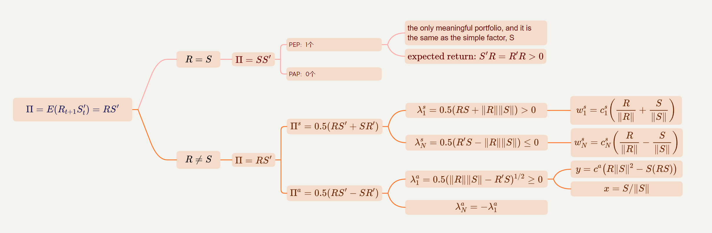

### D. Static and Dynamic Bets

在前面的例子中，信号 $S_t$ 是恒定的，这使得模型比较简单。但持续的信号意味着只有静态的交易机会。一般来说，信号会随时间波动，而PPs同时使用关于静态和动态交易机会的信息。

预测矩阵可以写成其静态和动态分量的和:

$$
\Pi=E(R_{t+1}S_t')=E(R_{t+1})E(S_t')+\mathrm{cov}(R_{t+1},S_t') \tag{39}
$$

假设信号不能预测未来的回报，也即 $\forall i,j,\; \operatorname{cov}(S_{i,t},R_{j,t+1})=0$，此时 $\Pi = E(R)E(S')$，此时得到的组合只是基于信号的时序均值，因此这种情况是静态的

若只考虑动态部分，将信号demean处理：${\tilde{S}}_{i,t}=S_{i,t}-E(S_{i,t})$

$$
E(R_{t+1}\tilde{S}_{t}^{'})=\mathrm{cov}(R_{t+1},\tilde{S}_{t}^{'})=\mathrm{cov}(R_{t+1},S_{t}^{'}) \tag{40}
$$

> <p id="p1">&nbsp;&nbsp; 📘: We find in our empirical analysis that many of the effects we see are driven by dynamic bets.</p>

---

### A summary of PP、PEPs、PAPs

<div align ='center'>

```mermaid
graph LR
    subgraph <font color='#ffffde'>子图表</font>
        id2[prediction matrix: Π] --SVD--->id1((PPs))
        id2--symmetric-->id3{Π<sup>s<sup>}
        id3--eigenvalue<br>eigenvector---id5((PEPs))
        id2--antisymmetric-->id6{Π<sup>&#945<sup>}
        id6--eigenvalue<br>eigenvector---id8((PAPs))    
    end
    id1-->id9["L=(Π'Π)<sup>-1/2</sup> Π' "]
    id5-->id9
    id8-->id10["tr(L<sup>&#945</sup>Π<sup>&#945</sup>)"]
    id10-->id9
    id9-->id11(("E(S'<sub>t</sub>LR<sub>t+1</sub>)"))
    id10-->id11
    style id1 r:25px;
```

&nbsp;

<table border="0" cellpadding="0" cellspacing="0" width="715" style="border-collapse:
 collapse;table-layout:fixed;width:500pt">
  <colgroup>
  <col width="72" style="width:100pt">
  <col width="306" style="mso-width-source:userset;mso-width-alt:9792;width:200pt">
  <col width="337" style="mso-width-source:userset;mso-width-alt:10784;width:200pt">
  </colgroup>
  <tbody>
    <tr height="19" style="height:14.25pt">
      <td height="19" width="72" style="height:14.25pt;width:54pt;border-top:1pt solid windowtext;
      border-right:1pt solid windowtext;border-bottom:1pt solid windowtext;
      border-left:none"></td>
      <td width="306" style="width:230pt;border-top:1pt solid windowtext;border-right:none;
      border-bottom:1pt solid windowtext;border-left:none">$\alpha$</td>
      <td width="337" style="width:253pt;border-top:1pt solid windowtext;border-right:none;
      border-bottom:1pt solid windowtext;border-left:none">$\beta$</td>
    </tr>
    <tr>
      <td style="border-top:none;
      border-right:1pt solid windowtext;border-bottom:#f3f3ef solid 1px;border-left:none;background:#F3F3EF;">PPs</td>
      <td style="border-top:none;border-right:none;
      border-bottom:#f3f3ef solid 1px;border-left:none;background:#F3F3EF;">$E(S'_tLR_{t+1}) - S_t' L^s S_t\lambda$</td>
      <td style="border-top:none;border-right:none;border-bottom:#f3f3ef solid 1px;
      border-left:none;background:#F3F3EF;">$S_t' L^s S_t$</td>
    </tr>
    <tr>
      <td style="border-top:none;
      border-right:1pt solid windowtext;border-bottom:#f3f3ef solid 1px;border-left:none;background:#F3F3EF;">PEPs</td>
      <td style="border-top:none;border-right:none;
      border-bottom:#f3f3ef solid 1px;border-left:none">$E(S'_tL^sR_{t+1}) - S_t' L^s S_t\lambda$</td>
      <td style="border-top:none;border-right:none;border-bottom:#f3f3ef solid 1px;
      border-left:none">$S_t' L^s S_t$</td>
    </tr>
    <tr>
      <td style="border-top:none;
      border-right:1pt solid windowtext;border-bottom:1pt solid windowtext;border-left:none;background:#F3F3EF;">PAPs</td>
      <td style="border-top:none;border-right:none;
      border-bottom:1pt solid windowtext;border-left:none;background:#F3F3EF;">$E(S'_tL^aR_{t+1})$</td>
      <td style="border-top:none;border-right:none;border-bottom:1pt solid windowtext;
      border-left:none;background:#F3F3EF;">0</td>
    </tr>
    <!--[if supportMisalignedColumns]-->
    <tr height="0" style="display:none">
      <td width="72" style="width:54pt"></td>
      <td width="306" style="width:230pt"></td>
      <td width="337" style="width:253pt"></td>
    </tr>
 <!--[endif]-->
</tbody></table></div><br>

相对于$F_{t+1}$来说，有两种方式可以获得 $\alpha$：

* 观察 $\Pi^s$ 的特征值，做多特征值为正的组合，做空特征值为负的组合
* 找到有正收益的反对称策略，因为反对称策略的因子暴露为零

## III. Asset Pricing Tests: Positivity Bounds

接下来，我们提出一个测试，看看我们的信号S是否暴露于真正的定价内核，即验证信号是否是一个贝塔

假设信号和定价核的风险暴露成比例：$S_{i,t}\propto \mathop{\mathrm{cov}}_{t}(R_{j,t+1},-M_{t+1})$

对于任意资产：$E_t((1+R_t^f+R_{j,t+1})M_{t+1})=1$

$$
E_t(R_{j,t+1})=(1+R_t^f)\text{cov}_t(R_{j,t+1},-M_{t+1})=\theta_tS_{j,t}
$$

proof：

$$
(1+R_t^f)E_t(M_{t+1})=1 \implies E_{t}(R_{j,t+1}M_{t+1})=0
$$

于是，

$$
\begin{aligned}
  E_{t}(R_{j,t+1})&=(1+R_{t}^{f})E_{t}(M_{t+1})E_{t}(R_{j,t+1})\\
  &=(1+R_{t}^{f})(E_{t}(R_{j,t+1}M_{t+1})-\mathrm{cov}_{t}(R_{j,t+1},M_{t+1}))\\
  &=(1+R_{t}^{f})\mathrm{cov}_{t}(R_{j,t+1},-M_{t+1})\\
  &=\theta_tS_{j,t}
\end{aligned}
$$

## IV. Robust Strategies: Shrinkage via PPs

> <p id="p1">&nbsp;&nbsp; 📘: In this section, we develop robust PP trading strategies by shrinking the predictability matrix.</p>

PPs 策略想要达到的两个目的:

* (i) 尽可能地从预测矩阵中获得足够的信息
* (ii) 控制参数以防止过拟合，并且保证策略有强的样本外表现

为了保证好的样本外表现，需要对预测矩阵 $\Pi$ 进行“压缩”：

In particular, if we reconstitute the matrix by retaining only the K largest singular values and zeroing out the rest, we obtain the matrix of rank K that is as close as possible to the original $\Pi$. This idea is familiar from PCA, which finds low-rank approximations to a variance-covariance matrix by zeroing out all but its largest eigenvalues.

The following proposition operationalizes the idea of robust optimal trading strategies by constraining the parameter space to position matrices with $rank(L) \leq K$

K 是一个可根据实际情况设定的参数，这里介绍了 Schatten p-norm：

$$
\|L\|_p=\left(\sum\limits_{k=1}^N|\bar{\lambda}_k(L)|^p\right)^{1/p}
$$

其中 $\bar{\lambda}_k(L)$ 是 $L$ 的第 k 个奇异值，$p \in [1,\infty)$

---

PROPOSITION 11 (General Solution): Optimal portfolios subject to $rank(L) = K$ and $\|L\|p \leq 1$, where $p \in [1,\infty)$ and $q$ is defined by $1/p+ 1/q = 1$, satisfy:

(i) 当线性策略 $L$ 没有对称的限制时，最优收益与 $\Pi$ 的前 $K$ 个最大的奇异值有关：

$$
\operatorname*{max}_{\|L\|_{p}\leq1,\operatorname{rank}(L)\leq K}E(S_{t}^{\prime}L R_{t+1})=\left(\sum_{k=1}^{K}\bar{\lambda}_{k}^{q}\right)^{1/q} \tag{45}
$$

The optimal $L$ is $S_t' L R_{t+1} = c\sum_{k=1}^{K}\bar{\lambda}_k^{q-1} PP_{t+1}^{k}$, where $ c=(\sum_{k=1}^{K}\bar{\lambda}_k^{q})^{-1/p}$

(ii) 当限制线性策略 $L$ 是对称矩阵时，最优收益与 $\Pi^s$ 的前 $K$ 个绝对值最大的特征值有关：

$$
\operatorname*{max}_{\|L\|_{p}\leq1,\operatorname{rank}(L)\leq K,L=L^{'}}E(S_{t}^{\prime}L R_{t+1})=\left(\sum_{k\in\mathcal{K}}|\lambda_{k}^{s}|^{q}\right)^{1/q} \tag{46}
$$

The optimal $L$ is $S_t' L R_{t+1} = \mathrm{c}\sum_{\mathcal{K}}|\lambda_{k}^{s}|^{q-1}\mathrm{sign}(\lambda_{k}^{s})P E P_{t+1}^{k}$, where $ c=(\sum_{\mathcal{K}}|\lambda^s_k|^q)^{-1/p}$

(iii) 当限制线性策略 $L$ 是反对称矩阵时，最优收益与 $\Pi^s$ 的前 $K$ 个最大的特征值有关：

$$
\max\limits_{\|L\|_p\leq1,\operatorname{rank}(L)\leq 2K, L'=-L}E(S'_t L R_{t+1})=\left(2\sum\limits_{k=1}^K(\lambda_k^a)^q\right)^{1/q} \tag{47}
$$

The optimal $L$ is $S_t' L R_{t+1} = c\sum_{k=1}^K(\lambda_k^a)^{q-1}PAP_{t+1}^k$, where $ c=(2\sum_{k=1}^K(\lambda_k^a)^q)^{-1/p}$

<hr>

Proposition 11 的启示：

* Optimal low-dimensional trading strategies are the same as the general optimality results proven earlier, with the exception that the strategies use only the leading PPs.
* The lesser components may be dominated by noise and therefore are likely to have poor out-of-sample performance. Zeroing them out regularizes the optimal strategy to control overfit and its adverse out-of-sample impact. 通过在前 K 个 PP 策略上“截断”，能够选取“robust”策略，排除“weak”策略(奇异值接近0)
* The optimal strategy is a weighted sum of PPs for any norm.

---

两个超参数影响 Principal Portfolios 的构成：

* K: The number of PPs included in a robust strategy, K, determines the extent of regularization. It serves as a hyperparameter that can be controlled by the researcher or tuned via cross-validation.
* p: The choice of norm simply affects how the PPs are weighted

Connection between the tuning parameters p and K: The less important PPs can be “zeroed out” by the choice of K and downweighted by the choice of p

machine learning approach: **Data-driven choices** for hyperparameters $K$ and $p$ can allow a researcher to select the level of PP model complexity best suited for constructing optimal out-of-sample strategies.

---

<span id="jump3">
<details class="details2">
<summary  style="width: 13.9em">Proof of Proposition 3:</summary>

We provide a proof in the case of a general Schatten $p$-norm considered in Proposition 11, where $p = [1, \infty]$ and $q$ is defined by $1/p + 1/q = 1$.

since $|(V'U)_{k,k}|=|V_{\text{column}k}'U_{\text{column}k}|\le\|V_{\text{column}k}\|\|U_{\text{column}k}\|=1$, we have:

$$
|\text{tr}(A)|=|\operatorname{tr}(UDV')|=|\operatorname{tr}(V'UD)|=|\sum_k d_k(V'U)_{k,k}|\le \sum_k d_k=\|A\|_1
$$

这表明任何一个方块矩阵 $A = UDV'$ 的迹，都小于它的奇异值之和

$$
|\operatorname{tr}(L\Pi)|\le \sum_k  d_k^{L\Pi} = \|\Pi L\|_1\le\|\Pi\|_q\|L\|_p
$$

Finally, equality is achieved if $L$ is proportional to $(\Pi'\Pi)^{q/2-1}\Pi'$:

$$
\arg\max\limits_{\|L\|_p\leq1}\operatorname{tr}(L\Pi)~=~(\Pi'\Pi)^{q/2-1}\Pi' / \|(\Pi'\Pi)^{q/2-1}\Pi'\|_p
$$

在 Proposition 3 中，$q=1,p\to \infty$，且 $\forall matrix\ A, \|A\|_p = \max_k \ d_k^A$

$(\Pi'\Pi)^{-1/2}\Pi' = VU'$，因此 $\|(\Pi'\Pi)^{-1/2}\Pi'\|_p=1$，于是 $L=(\Pi'\Pi)^{-1/2}\Pi'$
</details></span>

## V. Empirical Results

### A. Fama-French Portfolio Momentum

> <p id="p1">&nbsp;&nbsp; 📘: As a simple illustration of our method, we first consider the empirical performance of PPs using standard Fama-French portfolios as base assets and momentum (i.e., past returns) as the trading signal.</p>

根据 size 和 book-to-market 指标双重排序，美股，日频数据，1963.7-2019.12

* For each asset in each sample, we compute its cumulative return over the past 20 trading days (approximately one month).
* We then standardize the signal each period by converting it to a cross-sectional rank and dividing by the number of assets and subtracting the mean (mapping the signal into the [−0.5,0.5] interval).

We use this rank to predict subsequent monthly (20-day cumulative) returns on each portfolio

用“滚动窗口”的方式来估计预测矩阵：

$$
\hat{\Pi}_t=\frac{1}{120}\sum\limits_{\tau=t-120}^{t-1}R_{\tau+1}S'_\tau \tag{48}
$$

通过计算 $\hat{\Pi}_t$ 的奇异向量来构成 PPs；计算 $\hat{\Pi}_t$ 的对称和非对称部分，得到 PEPs and PAPs

---

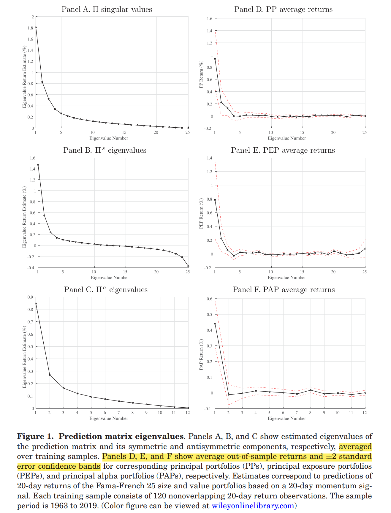

Panel A 展示了根据“滚动窗口”得到的不同时间维度上的奇异值的平均情况；Panel D 则是样本外的表现

对比 AD 可以发现：

* 事前事后的奇异值变化趋势基本一致
* Panel D 的样本外收益率出现了恶化(degradation)

> <p id="p1">&nbsp;&nbsp; 📘: In this sample, only the first two PPs and first two PEPs appear to have a significant out-of-sample return, and only the first PAP return is significant.</p>

---

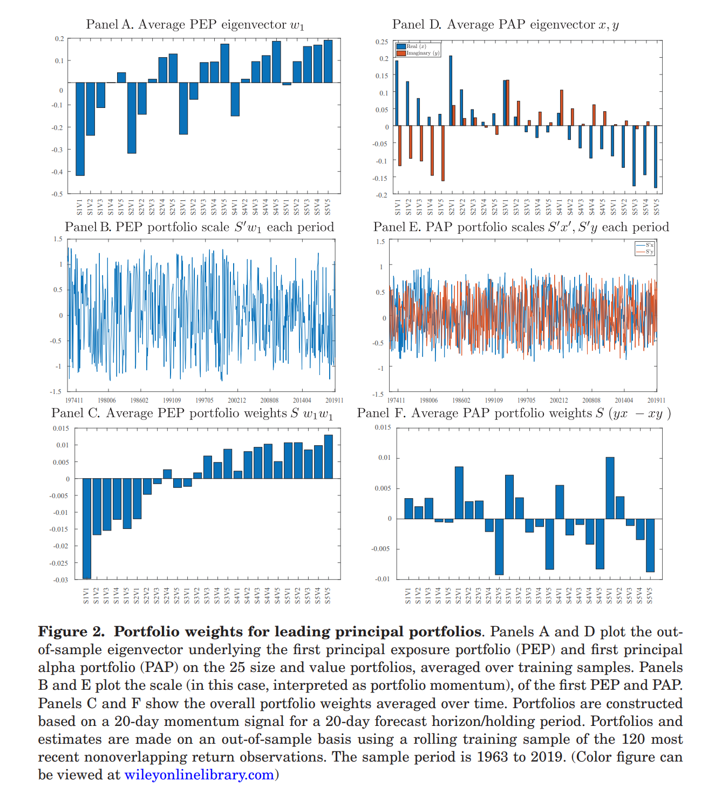

通过 Panel A 可以发现：

第一个 PEP 做多价值股，做空成长股；同时做多大市值股票，做空小市值股票

---

> <p id="p1">&nbsp;&nbsp; 📘: Figure 3 reports the return of the sum of the top three PPs (among each version: PP, PEP, and PAP), and the combination of the top three PEPs plus top 3 PAPs.</p>

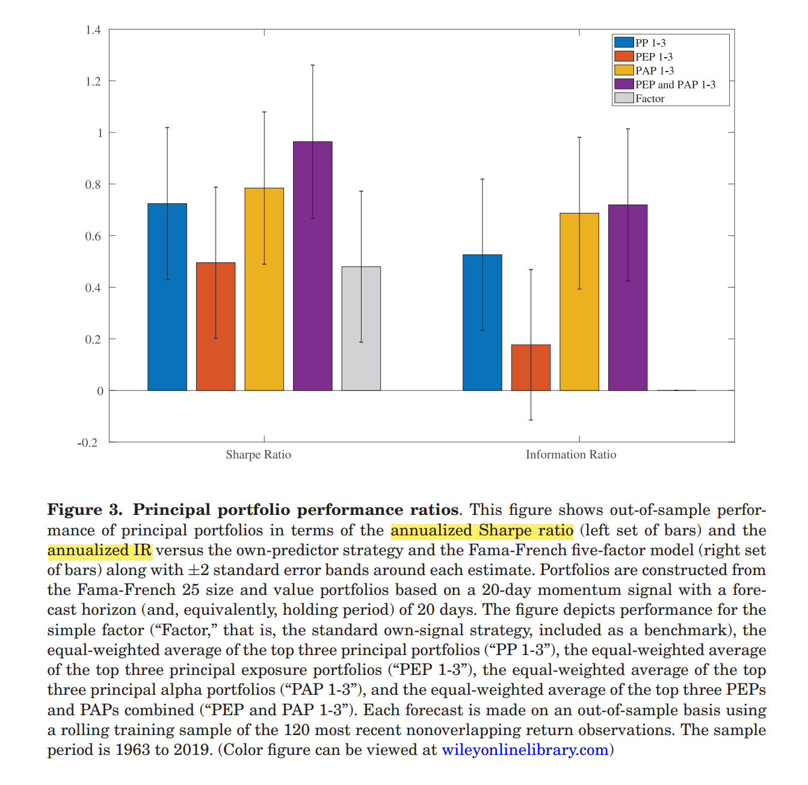

IR 由下面的回归计算得出：$\text{IR}=\alpha/\sigma(\varepsilon_t)$

$$
PP_t=\alpha+\beta^0\widetilde{F}_t+\beta^1MKT_t+\beta^2\text{SM}B_t+\beta^3HML_t+\beta^4RMW_t+\beta^5CMA_t+\varepsilon_t \tag{49}
$$

> [!TIP|label:信息比率 Information Ratio]
> 用来衡量超额风险所带来的超额收益。它表示单位主动风险所带来的超额收益。这个值越大，表明该基金表现持续优于大盘的程度越高，也就代表基金经理主动管理能力越强。

> [!NOTE|label:信息比率vs夏普比率]
> * 信息比率表示承担主动风险所带来的超额收益（相对某一指数），衡量的是基金经理的主动管理能力
> * 夏普比率表示承担风险所带来的超额收益（相对无风险利率），是从绝对收益和总风险角度来描述的，衡量的是基金的性价比<br>
> * 信息比率可以理解为当组合的因子风险全部被对冲掉之后的夏普比率

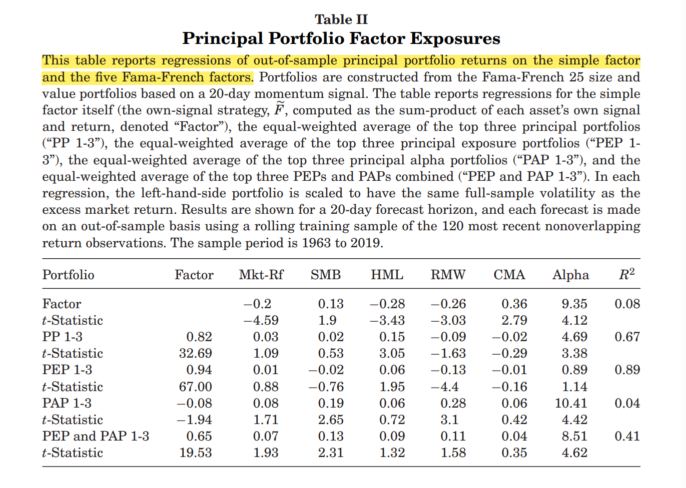

---

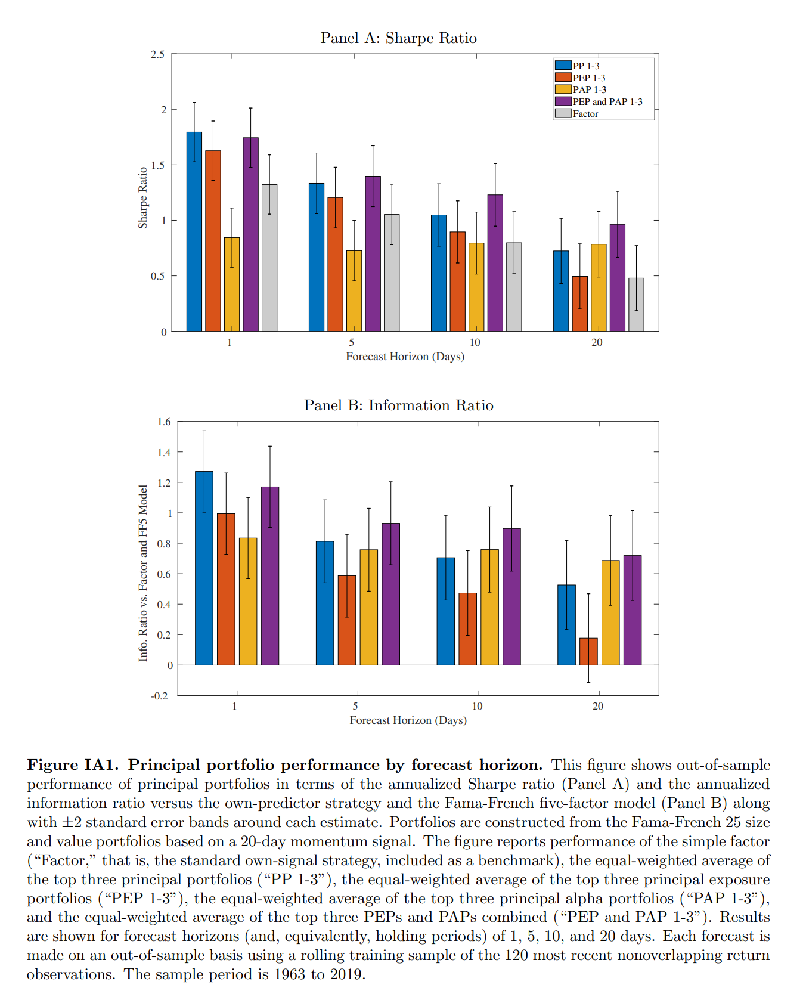

---

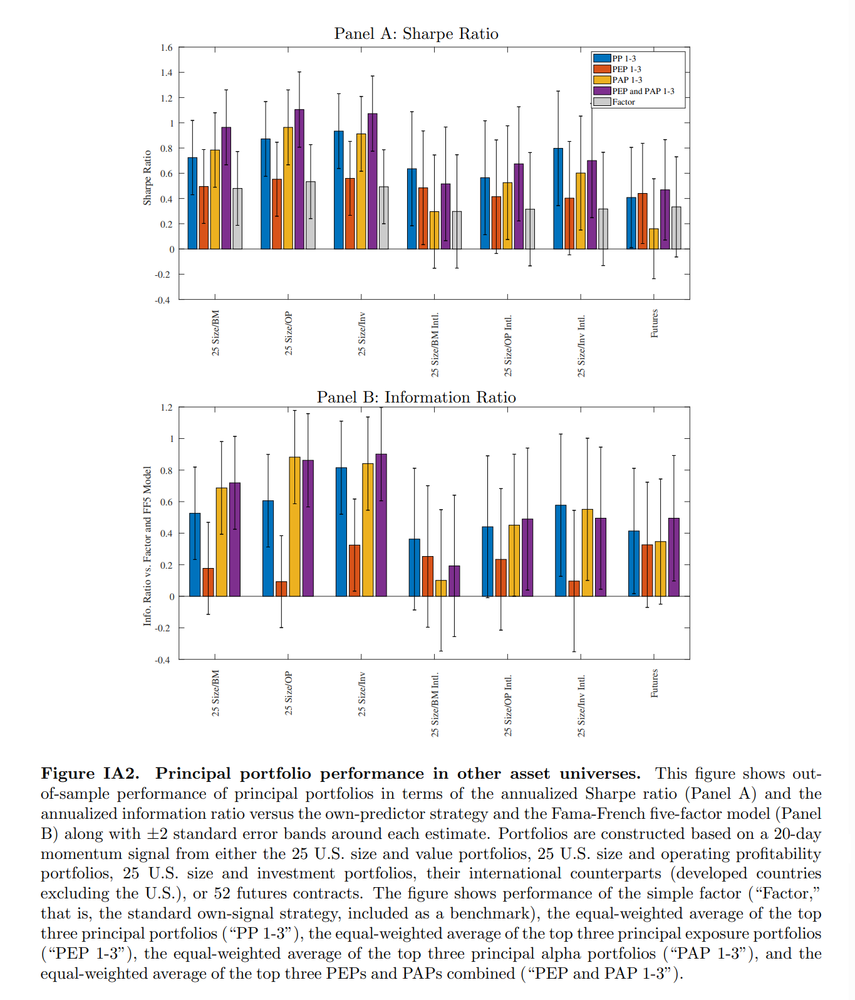

### B. Factor-Timing

月频数据；1963-2019；138个股票特征；研究这些特征各自的 Principal Portfolios 以及将138个特征结合起来的 Principal Portfolios

与第一部分的回归不同的是，这里在回归的右边又加了一项：factor portfolio based on historical mean weights

$$
PP_t=\alpha+\beta^0\widetilde{F}_t+\beta^1MKT_t+\beta^2\text{SM}B_t+\beta^3HML_t+\\ \beta^4RMW_t+\beta^5CMA_t+  \beta^6HMW_t +\varepsilon_t \tag{49}
$$

> <p id="p1">&nbsp;&nbsp; 📘: Indeed, the historical mean weight factor explains the bulk of the performance of PEP strategies, resulting in small and insignificant IRs. However, the leading PP and PAP portfolios continue to produce large and significant IRs. The leading PAP portfolio achieves an IR of 0.8 on average across all signals.</p>

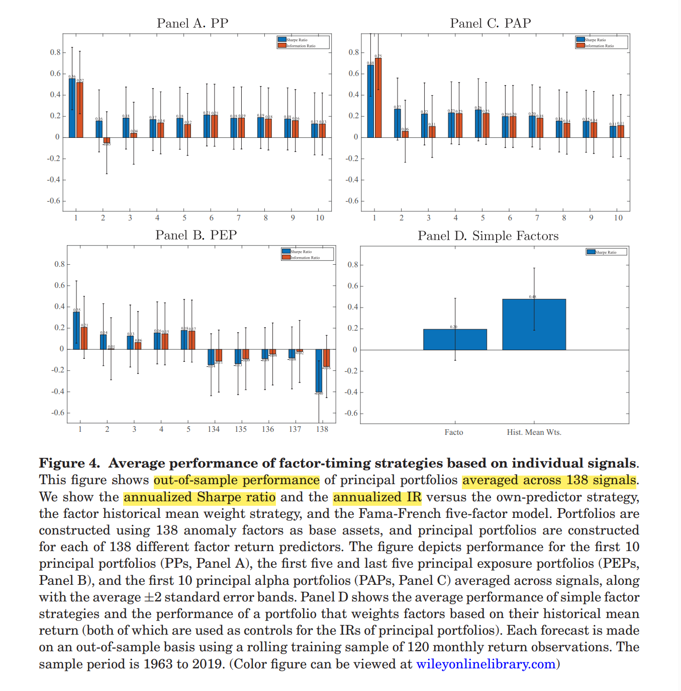

<table border="0" cellpadding="0" cellspacing="0" width="715" style="border-collapse:
 collapse;table-layout:fixed;width:600pt">
  <colgroup>
  <col width="72" style="width:50pt">
  <col width="306" style="mso-width-source:userset;mso-width-alt:9792;width:275pt">
  <col width="337" style="mso-width-source:userset;mso-width-alt:10784;width:275pt">
  </colgroup>
  <tbody>
    <tr height="19" style="height:14.25pt">
      <td height="19" width="72" style="height:14.25pt;width:54pt;border-top:1pt solid windowtext;
      border-right:1pt solid windowtext;border-bottom:1pt solid windowtext;
      border-left:none"></td>
      <td width="306" style="width:230pt;border-top:1pt solid windowtext;border-right:none;
      border-bottom:1pt solid windowtext;border-left:none">PP strategies based on
      individual signals</td>
      <td width="337" style="width:253pt;border-top:1pt solid windowtext;border-right:none;
      border-bottom:1pt solid windowtext;border-left:none">PP strategies based on
      combined signals</td>
    </tr>
    <tr height="19" style="height:14.25pt">
      <td rowspan="2" height="38" class="xl65" style="height:28.5pt;border-top:none;
      border-right:1pt solid windowtext;border-bottom:1pt solid windowtext;border-left:none;background:#F3F3EF;">Similarities</td>
      <td colspan="2" height="19" style="border-top:.5pt solid windowtext;border-right:none;border-bottom:#f3f3ef solid 1px;border-left:none;background:#F3F3EF;">each weight is calculated from PP methods using each characteristic's own signal</td>
    </tr>
    <tr height="19" style="height:14.25pt">
      <td colspan="2" height="19" style="border-top:.5pt solid windowtext;border-right:none;border-bottom:1pt solid windowtext;border-left:none;background:#F3F3EF;">$E(r)_{portfolio} = \frac{1}{138} \sum_{i=1}^{138} E\big((S_t')_i L_i R_{t+1}\big)$</td>
    </tr>
    <tr height="19" style="height:14.25pt">
      <td rowspan="2" height="38" class="xl65" style="height:28.5pt;border-top:.5pt solid windowtext;
      border-right:1pt solid windowtext;border-bottom:1pt solid windowtext;
      border-left:none;background:#F3F3EF;">Differences</td>
      <td style="border-top:.5pt solid windowtext;border-right:none;border-bottom:#f3f3ef solid 1px;border-left:none;background:#F3F3EF;">$SR = \frac{1}{138}(SR_1 + SR_2 + \cdots + SR_{138})$</td>
      <td style="border-top:.5pt solid windowtext;border-right:none;border-bottom:#f3f3ef solid 1px;border-left:none;background:#F3F3EF;">$SR$ is the combined strategy's own $SR$</td>
    </tr>
    <tr height="19" style="height:14.25pt">
      <td height="19" style="height:14.25pt;border-top:none;border-right:none;
      border-bottom:1pt solid windowtext;border-left:none">$IR = \frac{1}{138}(IR_1 + IR_2 + \cdots + IR_{138})$</td>
      <td style="border-top:none;border-right:none;border-bottom:1pt solid windowtext;
      border-left:none">$IR$ is the combined strategy's own $IR$</td>
    </tr>
    <!--[if supportMisalignedColumns]-->
    <tr height="0" style="display:none">
      <td width="72" style="width:54pt"></td>
      <td width="306" style="width:230pt"></td>
      <td width="337" style="width:253pt"></td>
    </tr>
 <!--[endif]-->
</tbody></table>

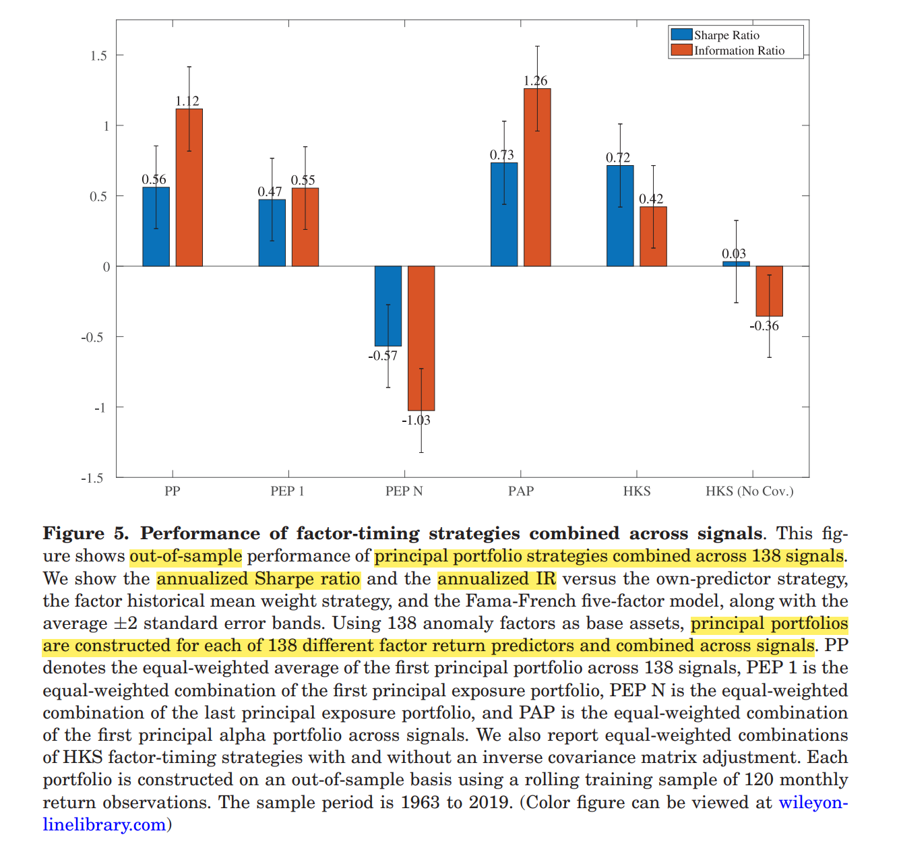

<hr align = "center" size = 5 color = 'lightgreen'/>

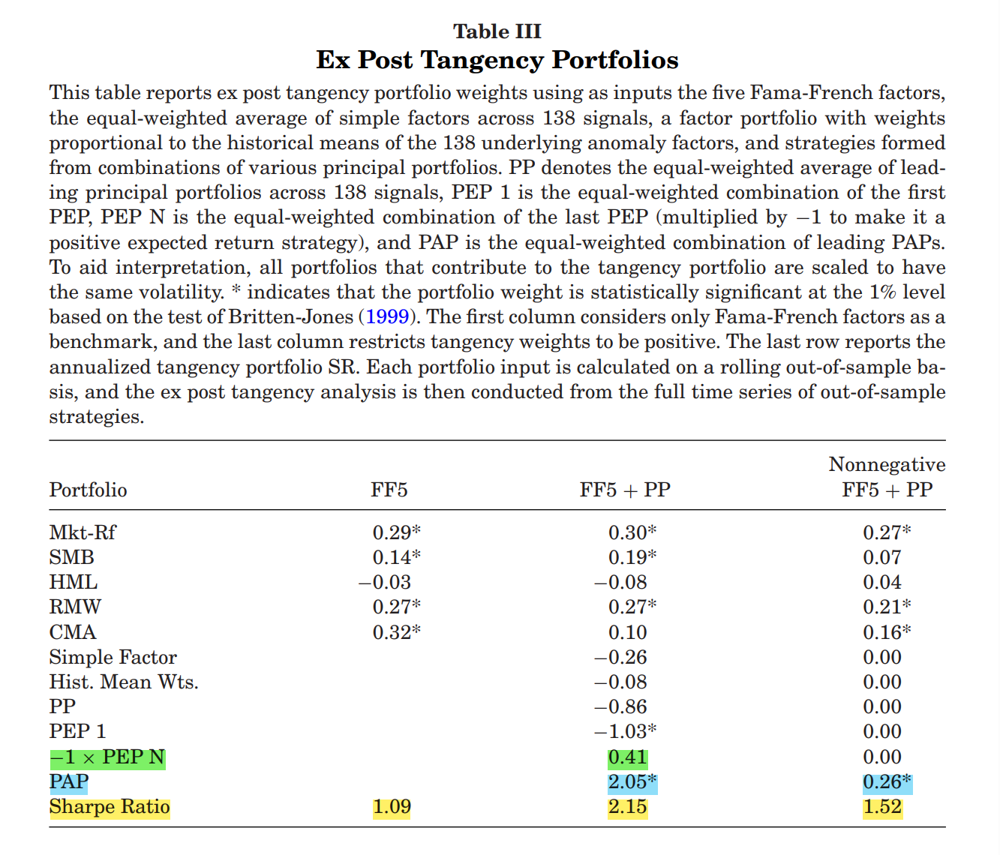

## VI. Conclusion

<div align ='center'>

```mermaid
graph TB
    subgraph Summary
        direction TB
        id1 --"提出<font color=blue>不同资产间</font><font color=red>不同特征</font>的<br>交叉预测性(股票截面+特征截面)"-->id10["E(S'<sub>t</sub>L<sup>3</sup>R<sub>t+1</sub>)"]
    end
    subgraph Summary
        direction LR
        id1("S'<sub>t</sub>R<sub>t+1</sub><br>特征只预测对应股票的收益，无交叉预测性")--"提出<font color=blue>不同资产间</font><font color=red>同一特征</font>的<br>交叉预测性(截面预测)"-->id2["E(S'<sub>t</sub>LR<sub>t+1</sub>)"]
        id2==max==>id3(("tr(LR'<sub>t+1</sub>S<sub>t</sub>)"))
        id3--提出预测矩阵-->id9((Π=R'<sub>t+1</sub>S<sub>t</sub>))
        id3--解一-->id4(("L=(Π'Π)<sup>-1/2</sup> Π' "))
        id3--解二-->id5(("tr(L<sup>s</sup>Π<sup>s</sup>)+tr(L<sup>&#945</sup>Π<sup>&#945</sup>)"))
        id4-->id6((PPs))
        id5-->id7((PAPs))
        id5-->id8((PEPs))
    end
```

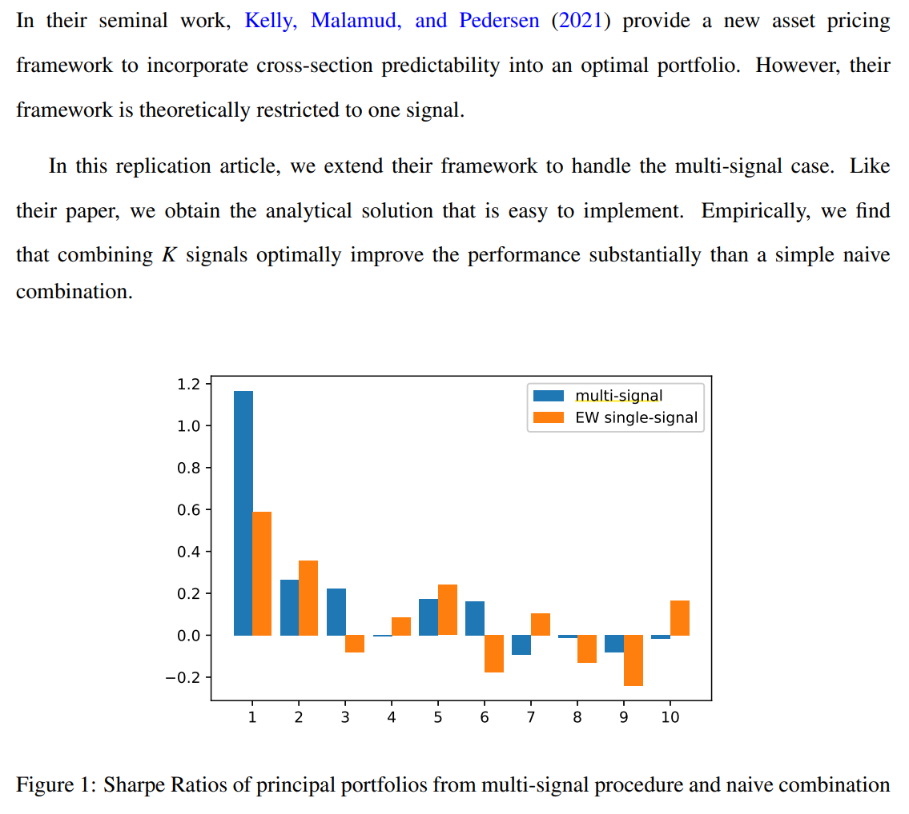
</div>