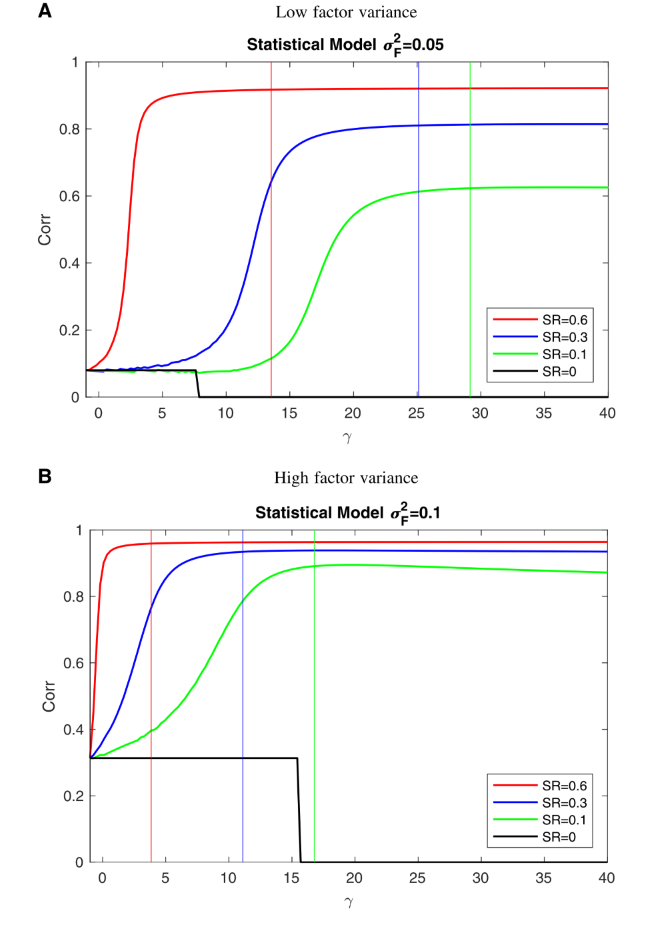
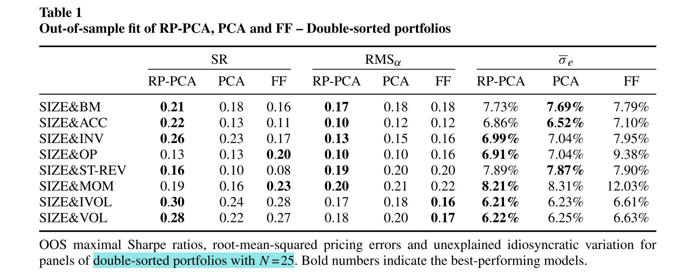
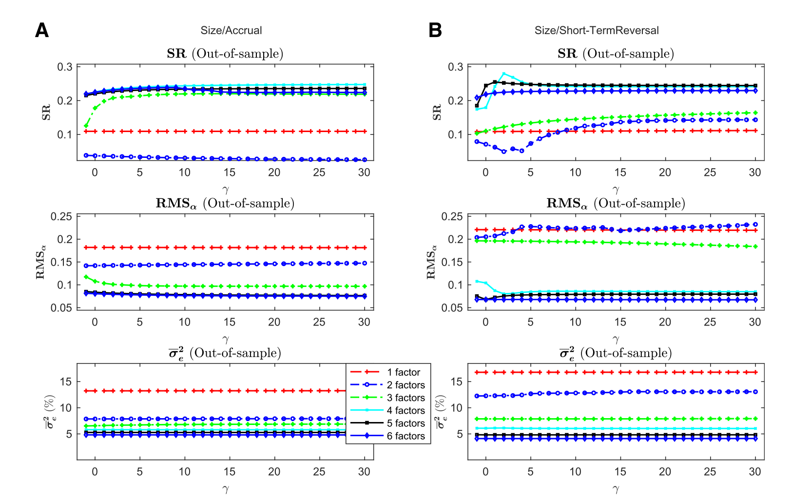
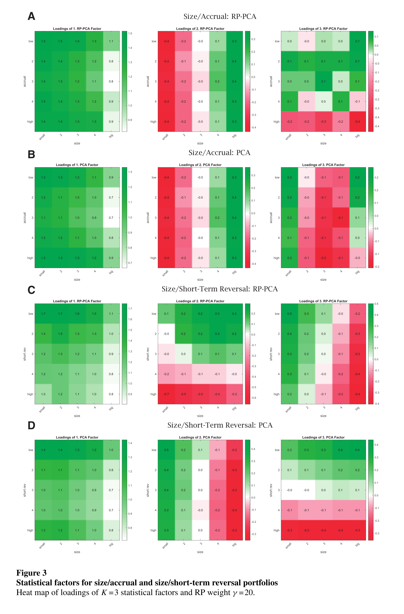
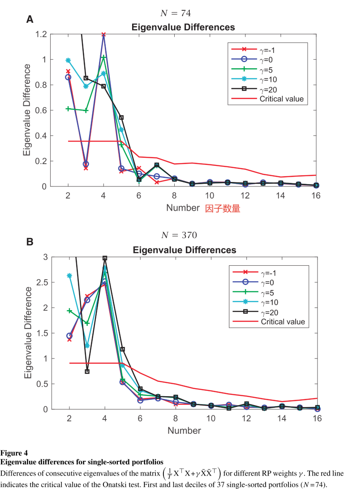
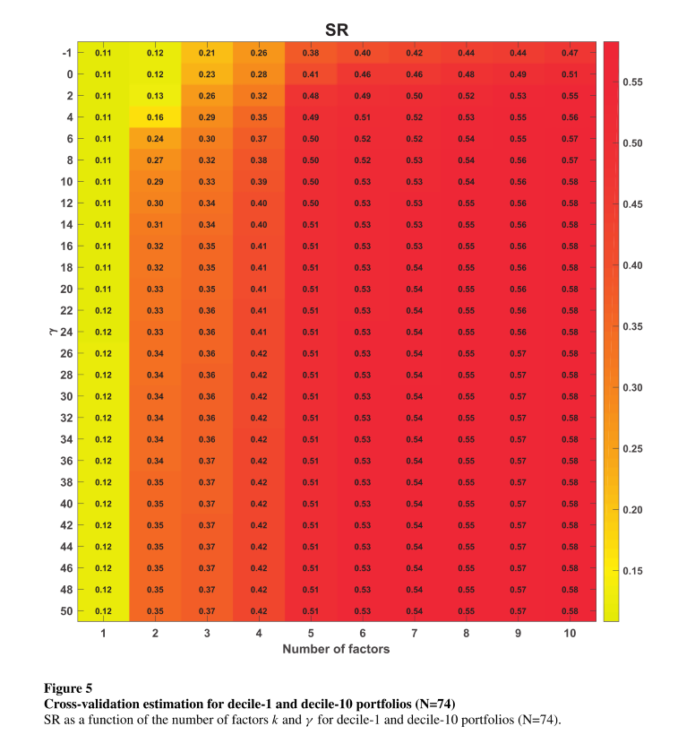
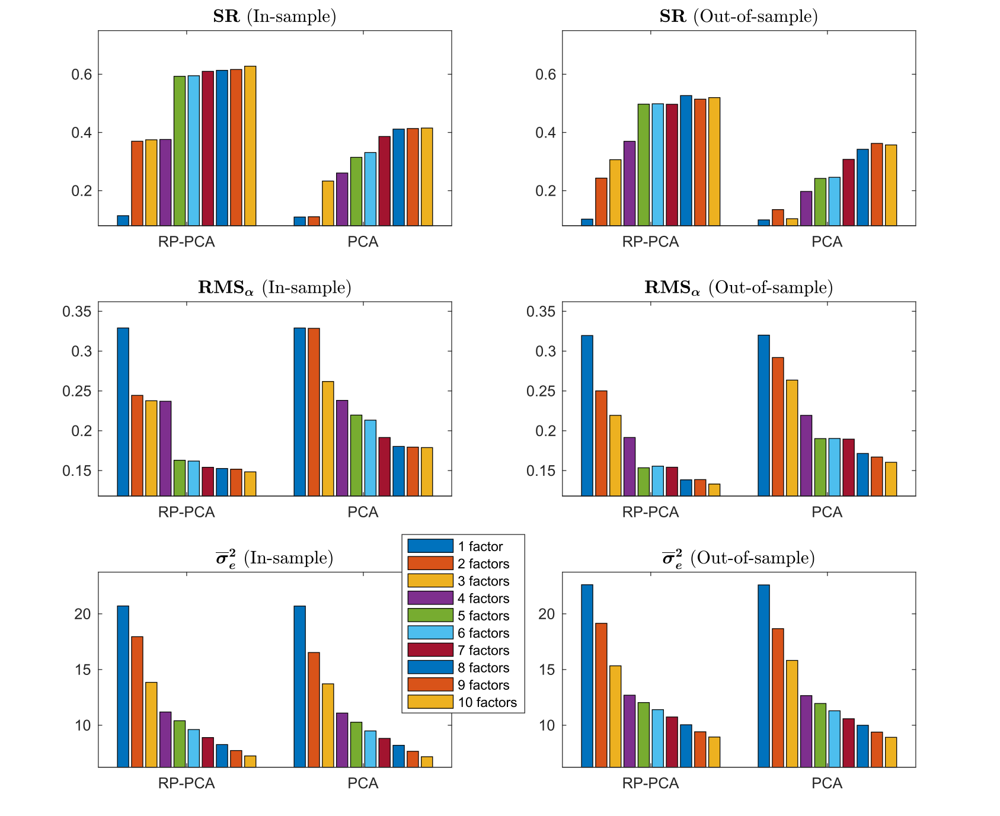
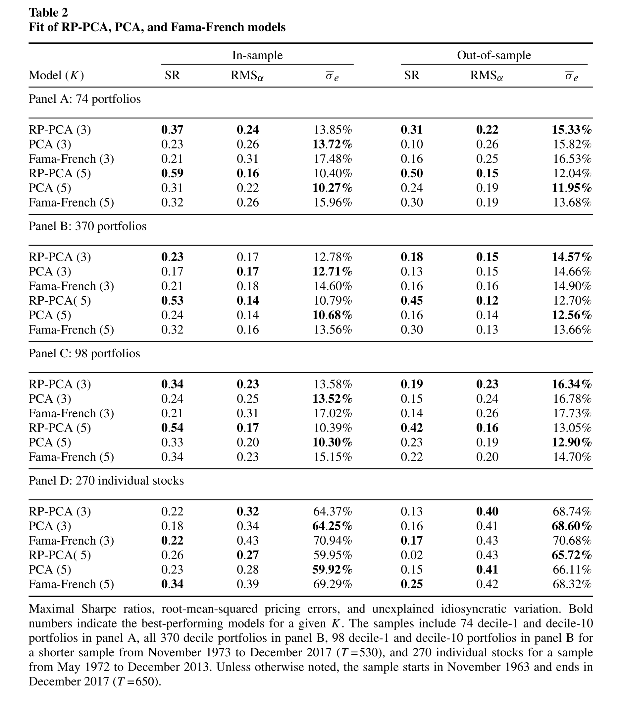
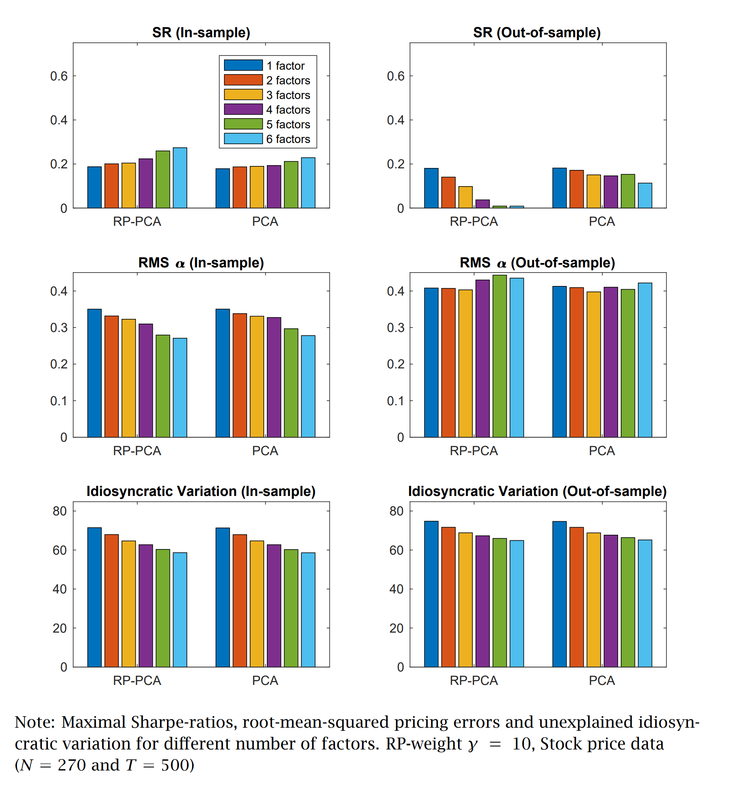
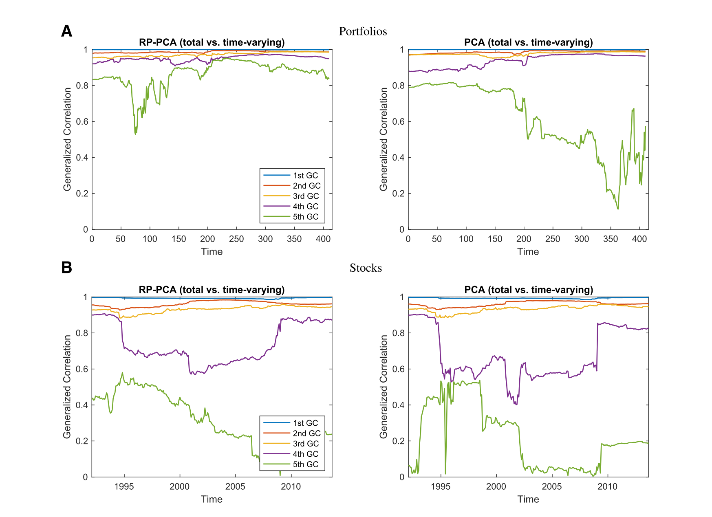

# RP_PCA

 **Factors That Fit the Time Series and Cross-Section of Stock Returns**

 **Journal:**

Review of Finanical Studies

 **Authors:**

* Martin Lettau:
  
  Haas School of Business, University of California at Berkeley, NBER and CEPR
* Markus Pelger:
  
  Department of Management Science & Engineering, Stanford University

## Abstract

We propose a new method for estimating $\text{\color{red}{latent}}$ asset pricing factors that fit the time series and cross-section of expected returns. Our estimator generalizes principal component analysis (PCA) by including a penalty on the pricing error in expected returns. Our approach finds $\text{\color{red}{weak factors}}$ with high Sharpe ratios that PCA cannot detect. We discover five factors with economic meaning that explain well the cross-section and time series of characteristicsorted portfolio returns. <mark>The out-of-sample maximum Sharpe ratio of our factors is twice as large as with PCA with substantially smaller pricing errors. Our factors imply that a significant amount of characteristic information is redundant. </mark>

<strong>“weak” factors:</strong>

* factors that affect only a subset of the underlying assets

* Weak factors are harder to detect than “strong” factors that affect all assets (“market” factor).

## Introducion

* Cochrane (2011), “factor zoo”:
  * which risk factors are important
  * which factors are subsumed by others

寻找可以同时解释共同运动（时间序列上）和预期收益横截面的因素的理论基础：
**APT认为: 系统的时间序列因素也决定了横截面风险溢价**

## 1. Methodology

**假设:**

1. 超额收益遵循标准近似因子模型

2. 套利定价理论的假设条件得到满足

有了上述的假设，我们便可认为N个资产在T期的收益率满足如下形式：

$$
X_{nt}=F_t\land_n^T+e_{nt}    \qquad  n=1,...,N, \quad t=1,...,T  \qquad (2)
$$

$$
\iff \underbrace{X}_{T×N}=\underbrace{F}_{T×K}\quad\underbrace{\land^T}_{K×N}+\underbrace{e}_{T×N}
$$

在这里，我们需要估计两个部分：潜在因子F和因子暴露$\land（\beta）$

>[!TIP|label:key point]
>这里X代表资产的超额收益率
>在此之前的一些研究都假设X的期望应该为0 (demean)，但如果收益率矩阵X的期望中包含了关于因子结构的信息，那么这一假设便是不合理的;
>因此RP_PCA对此进行了改善，以达到运用X的期望所包含信息的目的：
>$$\overline{X}=E[X] \not ={0} \\ \overline{F}=E[F] \not ={0} $$

**PCA vs RP_PCA**

### 1.1 PCA method

PCA方法的目标函数：
$$\text{PCA}: \qquad \hat{F}_{PCA}, \hat{\land}_{PCA} = \mathop{argmin}\limits_{\land,F}  \frac{1}{NT} \sum\limits_{n=1}^{N} \sum\limits_{t=1}^{T}  \big  ((X_{nt}-\overline{X}_n)-(F_t-\overline{F})\land_n^T \big)^2 \qquad (3)
$$
这里其实是 $var(X) = E \big(X - E(X)\big)^2$的形式

对(3)式进行变形：

$$
\begin{array}{lll}
  \hat{F}_{PCA}, \hat{\land}_{PCA} & = & \mathop{argmin}\limits_{\land,F}  \frac{1}{NT} \sum\limits_{n=1}^{N} \sum\limits_{t=1}^{T}  \big  ((X_{nt}-F_t\land_n^T) - (\overline{X}_n-\overline{F}\land_n^T)\big)^2 \\
   & & \\
   & = & \mathop{argmin}\limits_{\land,F} \frac{1}{N}\sum\limits_{n=1}^{N}  E \big(e_{nt} - E(e_{nt})\big)^2 \\
   & & \\
   & = & \mathop{argmin}\limits_{\land,F} \frac{1}{N}\sum\limits_{n=1}^{N} var(e_{n})
\end{array}
$$

>[!TIP|label:提示]
>
>$\qquad e_{nt} = X_{nt}-F_t\land_n^T$
>
>$\qquad E(e_{nt}) = e_n = E(X_{nt}-F_t\land_n^T) = \overline{X}_n-\overline{F}\land_n^T ，e_n$ 代表第n个资产在所有时间段T期内的期望定价误差

Conventional statistical factor analysis applies PCA to the **sample covariance** matrix:
$$\Sigma_X = \frac{1}{T}X^TX-\overline{X}*\overline{X}^T$$
where $\overline{X}$ denotes the **sample mean** of excess returns

$$
\begin{bmatrix}
{X_{11}}&{X_{21}}&{\cdots}&{X_{N1}}\\
{X_{12}}&{X_{22}}&{\cdots}&{X_{N2}}\\
{\vdots}&{\vdots}&{\ddots}&{\vdots}\\
{X_{1T}}&{X_{2T}}&{\cdots}&{X_{NT}}\\
\end{bmatrix}_{T\times N}
$$

$\overline{X}_i = \frac{1}{T} \sum\limits_{j=1}^{T}X_{ji}$

$$
\overline{X} =
\begin{bmatrix}
{\frac{1}{T}(X_{11}+X_{12}+\dots + X_{1T})}\\
{\vdots}\\
{\vdots}\\
{\frac{1}{T}(X_{N1}+X_{N2}+\dots + X_{NT})}\\
\end{bmatrix}_{N\times 1}
$$

* 传统的PCA方法主要步骤如下:
  * 首先对资产收益率的variance-covariance matrix$\Sigma_X$进行正交分解，得到N个**互相垂直**的特征向量，而特征向量对应的特征值便是这个特征向量的方差。
  * 其次，选择方差最大的K个特征向量作为等式(2)中因子载荷$\land$的估计值：$\hat{\land}_{PCA} $，这K个特征向量也代表了所谓的主成分(principal component)
  * 最后，再根据估计出的因子载荷 $\hat{\land}_{PCA} $，利用OLS方法，得到因子F的估计值：
  $$\hat{F}_{PCA}=X  \hat{\land}_{PCA}  (\hat{\land}^T_{PCA}  \hat{\land}_{PCA})^{-1}$$

$$\Sigma_X = Q^Tdiag(\lambda_1，\lambda_2,\dots,\lambda_n)Q$$

$$=\begin{bmatrix}
  {q_1^T}\\
  {q_2^T}\\
  {\vdots}\\
  {q_n^T}\\
\end{bmatrix}
\begin{bmatrix}
  {\lambda_1}&{0}&{\cdots}&{0}\\
  {0}&{\lambda_2}&{\cdots}&{0}\\
  {\vdots}&{\vdots}&{\ddots}&{\vdots}\\
  {0}&{0}&{\cdots}&{\lambda_n}\\
\end{bmatrix}
\begin{bmatrix}
  {q_1}&{q_2}&{\cdots}&{q_n}  
\end{bmatrix}
$$

>[!TIP|label:提示]
>有的PCA做法是先对收益率矩阵X进行demean处理，然后求协方差矩阵，最后对协方差矩阵进行正交分解$\\$
>如果对X进行了demean处理，那么 $\overline{X}$ 在这里是一个0向量$\\$
>此时 $\Sigma_X = \frac{1}{T}X^TX$

### 1.2 RP_PCA method

#### 1.2.1 objective function

$$
\text{RP\_PCA}: \qquad \hat{F}_{RP}, \hat{\land}_{RP} = \mathop{argmin}\limits_{\land,F}  \underbrace{\frac{1}{NT} \sum\limits_{n=1}^{N} \sum\limits_{t=1}^{T} (X_{nt}-F_t\land_n^T)^2}_{\text{unexplained TS variation}}    +  \gamma \ \underbrace{ \frac{1}{N} \sum\limits_{n=1}^{N}(\overline{X}_n- \overline{F}\land_n^T)^2}_{\text{cross-section pricing error}}   \qquad (4)
$$

这里$\gamma \geqslant$ −1 ，它代表平均截面定价误差在整个目标函数中的权重，这也是RP_PCA方法和PCA方法的不同之处

**cross-sectional pricing errors are taken into account:**

**the difference between the mean excess returns $\overline{X}$ and the fitted model-implied mean  $E[\hat{F}_{t}] \hat{B}^n_{t}$**

&nbsp;
**[《Estimating latent asset-pricing factors》](https://www.sciencedirect.com/science/article/pii/S0304407620300051)Martin Lettau, Markus Pelger**

**We show that RP-PCA minimizes jointly the unexplained variation and pricing error:**

$$
\text{RP\_PCA}: \qquad \hat{F}_{RP}, \hat{\land}_{RP} = \mathop{argmin}\limits_{\land,F}  \underbrace{\frac{1}{NT} \sum\limits_{n=1}^{N} \sum\limits_{t=1}^{T} (\widetilde{X}_{nt} -   \widetilde{F}_t \land_n^T)^2}_{\text{unexplained TS variation}}    +  (\gamma+1) \ \underbrace{ \frac{1}{N} \sum\limits_{n=1}^{N}(\overline{X}_n- \overline{F}\land_n^T)^2}_{\text{cross-section pricing error}}
$$

其中：

$$
\widetilde{X}_{t} = X_t - \overline{X}
$$

$$
\widetilde{F}_{t} = F_t - \overline{F}
$$

因此RP_PCA目标函数的第一项其实就是PCA的目标函数，也即[等式(2)](#jump)的OLS目标函数；

第二项代表将每个资产(n = 1,2, $\dotsb$ ,N)先在时序上取期望后，每个资产在截面上的定价误差。

这里前后对于X和F的处理不一样，前后将X和F进行demean处理，而第二项没有对X和F进行demean处理，因此对二维随机变量 $e_{nt}$ 在时序上取期望后，$E(e_{nt}) = e_n$ 并不为0，根据APT的假设，$E\big(E(e_{nt})\big)  = E(e_n) = 0$，即对二维随机变量 $e_{nt}$ 在时序和截面上取两次期望后，其期望为0。

因此，RP_PCA目标函数第二项的完整版：

$$
\begin{array}{ll}
 & \frac{1}{N} \sum\limits_{n=1}^{N}(\overline{X}_n- \overline{F}\land_n^T)^2\\
 & \\
= & \frac{1}{N} \sum\limits_{n=1}^{N} \big((\overline{X}_n- \overline{F}\land_n^T) - E(\overline{X}_n- \overline{F}\land_n^T)\big)^2\\
 & \\
= & \frac{1}{N} \sum\limits_{n=1}^{N} \big((e_n) - E(e_n)\big)^2\\
 & \\
= & var(e_n)
\end{array}
$$

#### 1.2.2 objective matrix

等式(4)的目标函数相当于对如下矩阵$\Sigma_{RP}$应用PCA方法：

$$
\Sigma_{RP}=\frac{1}{T}X^TX + \gamma\overline{X}*\overline{X}^T \tag{5}
$$

* standard PCA using the variance-covariance matrix or the second-moment matrix is a special case of RP-PCA
* RP-PCA with $\gamma$>−1 can be understood as PCA applied to a matrix that $\mathbf{“overweights”}$ the means

different $\gamma$:

* $\gamma=0$, the RP-PCA objective is identical to the OLS objective function,  the OLS estimate $\hat{B}_n$	 in Equation (9) is equal to the RP-PCA estimator $\hat{\land}_n$
* $\gamma=-1$, is similar to PCA, but in PCA  method $X_n$ and $\hat{F}$ are demeaned

#### 1.2.3 estimate RP_PCA model

$$X_{nt}=F_t B_n^T+e_{nt} \qquad(9) $$

等式(2)中的因子模型意味着没有截距项，因此残差 $e_{nt}$ 的期望不一定为0(截距项被包含在 $e_{nt}$ 中了)。
作为替代，我们可以利用等式(10)中的定价误差 $\alpha_n$ 来评估RP_PCA模型

$$X_{nt}=\alpha_n+F_t B_n^T+e_{nt} \qquad (10)$$

等式(10)中，由于有了截距项 $\alpha_n$，则残差部分的信息被 $\alpha_n$ 吸收，此时残差 $e_{nt}$ 的期望为0，这里也假设了 $\alpha_n$ 的期望为0

>[!NOTE|label:提示]
>虽然OLS的时候对X和F进行了demean处理，$e_{nt}$ =0，但这只是为了用OLS来估计因子F。为了评估模型的好坏，我们需要用带有截距项的等式(10)，希望截距越接近0越好。而不是没有截距项的等式(9)

#### 1.2.4 A Summary for RP-PCA Method

$
\begin{array}{ll}
 \text{1.} & \mathbf{对矩阵 \frac{1}{T}X^TX + \gamma\overline{X}*\overline{X}^T 应用PCA方法得到前K个主成分，作为因子载荷\land的估计，也即 \hat{\land}} \\
 & \\
 \text{2.} & \mathbf{使用 \hat{\land} 在等式(9)中来估计因子: \hat{F}=X \hat{\land} (\hat{\land}^T  \hat{\land})^{-1}} \\
 & \\
 \text{3.} & \mathbf{对于每个资产n，使用 \hat{F} 来估计等式(10)中的 \hat{\alpha} , \hat{B} 和 \hat{e}} \\
 & \\
 \text{4.} & \mathbf{分别使用 \hat{\alpha} 和 \hat{e} 来估计 {RMS}_\alpha 和 \overline{\sigma}^2_e} \\
 & \\
 & {RMS}_\alpha = \sqrt {\hat{\alpha}^T\hat{\alpha}/N}  \\
 & \\
 & \overline{\sigma}^2_e = avg(Var(\hat{e}_n)/Var(X_n)) \\
 & \\
 \text{5.} & \mathbf{计算可以从估计出的潜在因子 \hat{F} 构建的最大\text{Sharpe Ratio}}
\end{array}
$

#### 1.2.5 Some proofs

>[!TIP|label:提示]
>$\gamma$为何从-1开始

协方差的定义：
$$
Cov(X,Y) = E[\big(X -E(X) \big) \big(Y -E(Y) \big)]
$$

$$
=E(XY) - E(X)E(Y)
$$

如果是总体协方差：
$$
Cov(X,Y) = \frac{1}{n} \sum\limits_{i=1}^{n} (x_i -\overline{x})(y_i -\overline{y}) $$

$$
=\frac{1}{n} \sum\limits_{i=1}^{n} x_i y_i - \overline{x}\ \overline{y}
$$

把X，Y都理解为n×1的向量，则：
$$
\frac{1}{n} \sum\limits_{i=1}^{n} x_i y_i - \overline{x}\ \overline{y}
$$

$$
=\frac{1}{n} \vec{X}^T \vec{Y} - \overline{X}\ \overline{Y}^T
$$

在PCA方法中，收益率矩阵 $X_{T×N}$ 是二维的，对其求协方差其实是消除时间 T 这一维度，因此 $X_{T×N}$ 的协方差为：

$$
\frac{1}{T} X^TX - \overline{X}*\overline{X}^T
$$

而RP_PCA想要利用一阶矩的信息，于是在PCA的目标矩阵后再加上m个由资产均值向量组成的矩阵，即：

$$
\begin{array}{ll}
 & \frac{1}{T} X^TX - \overline{X}*\overline{X}^T + m \overline{X}*\overline{X}^T \\
 & \\
= & \frac{1}{T} X^TX + \text{\color{red}{(m-1)}} \overline{X}*\overline{X}^T\\
 & \\
= & \frac{1}{T} X^TX + \textcolor{red}{ \gamma}\ \overline{X}*\overline{X}^T\\
\end{array}
$$

这里的 m-1 其实就是RP_PCA的目标矩阵中的参数 $\gamma$，$\gamma$ = m-1
由于RP_PCA想要在PCA的基础上再利用一阶矩的信息，因此给一阶矩的权重肯定为正，所以 $m \geqslant0$，所以 $\gamma \geqslant -1$

>[!NOTE|label:特别注意]
>$\overline{X}*\overline{X}^T$不是对角矩阵，虽然它的秩是1

#### 1.2.6 estimating SDF

Lettau and Pelger (Forthcoming) show theoretically that the RP-PCA estimator is (asymptotically) more efficient than standard PCA in the sense that the stochastic discount factor (SDF) and factors estimated by RP-PCA are more highly correlated with the true SDF and factors than those estimated by PCA.

有了F的估计量，我们可以估计SDF：

* 根据F的数据，计算由这些因子的期望方差数据构成的有效前沿的最大夏普比率：
&nbsp;
   $\hat{b}_{MV} = \Sigma_{F}^{-1} \mu_F$  $\quad$(其中$\mu_F$和$\Sigma_{F}^{-1}$分别代表$\hat{F}$的期望向量和方差矩阵)
&nbsp;

* 如果$\Sigma_{F}$是对角矩阵，则：
&nbsp;
   $\hat{b}_{MV,i} = \frac{\mu_{F,i}}{\sigma^2_{F,i}} $ 
&nbsp;

* 由此可以得到SDF：
&nbsp;
 $M_t = \hat{b}_{MV}^T(\hat{F}_T - E[\hat{F}_T]) $ 

### 1.3 Properties of RP-PCA

#### 1.3.1 ‘strong factors’ and 'weak factors'

Lettau and Pelger认为，对因子的估计，取决于因子的“**信号强度**”相对于特质性风险，也即 “噪声” 方差的大小；
RP_PCA方法将一阶矩的信息纳入进来，提高了因子的信号强度，从而提高了**信噪比**

**通过对因子载荷的适当标准化，因子的强度取决于载荷$\beta$的结构$\land$**

* 在一个全部都是“强因子”的模型中，$\land^T\land/N \stackrel{p}{\rightarrow}  I_K$

* 在一个全部都是“弱因子”的模型中，$\land^T\land \stackrel{p}{\rightarrow}  I_K$

>[!NOTE|label:提示]
>根据前面的分析，因子的载荷是由$\Sigma_X$的前K个特征值对应的特征向量组成，这些向量互相之间正交，因此不难理解$\land^T\land$是一个对角矩阵，再进行相应的标准化，可以近似单位矩阵$\\$“弱因子”只在一部分资产上的载荷显著不为0，因此某一“弱因子”在所有测试资产上的载荷平方和肯定很小，所以其协方差矩阵不用除以N便可近似为单位矩阵

**一般的模型同时包含“强因子”和“弱因子”，因此，若运用PCA方法直接对 $\Sigma_X$ 进行分解，那么：**

* "强因子"由于方差较大，其特征值相应很大，因此会被选为"主成分"；

* “弱因子”由于方差较小，其特征值相应很小，可能不会被选为“主成分”，这会对估计造成偏误

**作者认为：因子的“信号强度”相对于特质性风险的大小，有一个阈值(threshold),**

* 如果低于这个阈值，那么这个因子很难用PCA或RP_PCA方法检测到；
* 如果高于这个阈值，那个这个因子能被检测到，且它与现实市场中某个因子的会有很高的相关性
  
RP_PCA方法中，通过改变参数 $\gamma$ 的大小，可以提高因子的强度，使得“弱因子”更容易被检测到，整体的估计相对于PCA方法也更精确。此外，阈值 (threshold) 的大小和 $\gamma$ 无关，因此可以通过改变 $\gamma$，使得因子的强度发生变化。

**对不同数据的分析结果如下：**

* 对“强因子”的估计：强因子可以用基于PCA的方法可靠地估计，且它们与 $\gamma$ 的选取无关

* 对“弱因子”的估计：

  * 即使N和T增长，弱因子也只能被有偏差地估计
  
  * 如果一个因子的信号强度低于阈值，则根本无法检测到；只有通过改变 $\gamma$ 的取值，才可能被检测到
  
  * 存在一个有限的 $\gamma$ ，使得估计出的因子与真实因子的相关性最大，并且只要 $\gamma$ >−1,其估计出的因子与真实因子的相关性大于用PCA方法得到的结果

#### 1.3.2 How should the optimal $\gamma$ be chosen?

**简要来说，$\gamma$ 的选取有如下三条参考标准：**

1. 一个非常大的 $\gamma$ 能最大化检测到弱因子的概率，但同时会降低其与真实因子的相关性
2. 如果 $\gamma$ 选取的非常大，会造成样本外表现的恶化
3. 实证的做法：$\gamma$ 从-1开始增大，直到样本外表现不再提升

<strong>

对于Sharpe Ratio为正的因子：
$\gamma$ 较小时，随着 $\gamma$ 的增加，估计因子和真实因子的相关性快速增加，$\gamma$ 增加到一定程度时，相关性不会因为 $\gamma$ 的增加继续提升

对于Sharpe Ratio为0的因子：
$\gamma$ 越大，估计因子和真实因子的相关性反而会降低，此时最优 $\gamma$ 为-1，因为均值为0的因子，其均值不包含任何有用的信息，此时较高的 $\gamma$ 会增加对无信息横截面误差的权重
</strong>

**Figure 1
Weak factors: Correlation of estimated factor with the true factor** $\\$
This plot shows the correlation of the estimated factor with the true factor as a function ofγ for different parameter
settings implied by the theoretical results of the weak factor model (N=370 and T =650).

对于同一条线（Sharpe Ratio相同），$\gamma$ 越大，代表给均值信息赋予的权重越大，那么相关性也会越大

对于同一条线（Sharpe Ratio相同），但不同的方差（上下两图），可以发现方差越大时，其与真实因子的相关性越大

## 2. Empirical Results

因子和因子载荷是在20年(T=240)的**滚动窗口**中估计的,利用这些估计的载荷，包括截至时间T的信息，可以预测T+1的收益，并在T+1处获得样本外定价误差

当展示实证结果时，将因子的协方差矩阵标准化更有用，即 $\Sigma_F = I_K$，这是因为当比较不同的因子模型时，因子载荷必须是可比较的。

整体模型不受任何标准化的影响

### 2.1 Double-sorted portfolios

共有八组数据，每一组数据都是经过双重排序后，由25个投资组合构成的新组合
这里比较了RP_PCA、PCA、FF3三种模型的**样本外估计结果**

**结果分析：**

在八种情况中，有六种情况下，RP_PCA的Sharpe Ratio大于PCA和FF3的Sharpe Ratio，且RP_PCA的 $RMS_\alpha$ 最小，此外，RP_PCA 在样本外残差方面的表现也更好

**不同的PCA方法可能会影响因子被选择的顺序，** 以size/short-term reversal这组资产为例:

* 在RP_PCA方法中，对这组资产提取的第二个因子是 reversal factor，第三个因子是 size factor；

* 而在PCA方法中，对这组资产提取的第二个因子是 size factor，第三个因子是 reversal factor;

**原因是 reversal factor 捕获了平均收益差异的信息，因此在RP_PCA估计中被赋予了更高的权重**

**Figure 2
Out-of-sample results as a function of $\gamma \\$**
Out-of-sample maximal Sharpe ratios, root-mean-squared pricing errors, and unexplained idiosyncratic variation
for different number of factors and $\gamma$. **Left: Size/Accrual. Right: Size/Short-Term Reversal.**

对 Size/Accrual 这一组资产来说，当加入第三个因子的时候，样本外SR大幅提升，且样本外  $RMS_\alpha$ 大幅降低；
对 Size/Short-Term Reversal 这一组资产来说，当加入第四个因子的时候，样本外SR大幅提升，且样本外 $RMS_\alpha$ 大幅降低；

不论因子的个数，当 $\gamma$ 从-1开始增加时，样本外SR逐渐提升，且样本外 $RMS_\alpha$ 逐渐降低

**绿色代表因子载荷为正，红色代表因子载荷为负**

对 Size/Accrual 这一组资产来说，RP_PCA和PCA的前两个因子很像

第一个factor是一个“long” factor，所有投资组合都具有正的载荷，并且小股票组合的载荷更大，这类似于 market factor

第二个factor是一个long-short factor，小股票投资组合的因子载荷为负，大股票投资组合的因子载荷为正，这类似于FF3中的 SMB

第三个 RP_PCA factor：高应计项目的公司载荷为负，低应计项目的公司载荷为正，类似于Fama-French类型的因子

第三个 PCA factor：没有明显的表征

对 Size/Short-Term Reversal 这一组资产来说，实验结果与前面的分析基本吻合

### 2.2 Large cross-section of single-sorted portfolios

数据:

* single-sorts of 37 different characteristics
* The sample span is November 1963 to December 2017 in all cases

将每个特征分别按10分位数分为10组，则共有370个test portfolios。由于大多数相关信息都包含在每个特征的第一个和第十个十分位数的投资组合中，因此，我们考虑了一个较小的横截面，将37个 decile-1 和 37个decile-10 投资组合作为测试基准。(full panel of 370 portfolios on the Online Appendix)

**如何判断哪些因子是系统性的，哪些因子是特质性的**

>[!TIP|label:提示]
>Onatski criterion: Alexei Onatski, Chen Wang.SPURIOUS FACTOR ANALYSIS.Econometrica

* $\gamma$<10的时候，在两个样本中，第五个factor的eigenvalue difference都低于临界值，表明此时前四个因子是系统性因子

* $\gamma \geqslant$10的时候,在两个样本中，第五个factor的eigenvalue difference都高于临界值，表明此时前五个因子是系统性因子

**这表明第五个因子是弱因子，需要通过调整RP_PCA中的参数 $\gamma$ 才能被检测到**

对比图A和图B可以发现，74个十分位数组合和全样本组合，检测出的系统性因子基本一致，证明**大部分相关信息的确保留在37个 decile-1 和 37个decile-10 投资组合中**

**cross-validation estimation（交叉验证）**

验证不同参数 $\gamma$ 和不同因子个数K的组合

方法：将样本分为三个数据量相同的子样本 $v_1,v_2,v_3$，使用其中一个子样本的数据来估计模型，并用另外两个子样本的数据来评估样本外表现，并将三次样本外的数据进行平均

**黄色表示低Sharpe Ratio，红色表示高Sharpe Ratio**

同样证实五个系统性因子

前五个因子的样本外Sharpe Ratio逐渐增加，但添加其他因子对样本外SR的影响很小，这证实了RP_PCA提取了五个系统性因子

之所以FF3和FF5模型在个股上表现得更好，是因为，PCA和RP_PCA都假定公司特征是不随时间变化的，而个股的特征变化非常大；FF模型则是直接将收益率回归到特征上来，其内在逻辑是个股收益率和特征都是随时间变化，因此需要找到它们之间的相关性，也即这些特征的 factor loading

### 2.3 Individual stocks

数据：

* a balanced panel of stock returns from May 1972 to December 2013
* N=270 stocks with T =500 monthly returns (CRSP)
  

可以看到，当研究对象是个股而不再是投资组合时，RP_PCA方法和PCA方法的样本内表现均不如它们应用于投资组合时，且RP_PCA方法的样本外表现更差，SR非常低，且 $RMS_\alpha$ 较高

造成这种现象的原因可能如下：

* RP_PCA方法和PCA方法都假设因子载荷时不变，这一假设对于投资组合来说尚可，但对于个股来说不再适用
* 个股收益的波动性远远大于投资组合，使得对个股均值的估计十分不精确。而RP_PCA方法又考虑了均值的信息，因此它所使用的信息可能本就有误，这也是它样本外表现差于PCA方法的原因
* 个股收益的信噪比低于投资组合的信噪比，这使得共同因子的识别更加困难
* 个股的因子结构可能不如投资组合稳定

**Generalized correlations between loadings estimated on the whole sample and rolling windows with lengths of 240 months.**

>[!NOTE|label:注意]
>不是和真实因子的correlation