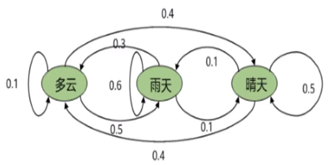

# SDF’s permanent-transitory decomposition

Nonparametric Stochastic Discount Factor Decomposition.ECONOMETRICA

Author: Timothy M. Christensen

## Abstract

Stochastic discount factor (SDF) processes in dynamic economies admit a permanent-transitory decomposition in which $\colorbox{aqua}{the permanent component characterizes pricing over long investment horizons.}$  This paper introduces an empirical framework to analyze the permanent-transitory decomposition of SDF processes. Specifically, we show how to estimate nonparametrically the solution to the Perron-Frobenius eigenfunction problem of Hansen and Scheinkman (2009). Our empirical framework allows researchers to (i) recover the time series of the estimated permanent and transitory components and (ii) estimate the yield and the change of measure which characterize pricing over long investment horizons. We also introduce nonparametric estimators of the continuation value function in a class of models with recursive preferences by reinterpreting the value function recursion as a nonlinear Perron-Frobenius problem. We establish consistency and convergence rates of the eigenfunction estimators and asymptotic normality of the eigenvalue estimator and estimators of related functionals. As an application, we study an economy where the representative agent is endowed with recursive preferences, allowing for general (nonlinear) consumption and earnings growth dynamics.

## Theoretical framework

In arbitrage-free environments, there is a positive stochastic discount factor process M = $\{M_t : t \in T\}$ that satisfies:

$$
E[\frac{M_{t+\tau}}{M_t}R_{t,t+\tau}|I_t] = 1 \tag{1}
$$

$R_{t,t+\tau}$: the (gross) return on a traded asset over the period from t to t + $\tau$

$I_t$: the information available to all investors at date t

Alvarez and Jermann (2005) introduce the permanent-transitory decomposition:

$$
\frac{M_{t+\tau}}{M_t} = \frac{M_{t+\tau}^P}{M_t^P}\frac{M_{t+\tau}^T}{M_t^T} \tag{2}
$$

The permanent component $\dfrac{M_{t+\tau}^P}{M_t^P}$ is a martingale :

$$
E[\frac{M_{t+\tau}^P}{M_t^P}|I_t] = 1 \tag{1}
$$

>[!TIP|label:鞅过程：]
>对于一个随机变量 $𝑀_𝑛，{𝑋_𝑛}$ 是一个随机过程。如果满足：$\\$
>$\bullet \ 𝑀_𝑛$ 仅仅与 $𝑋_0，𝑋_1，…… 𝑋_𝑛$ 有关 $\\$
>$\bullet \ E（𝑀_{𝑛+1}|𝑋_0，𝑋_1，…… 𝑋_𝑛）= 𝑀_𝑛$ $\\$
>则称 $𝑀_𝑛$ 是一个关于 $𝑋_𝑛$ 的鞅。如果第2个式子的符号为≤，那么称它为上鞅。如果为≥，那么称它为下鞅

在已知过程在时刻s之前的变化规律的条件下，过程在将来某一时刻t的期望值等于过程在时刻s的值

鞅过程指的是根据所得的信息对未来某个资产价格的最好预期就是资产的当前价格。

这里鞅的这种性质可以很好地对应permanent部分的不变的性质，permanent部分可以用来描述长期投资期限的定价特征

### 马尔可夫过程与马尔可夫链

马尔可夫过程：
未来独立于过去，预测未来只基于当下的信息。过去的事件中所包含的能够预测未来的信息，全部已经被保存到了当前的状态，因此基于当前便可以预测未来。这种性质也称为无后效性或者无记忆性

马尔科夫链：
是指数学中具有马尔可夫性质的离散事件随机过程。对于满足马尔可夫性的状态与时间都离散的随机过程称为马尔可夫链

转移概率：
在马尔可夫链的每一步，系统根据概率分布，可以从一个状态变到另一个状态，也可以保持当前状态。状态的改变叫做转移，与不同的状态改变相关的概率叫做转移概率。
$Prob (X_{t+1}  = i | X_t  = j) = P_{ij}$
所有 $P_{ij}$ 组成的矩阵称为转移矩阵

初始概率：
t时刻各个状态的概率，并不一定等于转移概率，具有随机性。状态转移概率矩阵与初始状态概率向量确定了隐藏的马尔科夫链

<table border="0" cellpadding="0" cellspacing="0" width="360"
style="border-collapse:
 collapse;table-layout:fixed;width:370pt">
 <colgroup><col width="72" span="5" style="width:54pt">
 </colgroup><tbody><tr height="39" style="mso-height-source:userset;height:29.25pt">
  <td height="39" class="xl66" width="72" style="height:29.25pt;width:54pt"></td>
  <td class="xl66" width="72" style="width:54pt"></td>
  <td colspan="3" class="xl65" width="216" style="width:162pt">第二天的天气</td>
 </tr>
 <tr height="21" style="height:15.75pt">
  <td height="21" class="xl66" width="72" style="height:15.75pt;width:54pt"></td>
  <td class="xl66" width="72" style="width:54pt"></td>
  <td class="xl67" width="72" style="width:54pt">多云</td>
  <td class="xl67" width="72" style="width:54pt">雨天</td>
  <td class="xl67" width="72" style="width:54pt">晴天</td>
 </tr>
 <tr height="22" style="mso-height-source:userset;height:16.5pt">
  <td rowspan="3" height="65" class="xl65" width="72" style="height:48.75pt;width:200pt">第一天的天气</td>
  <td class="xl67" width="72" style="width:100pt">多云</td>
  <td class="xl66" width="72" style="width:100pt">0.1</td>
  <td class="xl66" width="72" style="width:100pt">0.5</td>
  <td class="xl66" width="72" style="width:100pt">0.4</td>
 </tr>
 <tr height="21" style="height:15.75pt">
  <td height="21" class="xl67" width="72" style="height:15.75pt;width:54pt">雨天</td>
  <td class="xl66" width="72" style="width:54pt">0.3</td>
  <td class="xl66" width="72" style="width:54pt">0.6</td>
  <td class="xl66" width="72" style="width:54pt">0.1</td>
 </tr>
 <tr height="22" style="mso-height-source:userset;height:16.5pt">
  <td height="22" class="xl67" width="72" style="height:16.5pt;width:54pt">晴天</td>
  <td class="xl66" width="72" style="width:54pt">0.4</td>
  <td class="xl66" width="72" style="width:54pt">0.1</td>
  <td class="xl66" width="72" style="width:54pt">0.5</td>
 </tr>
</table>

