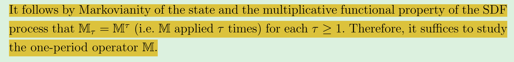

# SDF’s permanent-transitory decomposition

Nonparametric Stochastic Discount Factor Decomposition.ECONOMETRICA

Author: Timothy M. Christensen

## Abstract

Stochastic discount factor (SDF) processes in dynamic economies admit a permanent-transitory decomposition in which <mark>the permanent component characterizes pricing over long investment horizons</mark>. This paper introduces an empirical framework to analyze the permanent-transitory decomposition of SDF processes. Specifically, we show how to estimate nonparametrically the solution to the Perron-Frobenius eigenfunction problem of Hansen and Scheinkman (2009). Our empirical framework allows researchers to (i) recover the time series of the estimated permanent and transitory components and (ii) estimate the yield and the change of measure which characterize pricing over long investment horizons. We also introduce nonparametric estimators of the continuation value function in a class of models with recursive preferences by reinterpreting the value function recursion as a nonlinear Perron-Frobenius problem. We establish consistency and convergence rates of the eigenfunction estimators and asymptotic normality of the eigenvalue estimator and estimators of related functionals. As an application, we study an economy where the representative agent is endowed with recursive preferences, allowing for general (nonlinear) consumption and earnings growth dynamics.

## Theoretical framework

In arbitrage-free environments, there is a positive stochastic discount factor process M = $\{M_t : t \in T\}$ that satisfies:

$$
E[\frac{M_{t+\tau}}{M_t}R_{t,t+\tau}|I_t] = 1 \tag{1}
$$

$R_{t,t+\tau}$: the (gross) return on a traded asset over the period from t to t + $\tau$

$I_t$: the information available to all investors at date t

Alvarez and Jermann (2005) introduce the permanent-transitory decomposition:

$$
\frac{M_{t+\tau}}{M_t} = \frac{M_{t+\tau}^P}{M_t^P}\frac{M_{t+\tau}^T}{M_t^T} \tag{2}
$$

The permanent component $\dfrac{M_{t+\tau}^P}{M_t^P}$ is a martingale :

$$
E[\frac{M_{t+\tau}^P}{M_t^P}|I_t] = 1 \tag{1}
$$

>[!TIP|label:鞅过程：]
>对于一个随机变量 $𝑀_𝑛，{𝑋_𝑛}$ 是一个随机过程。如果满足：$\\$
>$\bullet \ 𝑀_𝑛$ 仅仅与 $𝑋_0，𝑋_1，…… 𝑋_𝑛$ 有关 $\\$
>$\bullet \ E（𝑀_{𝑛+1}|𝑋_0，𝑋_1，…… 𝑋_𝑛）= 𝑀_𝑛$ $\\$
>则称 $𝑀_𝑛$ 是一个关于 $𝑋_𝑛$ 的鞅。如果第2个式子的符号为≤，那么称它为上鞅。如果为≥，那么称它为下鞅

在已知过程在时刻s之前的变化规律的条件下，过程在将来某一时刻t的期望值等于过程在时刻s的值

鞅过程指的是根据所得的信息对未来某个资产价格的最好预期就是资产的当前价格。

这里鞅的这种性质可以很好地对应permanent部分的不变的性质，permanent部分可以用来描述长期投资期限的定价特征

### Markov process and Markov chain

Markov process：
未来独立于过去，预测未来只基于当下的信息。过去的事件中所包含的能够预测未来的信息，全部已经被保存到了当前的状态，因此基于当前便可以预测未来。这种性质也称为无后效性或者无记忆性

Markov chain：
是指数学中具有马尔可夫性质的离散事件随机过程。对于满足马尔可夫性的状态与时间都离散的随机过程称为马尔可夫链

转移概率：
在马尔可夫链的每一步，系统根据概率分布，可以从一个状态变到另一个状态，也可以保持当前状态。状态的改变叫做转移，与不同的状态改变相关的概率叫做转移概率。
$Prob (X_{t+1}  = i | X_t  = j) = P_{ij}$
所有 $P_{ij}$ 组成的矩阵称为转移矩阵

初始概率：
t时刻各个状态的概率，并不一定等于转移概率，具有随机性。状态转移概率矩阵与初始状态概率向量确定了隐藏的马尔科夫链

<table border="0" cellpadding="0" cellspacing="0" width="360"
style="border-collapse:
 collapse;table-layout:fixed;width:370pt">
 <colgroup><col width="72" span="5" style="width:54pt">
 </colgroup><tbody><tr height="39" style="mso-height-source:userset;height:29.25pt">
  <td height="39" class="xl66" width="72" style="height:29.25pt;width:54pt"></td>
  <td class="xl66" width="72" style="width:54pt"></td>
  <td colspan="3" class="xl65" width="216" style="width:162pt">第二天的天气</td>
 </tr>
 <tr height="21" style="height:15.75pt">
  <td height="21" class="xl66" width="72" style="height:15.75pt;width:54pt"></td>
  <td class="xl66" width="72" style="width:54pt"></td>
  <td class="xl67" width="72" style="width:54pt">多云</td>
  <td class="xl67" width="72" style="width:54pt">雨天</td>
  <td class="xl67" width="72" style="width:54pt">晴天</td>
 </tr>
 <tr height="22" style="mso-height-source:userset;height:16.5pt">
  <td rowspan="3" height="65" class="xl65" width="72" style="height:48.75pt;width:200pt">第一天的天气</td>
  <td class="xl67" width="72" style="width:100pt">多云</td>
  <td class="xl66" width="72" style="width:100pt">0.1</td>
  <td class="xl66" width="72" style="width:100pt">0.5</td>
  <td class="xl66" width="72" style="width:100pt">0.4</td>
 </tr>
 <tr height="21" style="height:15.75pt">
  <td height="21" class="xl67" width="72" style="height:15.75pt;width:54pt">雨天</td>
  <td class="xl66" width="72" style="width:54pt">0.3</td>
  <td class="xl66" width="72" style="width:54pt">0.6</td>
  <td class="xl66" width="72" style="width:54pt">0.1</td>
 </tr>
 <tr height="22" style="mso-height-source:userset;height:16.5pt">
  <td height="22" class="xl67" width="72" style="height:16.5pt;width:54pt">晴天</td>
  <td class="xl66" width="72" style="width:54pt">0.4</td>
  <td class="xl66" width="72" style="width:54pt">0.1</td>
  <td class="xl66" width="72" style="width:54pt">0.5</td>
 </tr>
</table>

* 转移概率：状态的改变叫做转移，与不同的状态改变相关的概率叫做转移概率
$\text{Prob}(X_{t+1}=i\mid X_t=j)=P_{ij}$
所有𝑃_𝑖𝑗组成的矩阵称为转移矩阵

* 初始概率：t时刻各个状态的概率，并不一定等于转移概率，具有随机性

**状态转移概率矩阵与初始状态概率向量确定了隐藏的马尔科夫链**

上述例子的转移概率矩阵可以写为：

$$
\begin{bmatrix}
0.1&0.5&0.4\\
0.3&0.6&0.1\\
0.4&0.1&0.5
\end{bmatrix}
$$

若初始概率：（0.2，0.2，0.6）

则连续三天下雨的概率为：0.2×0.6×0.6 = 0.072

本文所假设的马尔可夫过程的性质:

* time homogeneous（时间均匀的）：A Markov chain is called time homogeneous if and only if the transition probabilities are independent of the time t. 当转移概率不随时间变化时，这个马尔可夫过程便是时间均匀的

* strictly stationary：这个概念想表达的意思与前一特性基本相同，即转移概率并不依赖于时间t
https://math.stackexchange.com/questions/1288248/stationary-markov-process-properties

https://encyclopediaofmath.org/wiki/Markov_process,_stationary
这里有一个数学化的解释：当一个马尔可夫过程的转移概率满足时间均匀时，如果存在一个平稳的初始概率分布μ(A)，则这个马尔可夫过程是平稳的

* ergodic：是指不管事物现在处于什么状态，在较长时间内，马尔可夫过程逐渐趋于稳定状态，而且与初始状态无关。遍历性定理讲的就是只要时间够长，什么状态都有可能到达，状态是由相互连接的环组成的

stationary distribution of a Markov chain：

给定一个马尔可夫链，其状态空间存在概率分布 $\pi=\pi(s)$，且转移矩阵和转移概率 $P=p(i,j)$，若满足：

* $π=πP$（平衡方程）
* $\sum\pi_i=1$

则称 $\pi$ 是该马尔可夫链的平稳分布，或称为转移阵 P 的不变测度。这里的 $π_i$ 对应 SDF 的 s 种状态的发生的概率

如果马尔可夫链的存在平稳分布，并且其初始分布也是平稳分布，则该马尔可夫链处于稳态

马尔可夫半群(Markov semigroup)：

半群是最简单、最自然的一类代数系统。一个非空集合S连同定义在它上面的一个结合的(即满足结合律的)二元运算“·”的代数系统(S，·)称为一个半群.半群(S，·)简记为S

半群是抽象代数的概念，也可以理解为一类包含某种性质的集合，在本文中它的作用便是定义不同的连续两期之间的有界线性算子矩阵具有相同形式，因此有界线性算子满足：

$$
M_\tau=M^\tau
$$

### Bounded linear operator

矩阵的本质就是一种映射，有限维度的向量空间之间的线性变换完全可以用矩阵来描述，对于无限维度的空间则并非如此。有界线性算子的本质也是一种映射，将X空间中的元素映射到 Y 空间，有界线性算子在有限维度下可以表示成为矩阵，在无穷维度下一般不能找到矩阵的表示形式，但也可以通过无穷矩阵来表示

因此在本文有限维度的假设下，X 空间就是当期资产偿付（payoff） $X_t$ 元素的集合，Y 空间就是未来某期当期资产偿付（payoff） $X_{t+\tau}$ 元素的集合，而 M 就是将 X 空间元素映射到 Y 空间的映射矩阵，也就是我们之后要根据Perron-Frobenius问题分析其特征值、特征向量的那个矩阵。

范数：

是具有“长度”概念的函数。在线性代数、泛函分析及相关的数学领域，范数是一个函数，是矢量空间内的所有矢量赋予非零的正长度或大小

在有限维度的空间中，我们可以很容易的求一个向量的模长，即 $\sqrt{\sum Zi^2}$，但是在无穷维度的空间中，我们没有求向量的模长，于是便定义了范数的概念。范数有很多种类，不同的范数有不同的定义方式。

M 怎么求解：关键在于找到X空间与Y空间的坐标基，找到两个空间中对应的坐标基后，就可以求解 M:

$$
\begin{bmatrix}
\square&{\cdots}&\square\\
{\vdots}&{\ddots}&{\vdots}\\
\square&{\cdots}&\square\\
\end{bmatrix}
\overrightarrow{X 空间坐标基}= \overrightarrow{Y 空间坐标基}
$$

正是因为有了马尔可夫平稳性的假设以及马尔可夫半群的概念，所以每一次映射都是一样的方法，也即一样的矩阵，即从 t 期到 t+1 期，t+1 期到 t+2 期，t+2 期到 t+3 期……的映射矩阵都是相同的，所以文章中提到 $M_\tau=M^\tau$，只要知道 M 的性质，便知道了 $M_\tau$ 的性质:

根据矩阵特征值与特征向量的运算性质：

$$
\begin{array}{llllll}
Mx&=&\rho x \\
\\
M^2x&=&M\times(\text{Mx})&=&M\times(\text{Px})&=&\rho(\text{Mx})&=&\rho\rho\text{x}&=&\rho^2\text{x}\\
\\
M^3x&=&M\times(M^2x)&=&M\times(\rho^2x)&=&\rho^2(\rho x)&=&\rho^2\rho x&=&\rho^3x \\
\\
\dotsm\\
M^n x&=&\text{}\rho^n x
\end{array}
$$

所以只需要研究 t 期到 t+1 期的映射矩阵即可

### Perron-Frobenius

* We say a matrix or vector is positive if all its entries are positive
* We say a matrix or vector is nonnegative if all its entries are nonnegative
* if A ≥ 0 and z ≥ 0, then we have Az ≥ 0
* conversely: if for all z ≥ 0, we have Az ≥ 0, then we can conclude A ≥ 0
* suppose $A \in R^{n\times n}$, with $A\geq 0$ ，A is called regular if for some $k \geq 1$ , $A^k \geq 0$

the eigenvalue $\lambda_{pf}$ is called the Perron-Frobenius (PF) eigenvalue of A

the associated positive (left and right) eigenvectors are called the (left and right) PF eigenvectors (and are unique)

suppose $A \in R^{n\times n}$ is nonnegative and regular：

* there is an eigenvalue $\lambda_{pf}$ of A that is real and positive, with positive left and right eigenvectors
* for any other eigenvalue $\lambda$, we have $|\lambda|$ < $\lambda_{pf}$

### SDF's decomposition

Assumptions:

* Assumption 1: $X_t$ summarizes all information relevant for asset pricing at date t
* Assumption 2: payoffs depend only on future values of the state
* Assumption 3: allow trading at intermediate dates

Under the assumptions above, we may conclude the SDF process is a positive multiplicative functional of X:

$$
\dfrac{M_{t+\tau}}{M_t}=M_{\tau}(\theta_t)
$$

If $\tau = 1$, we have:

$$
\dfrac{M_{t+1}}{M_t}=m(X_t,X_{t+1})
$$

有了前面关于有界线性算子 $\mathbb{M}$ 以及Perron-Frobenius问题的定义，我们可以将SDF分解为permanent和transitory两部分。具体方法如下：

* 根据当期资产偿付（payoff） $X_t$ 元素的集合的X空间和下一期（或者第"τ" 期）资产偿付（payoff） $X_{t+1}$ 元素的集合的Y空间，求出其对应的映射矩阵，即有界线性算子 $\mathbb{M}$
* 根据 $\mathbb{M}$，求出其最大的特征值 $\rho$ 和其对应的本征函数（eigenfunction）$\phi$，这里本征函数的概念可以理解为矩阵的特征向量，只不过它是一种函数，是有界线性算子对应的特征函数。
* 根据不同的方法求解SDF
* 用上述各元素组合成为permanent SDF 和 transitory SDF

$$
\begin{aligned}
\frac{M_{t+\tau}^P}{M_t^P}&=\rho^{-\tau}\frac{M_{t+\tau}}{M_t}\frac{\phi(X_{t+\tau})}{\phi(X_t)}\\
\\
\frac{M_{t+\tau}^T}{M_t^T}&=\rho^\tau\frac{\phi(X_t)}{\phi(X_t+\tau)}
\end{aligned}
$$

不同情形的SDF

情形一：SDF is observable

这种情况下随机折现因子的函数形式是事前已知的。例如，考虑基于消费的资本资产定价模型（CCAPM），只要知道我们预设时间折价参数 $\beta$，以及效用函数中需要的风险规避参数 $\gamma$，就可以计算出SDF

情形二：SDF is estimated

在这种情况下，随机折现因子需要我们自己去估计。我们假设随机折现因子的形式是 $m(X_t,X_{t+1};\alpha_0 )$，SDF受参数 $\alpha_0$ 影响

在情况2中，我们考虑SDF分解的两步方法。在第一步中，根据状态的时间序列数据以及可能的资产收益来估计 $\alpha_0$。在第二步中，我们将第一阶段估计器 “$\alpha$” 插入非参数过程中，以恢复 $\rho, \varphi,\varphi^*$ 和相关量