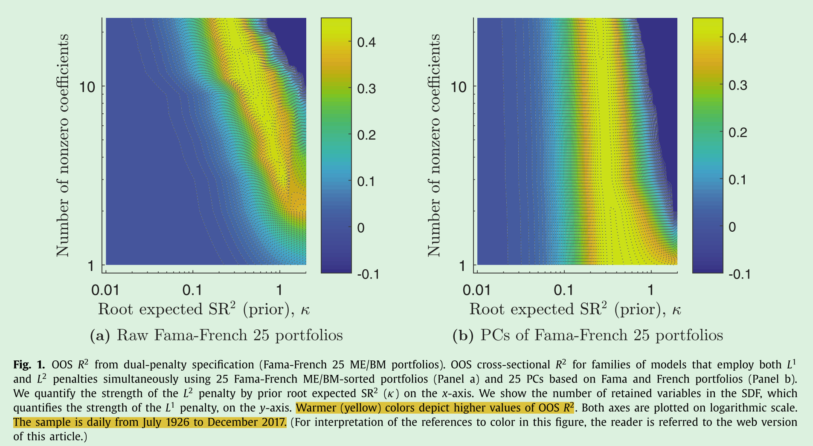

# shrinking 实证做法

## 4.1. Preliminary analysis: Fama-French ME/BM portfolios

ME/BM 双重排序 $5\times5$

测试这25个资产的 SDF loading

这一步骤相当于先在低维的情况下验证模型的可行性、合理性，然后再将模型应用于高维

期望的结果：

25个组合收益(相对于市场指数收益正交化)接近于SMB和HML因子的线性组合

Kozak(2018)的研究表明：SMB 和 HML 因子本质上匹配FF25(市场中性)投资组合回报的第一个和第二个princple componet。因此，当我们使用 FF25 投资组合收益的 pc 作为基础资产进行分析时，我们应该会发现更稀疏的情况: 至多两个 pc 就足以很好地描述 SDF

We vary the degree of $$ -shrinkage on the horizontal axis, going from extreme shrinkage on the left to no shrinkage at all at the right border of the plot.

Variation along the vertical axis represents different degrees of sparsity. Thus, there is no sparsity at the top end of the plot and extreme sparsity at the bottom.

