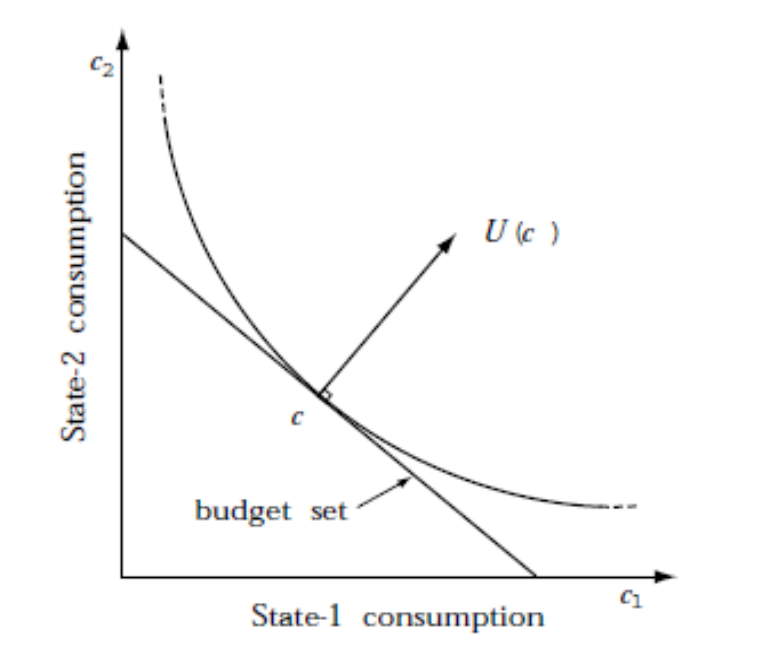
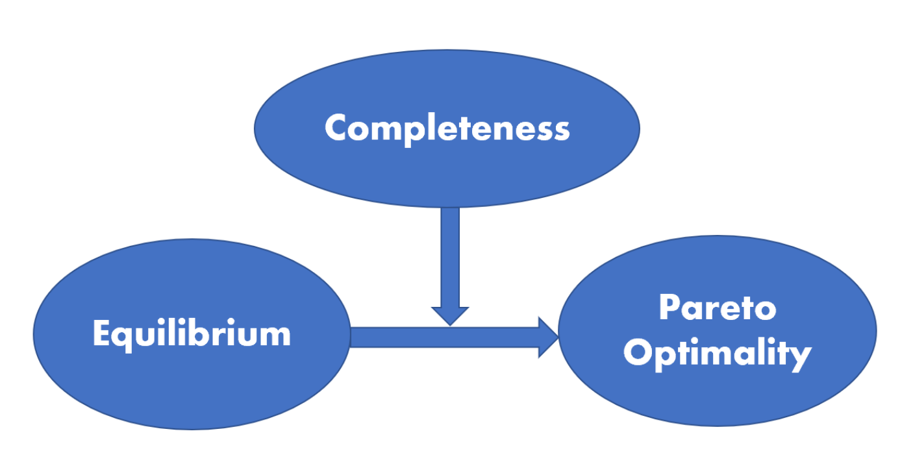

# 数理金融

状态集：$\varOmega = \{1,2,\dotsb,S \}$，未来只有一种状态会发生。不确定性的来源：在当前时刻我们无法预知未来将会发生哪一种状态。

## 基本定义

payoff matrix D:

$$
\begin{bmatrix}
{D_{11}}&{D_{12}}&{\cdots}&{D_{1S}}\\
{D_{21}}&{D_{22}}&{\cdots}&{D_{2S}}\\
{\vdots}&{\vdots}&{\ddots}&{\vdots}\\
{D_{N1}}&{D_{N2}}&{\cdots}&{D_{NS}}\\
\end{bmatrix}_{N\times S}
$$

$D_{ij}$ 代表第 i 个资产在第 j 种状态下的资产偿付

$\theta$ 代表投资组合的配置权重，$\theta \in R^N$

### 套利

套利的定义：存在一个投资组合$\theta$，使得投资的成本小于等于0，但收益为正；或投资成本为负，但收益非负。用公式表示为：

$q*\theta \leq 0$ and $D^T \theta >0$

$q*\theta < 0$ and $D^T \theta \geq0$

定义一个新的向量：

$\vec{M} =
\begin{bmatrix}
{-q*\theta}\\
{D^T \theta}\\
\end{bmatrix}_{(S+1)\times 1}
$

如果存在套利，则$M \in R^{S+1}_+$，即M的每一个元素都非负，且至少存在一个元素严格为正。此时 $\theta$ 称为一个套利组合

套利的直接含义便是在没有付出成本的情况下却获得了正收益。

### 状态价格向量

紧接着我们将套利和状态价格联系起来，状态价格指的是：对应未来某种状态 j，如果在这种状态下获取1单位的收益，那么在当前要付出的成本。状态价格可以理解为一种没有单位的度量，例如未来在某种状态可以获得1元的偿付，$\psi_j = 0.9$表示在当前状态下为了获得这1元的偿付需要付出0.9元。

因此：$\vec{q} = D\psi$

状态价格向量的每个元素都严格为正，因此$\psi \in R^S_{++}$

### 无套利和状态价格向量的联系

无套利 $\Longleftrightarrow$ 存在一个状态价格向量

## 效用最大化模型

假设：

* 收益价格信息(D,q)已知；

* 个体(agent)的效用函数是严格递增的，并且边际效用递减；

* 个体(agent)的初始禀赋(endowment)为e

那么个体的预算可行集为：

$$
X(q,e) = {e + D^T\theta \in R^S_+ : \theta \in R^N, q*\theta \leq 0}
$$

最优化问题：

$$
sup \quad U(e + D^T\theta) \tag{1}
$$

投资者通过交易来最大化自己的效用，通过找到最优交易策略 $\theta^*$ 来找到最优消费策略 $c^*$，以达到最大化效用的目的

金融市场的存在，使得投资者可以购买不同的资产，来改变自己的消费配置，从而找到最优消费策略。而 $q*\theta \leq 0$ 可以保证投资者在不同资产配置时无需付出额外成本。如果 $q*\theta < 0$，说明投资者在资产配置过程中有财富浪费，这部分浪费可以帮投资者更好地提升他的消费。因此一般 $q*\theta = 0$

(1)式有解 $\xleftrightharpoons{U连续}$ 无套利 $\Longleftrightarrow$ 存在一个状态价格向量

考虑两个状态的情况，最大化效用的 $c^*$ 一定是效用函数与消费预算集的切点。

此时，

$
\begin{bmatrix}
\psi_1 \\
\\
\psi_2 \\
\end{bmatrix}=
\lambda\begin{bmatrix}
\frac{\partial{U(c^*)}}{\partial{c_1}} \\
\\
\frac{\partial{U(c^*)}}{\partial{c_2}} \\
\end{bmatrix}
$

## 风险中性概率测度

假设：

* 状态价格向量存在

* 存在一种资产，其未来每一种状态下都可以获得1单位的收益

则这种资产便是无风险的资产，在当前时刻，这种资产的价格应该是：$\psi_1 + \psi_2 + \dotsb + \psi_s$，记为 $\psi_0$

那么无风险资产的收益率(gross return)为:

$\frac{1}{\psi_0}= 1+R_f$

根据 $\vec{q} = D\psi$，可得：$q_i = \sum\limits_{j=1}^{S} \psi_jD_{ij} $

对上式变形：$q_i = \psi_0 \sum\limits_{j=1}^{S} \frac{\psi_j}{\psi_0} D_{ij} $

如果把 $\frac{\psi_j}{\psi_0}$ 理解为一种概率测度，上式可变为：$q_i = \psi_0\hat{E}(D_i) = \frac{1}{1+R_f}\hat{E}(D_i)$

可见未来的资产偿付是用无风险收益率进行折现，这符合风险中性世界的定义，即风险中性世界中，投资者只要求无风险收益率。因此 $\hat{\psi_j} = \frac{\psi_j}{\psi_0}$ 也称为风险中性概率测度

当我们定价资产时，需要考虑时间折扣和风险折扣。每一种状态下1单位的收益对应的时间折扣都是不同的，所以状态价格向量的元素不全相同。而风险中性的意义在于利用 $\psi_0$ 来统一折现所有状态的收益，只需考虑风险的折扣。

## 随机折扣因子

## 均衡、完备市场、帕累托最优

### 均衡市场

均衡是指市场价格是通过多方竞争形成的，在这种情况下，商品或服务的供给数量和需求数量是相同的。

证券市场的均衡：

存在m个个体，他们的效用函数分别是：$U_1, U2, \dotsb,U_m$，初始禀赋分别是：$e^1,e^2,\dotsb,e^m$，若一个证券市场中，每个投资者都有自己的资产配置策略 $\theta^i$， $\theta^i = sup_\theta \ U_i(e^i + D^T\theta)$，并且 $\sum\limits_{i=1}^{m} \theta^i =0 $ (保证了供给需求平衡)，那么这个证券市场便是均衡的证券市场

### 完备市场

$rank(D) = S, \implies$ 市场是完备的

资产定价第二基本定理：

无套利市场中，状态价格唯一 $\Longleftrightarrow$ 市场是完备的

### 帕累托最优

市场上所有个体的消费分布：$(c^1,c^2,\dotsb,c^m)$

不存在另一个消费分布：$(\hat{c^1},\hat{c^2},\dotsb,\hat{c^m})$，使得 $\forall i, U_i(\hat{c^i}) \geq U_i(c^i)$ 且 $\exist i, U_i(\hat{c^i}) > U_i(c^i)$

### 三者之间的联系

均衡不代表帕累托最优，但如果市场完备，则均衡一定是帕累托最优

