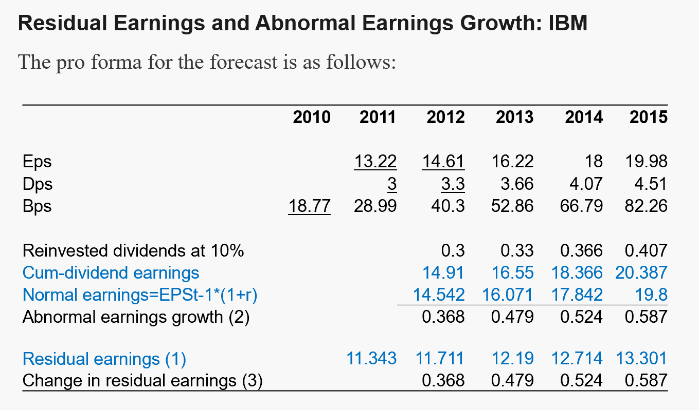
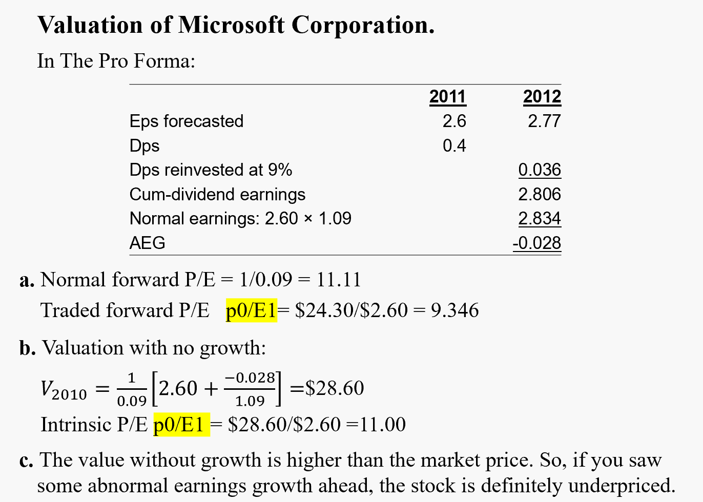
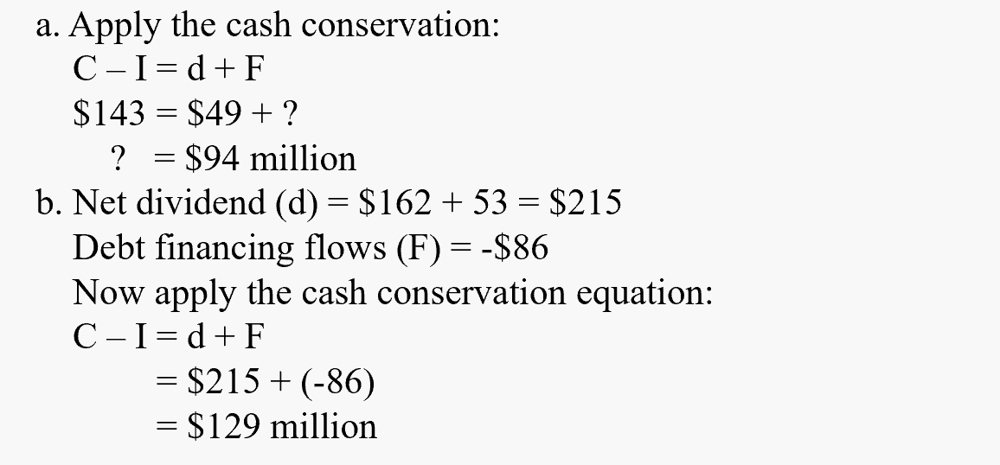

# 财报exercise合集

## 第6章

**Residual Earnings and Abnormal Earnings Growth: IBM**

Consider the following pro forma for International Business Machines Corp. (IBM) based on analysts' forecasts in early 2011

<table border="0" cellpadding="0" cellspacing="0" width="590" style="border-collapse:
 collapse;table-layout:fixed;width:442pt">
 <colgroup><col width="68" style="width:51pt">
 <col width="156" style="mso-width-source:userset;mso-width-alt:5307;width:117pt">
 <col width="68" span="2" style="width:51pt">
 <col width="230" style="mso-width-source:userset;mso-width-alt:7833;width:172pt">
 </colgroup><tbody><tr height="41" style="mso-height-source:userset;height:30.4pt">
  <td colspan="2" height="41" class="xl67" width="224" style="height:30.4pt;width:168pt"></td>
  <td class="xl65" dir="LTR" width="68" style="width:51pt">2011</td>
  <td class="xl65" dir="LTR" width="68" style="width:51pt">2012</td>
  <td class="xl65" dir="LTR" width="230" style="width:172pt">Next Three Years</td>
 </tr>
 <tr height="37" style="mso-height-source:userset;height:27.4pt">
  <td colspan="2" height="37" class="xl66" dir="LTR" width="224" style="height:27.4pt;
  width:168pt">Earnings per share</td>
  <td class="xl65" dir="LTR" width="68" style="width:51pt">13.22</td>
  <td class="xl65" dir="LTR" width="68" style="width:51pt">14.61</td>
  <td class="xl65" dir="LTR" width="230" style="width:172pt">Growth at 11 %</td>
 </tr>
 <tr height="33" style="mso-height-source:userset;height:24.75pt">
  <td colspan="2" height="33" class="xl66" dir="LTR" width="224" style="height:24.75pt;
  width:168pt">Dividends per share</td>
  <td class="xl65" dir="LTR" width="68" style="width:51pt">3</td>
  <td class="xl65" dir="LTR" width="68" style="width:51pt">3.3</td>
  <td class="xl65" dir="LTR" width="230" style="width:172pt">Growth at 11 %</td>
 </tr>
 <!--[if supportMisalignedColumns]-->
 <tr height="0" style="display:none">
  <td width="68" style="width:51pt"></td>
  <td width="156" style="width:117pt"></td>
  <td width="68" style="width:51pt"></td>
  <td width="68" style="width:51pt"></td>
  <td width="230" style="width:172pt"></td>
 </tr>
 <!--[endif]-->
</tbody></table>

The book value of IBM's common equity at the end of 2010 was \$23.0 billion, or \$18.77 per share. Use a required return for equity of 10 percent in calculations.

* a. Forecast residual earnings for each of the years 2011- 2015
* b. Forecast abnormal earnings growth (in dollars) for each of the years 2012- 2015
* c. Show that abnormal earnings growth is equal to the change in residual earnings for every year.

**Answers:**

用到的公式：

$\begin{array}{lll}
\text{Reinvested dividends}_t& = &DPS_{t-1} \times r \\
\\
\text{Cum-dividend earnings}_t&=&EPS_t+\text{Reinvested dividends}_t \\
\\
\text{Normal earnings}_t&=&EPS_{t-1}\times r \\
\\
\text{Abnormal earnings growth}_t&=&\text{Cum-dividend earnings}_t - \text{Normal earnings}_t\\
\\
&=& RE_t - RE_{t-1}\\
\end{array}$

**Valuation of Microsoft Corporation**

In 2010, some fundamental investors believed that Microsoft, after being overpriced in the stock market for many years, was now a firm to buy. Microsoft's shares traded at \$24.30 in September 2010, down from a peak of $60 (split-adjusted) in January 2000.

Analysts' consensus EPS forecasts for 2011 and 2012 fiscal years (ending in June) were \$2.60 and \$2.77, respectively. A dividend of \$0.40 per share was indicated for fiscal year 2011.

* a. Calculate Microsoft's normal forward P/E and the forward P/E at which it traded in September 2010. Use a required return of 9 percent.

* b. Calculate the intrinsic P/E implied by the analysts' forecasts with the assumption that there will be no abnormal earnings growth after 2012.

* c. If you forecast that there will be significant abnormal earnings growth after 2012, do you think this stock is appropriately priced at $24.30?

**Answers:**

用到的公式：

$\begin{array}{lll}
\text{Normal forward P/E} \qquad&= \qquad & \dfrac{1}{r} \\
\\
\text{Normal Trailing P/E}&=& \dfrac{1+r}{r}\\
\\
\text{Forward P/E}&=& \dfrac{\text{Price}_0}{\text{Eamings}_1}\\
\\
\text{Trailing P/E}&=& \dfrac{\text{Price}_0+\text{Dividend}_0}{\text{Eamings}_0}\\
\\
\text{Intrinsic P/E}&=& \dfrac{\text{Intrinsic Price}_0}{\text{Eamings}_1}\\
\end{array}$

Intrinsic Price here is calculated from valuation models.

## 第8章

**Applying the Cash Conservation Equation**

* a. A firm generated \$143 million in free cash flow and paid a net dividend of \$49 million to shareholders. How much was paid to debtholders and debt issuers?
  
* b. A firm paid a dividend to shareholders of \$162 million and repurchased stock for \$53 million. There were no share issues. The firm $\textcolor{red}{received}$ net cash of \$86 million from debt financing transactions. What was its free cash flow?

**Answers:**

用到的公式：

$\begin{array}{lll}
d&=&\text{net cash flow to shareholders} \\
&=&\text{common dividends + share repurchases – share issues} \\
\\
F&=&\text{net cash flow to debtholders and issuers} \\
&=&\text{Net principal payments + net interest paid} \\
\end{array}$

**Using Accounting Relations**

Below are a balance sheet and an income statement that have been reformulated according to the templates laid out in this chapter. Ignore income taxes

* a. How much was paid out in net dividends during 2012?
* b. What is free cash flow for 2012?

<table border="0" cellpadding="0" cellspacing="0" width="882" style="border-collapse:
 collapse;table-layout:fixed;width:662pt">
 <colgroup><col width="141" style="mso-width-source:userset;mso-width-alt:4812;width:106pt">
 <col width="78" style="mso-width-source:userset;mso-width-alt:2662;width:59pt">
 <col width="184" style="mso-width-source:userset;mso-width-alt:6280;width:138pt">
 <col width="87" style="mso-width-source:userset;mso-width-alt:2969;width:65pt">
 <col width="256" style="mso-width-source:userset;mso-width-alt:8738;width:192pt">
 <col width="68" span="2" style="width:51pt">
 </colgroup><tbody><tr height="20" style="height:15.0pt">
  <td colspan="7" height="20" class="xl71" width="882" style="height:15.0pt;width:662pt">Balance
  Sheet</td>
 </tr>
 <tr height="20" style="height:15.0pt">
  <td colspan="3" height="20" class="xl71" style="height:15.0pt">Assets</td>
  <td class="xl72"></td>
  <td colspan="3" class="xl71">Liabilities and Equity</td>
 </tr>
 <tr height="19" style="height:13.9pt">
  <td height="19" style="height:13.9pt"></td>
  <td align="right">2012</td>
  <td align="right">2011</td>
  <td colspan="2" style="mso-ignore:colspan"></td>
  <td align="right">2012</td>
  <td align="right">2011</td>
 </tr>
 <tr height="19" style="height:13.9pt">
  <td height="19" style="height:13.9pt">Operating assets</td>
  <td align="right">205.3</td>
  <td align="right">189.9</td>
  <td></td>
  <td>Operating liabilities</td>
  <td align="right">40.6</td>
  <td align="right">34.2</td>
 </tr>
 <tr height="19" style="height:13.9pt">
  <td height="19" style="height:13.9pt">Financial assets</td>
  <td align="right">45.7</td>
  <td align="right">42</td>
  <td></td>
  <td>Financial obligations</td>
  <td align="right">120.4</td>
  <td align="right">120.4</td>
 </tr>
 <tr height="19" style="height:13.9pt">
  <td height="19" colspan="4" style="height:13.9pt;mso-ignore:colspan"></td>
  <td>Common stockholders’ equity</td>
  <td align="right">90</td>
  <td align="right">77.3</td>
 </tr>
 <tr height="19" style="height:13.9pt">
  <td height="19" style="height:13.9pt"></td>
  <td align="right">251</td>
  <td align="right">231.9</td>
  <td colspan="2" style="mso-ignore:colspan"></td>
  <td align="right">251</td>
  <td align="right">231.9</td>
 </tr>
 <tr height="19" style="height:13.9pt">
  <td height="19" colspan="7" style="height:13.9pt;mso-ignore:colspan"></td>
 </tr>
 <tr height="20" style="height:15.0pt">
  <td colspan="2" rowspan="7" height="134" class="xl68" style="height:98.4pt"></td>
  <td colspan="3" class="xl71">Income Statement (2012)</td>
  <td colspan="2" rowspan="7" class="xl68"></td>
 </tr>
 <tr height="19" style="height:13.9pt">
  <td height="19" style="height:13.9pt">Operating revenue&nbsp;</td>
  <td></td>
  <td align="right">134.5</td>
 </tr>
 <tr height="19" style="height:13.9pt">
  <td height="19" style="height:13.9pt">Operating expense</td>
  <td></td>
  <td align="right">-112.8</td>
 </tr>
 <tr height="19" style="height:13.9pt">
  <td height="19" style="height:13.9pt">Operating income</td>
  <td></td>
  <td align="right">21.7</td>
 </tr>
 <tr height="19" style="height:13.9pt">
  <td height="19" style="height:13.9pt">Interest revenue&nbsp;</td>
  <td></td>
  <td align="right">2.5</td>
 </tr>
 <tr height="19" style="height:13.9pt">
  <td height="19" style="height:13.9pt">Interest expenses</td>
  <td></td>
  <td align="right">-9.6</td>
 </tr>
 <tr height="19" style="height:13.9pt">
  <td height="19" style="height:13.9pt">Comprehensive income&nbsp;&nbsp;&nbsp;&nbsp;</td>
  <td></td>
  <td align="right">14.6</td>
 </tr>
 <!--[if supportMisalignedColumns]-->
 <tr height="0" style="display:none">
  <td width="141" style="width:106pt"></td>
  <td width="78" style="width:59pt"></td>
  <td width="184" style="width:138pt"></td>
  <td width="87" style="width:65pt"></td>
  <td width="256" style="width:192pt"></td>
  <td width="68" style="width:51pt"></td>
  <td width="68" style="width:51pt"></td>
 </tr>
 <!--[endif]-->
</tbody></table>

$\begin{array}{lll}
\text{}_t&=& \\
\text{}_t&=& \\
\text{}_t&=& \\
\end{array}$

## 第9章

**A Simple Reformulation of the Equity Statement.**

From the following information, prepare a reformulated statement of common shareholders’ equity for 2012.

$$
\begin{array}{lr}
\text{Balance, December 31, 2011}&\qquad \$1,206\\
\text{Net income}&241\\
\text{Foreign currency translation loss}&(11)\\
\text{Unrealized gain on debt securities held} \qquad &24\\
\text{Issue of shares}&45\\
\text{Common dividends}&(94)\\
\text{Preferred dividends}&(15)\\
\text{Balance, December 31, 2012}&\$1,396\\
\end{array}
$$

Amounts are in millions.
The beginning and end-of-year balances include $200 million of preferred stock.